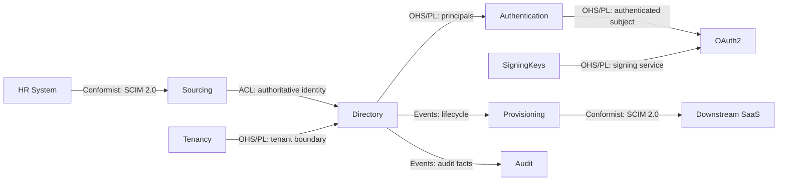
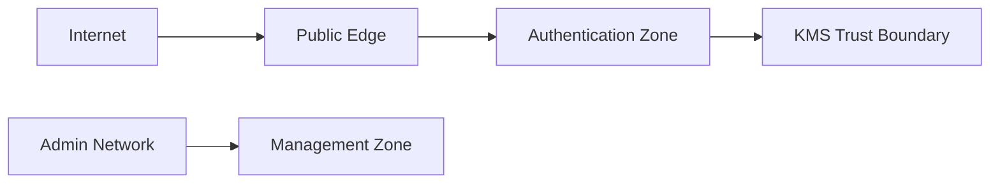
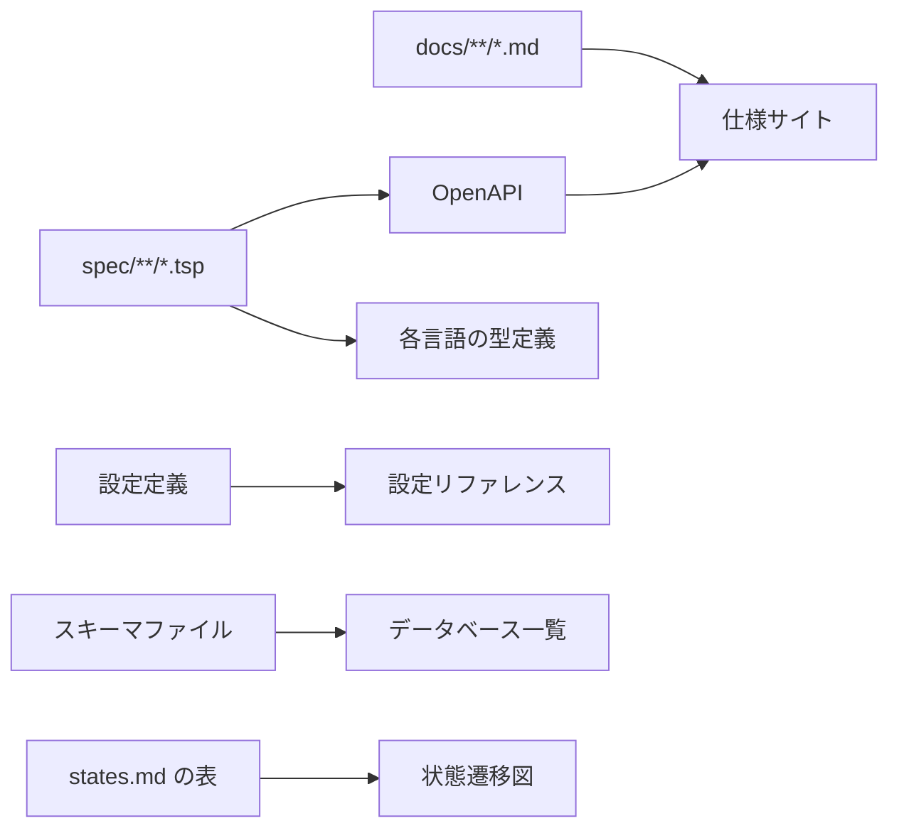

# 文書ガイド

仕様、設計、開発、運用の文書について、種類、責務、書式、配置を定める。

例はすべて、複数企業へ提供するマルチテナント型IdP/IdM（Identity Provider / Identity Management）を題材とする。特定のリポジトリに依存しない形で書く。

## 1. 目的

現在の仕様と設計を、一意の正本として、人間とAIの双方が読めて検証できる形で維持する。

文書の種類を増やさない。同じ書き方を、全体とコンテキストという二つのスコープへ適用する。アーキテクチャ文書、機能仕様書、状態遷移文書、品質要件文書、アクセシビリティ文書といった種類別の文書は設けない。

## 2. 正本の一覧

| 関心事 | 正本 |
|---|---|
| モデル、API操作、HTTPバインディング、ステータスコード、認証機構 | TypeSpec（`spec/**/*.tsp`） |
| 境界の宣言、用語、準拠する規範、状態遷移、設計判断、受け入れシナリオ | `docs/`のMarkdown |
| 一つの変更の動機、代替案、計画、経緯 | work item |
| 実行できる振る舞い | アプリケーションコードとテスト |
| データベースの構造 | 宣言的なスキーマファイル |
| 起動時設定の値と検証 | 設定定義のコード |
| 公開済みHTTPの互換性 | OpenAPIのリリースベースライン |
| 可用性、遅延、適時性の目標 | SLO定義 |
| 必須の検査 | CI定義 |
| 障害時の手順 | Runbook |

生成されたOpenAPI、HTML、設定リファレンスは見え方であって正本ではない。

### 判断の置き場所

独立したADR台帳は持たない。現在有効な判断は、それを扱うファイルに、判断・理由・見直し条件として置く。変更時点の比較検討はwork itemに残す。

| 判断の種類 | 置き場所 |
|---|---|
| Bounded Contextの分割と関係 | `docs/README.md` |
| ディレクトリ、依存方向、層構成、アーキテクチャスタイル | `docs/structure.md` |
| 外部に見える契約の規則 | `docs/api-rules.md` |
| 相関、ログ、指標 | `docs/observability.md` |
| 実行単位、信頼境界、可用性 | `docs/deployment.md` |
| 想定規模、上限の方針、縮退 | `docs/capacity.md` |
| データベースの型と制約の方針 | `docs/persistence.md` |
| 主体、スコープ、認可の境界 | `docs/authorization.md` |
| コンテキストが担う概念と担わない概念 | そのコンテキストの`README.md` |
| 外部標準・法令・ガイドラインへの準拠 | 該当スコープの`standards.md` |
| エンティティのライフサイクル | 該当スコープの`states.md` |
| コンテキスト固有の設計判断 | そのコンテキストの`decisions.md` |
| コードから復元できない機構の働き | そのコンテキストの`internals.md` |
| 外部から観測できる非交渉的な振る舞い | 該当スコープの`scenarios.md` |
| 一つの変更で比較した代替案 | work item |

この表に載らない判断が生じたら、文書を増やす前にこの表へ行を足す。

## 3. 原則

- 一つの事実に一つの正本を置く。
- 文書は現在有効な状態を説明する。経緯はwork itemとGit履歴が持つ。
- 測定可能な規則には数値、測定条件、検証方法を含める。同じ数値を二か所に書かない。
- 生成できるものは生成する。手で書いた図と表を併存させない。
- コードを読めば分かることを書き直さない。
- 必要が生じていない文書を作らない。

## 4. ディレクトリ構成

節ではなくファイルで分ける。ファイル名が内容の種類を表す。

**人が読む文書は`docs/`に集める。** 機械が食う契約——インターフェース定義言語のソースと、そこから導いた互換性の基準線——だけを別に置き、そのディレクトリはその契約の名前で呼ぶ。

```text
/
├── README.md
├── CONTRIBUTING.md
├── CHANGELOG.md
├── SECURITY.md
├── LICENSE
├── CONFIGURATION.md              # 生成物
│
├── docs/
│   ├── README.md                 # 境界の宣言、Context Map、索引
│   ├── product-overview.md       # 解決する問題、対象ユーザー、対象外
│   ├── structure.md              # ディレクトリ、依存方向、層構成、スタイル
│   ├── glossary.md               # Published Language
│   ├── standards.md              # 全体が従う外部規範
│   ├── api-rules.md              # 外部に見える契約の規則
│   ├── observability.md          # 相関、ログ、指標
│   ├── deployment.md             # 実行単位、信頼境界、可用性
│   ├── capacity.md               # 想定規模、上限の方針、縮退
│   ├── persistence.md            # データベース設計方針
│   ├── authorization.md          # 主体、スコープ、認可の境界
│   ├── scenarios.md              # コンテキストを跨ぐ振る舞い
│   │
│   ├── contexts/<context>/
│   │   ├── README.md             # 境界の宣言と索引
│   │   ├── glossary.md
│   │   ├── standards.md
│   │   ├── states.md
│   │   ├── decisions.md
│   │   ├── internals.md          # 稀。機構の説明が要るときだけ
│   │   └── scenarios.md
│   │
│   ├── development/              # 手順。環境構築、ビルド、生成、CI、テスト
│   └── operations/               # SLO、リリースと後退、バックアップ、runbooks/<event>.md
│
├── spec/                         # 機械が食う契約
│   ├── main.tsp
│   ├── <product>.openapi.baseline.json
│   └── contexts/<context>/{models.tsp,main.tsp}
│
├── infra/
│   └── schema/postgres.sql       # データベース構造の正本
│
└── work-items/
```

`README.md`はディレクトリを開いたときに表示されるため、境界の宣言と索引の置き場所として使う。

### 深さは重要度の裏返しにする

`docs/`直下に置くのは、**現在の仕様と設計そのもの**である。これらは他のすべての文書から参照され、変更のたびに開かれる。サブディレクトリへ落とすと、参照するたびに 1 階層余分に降りることになる。

手順（`development/`、`operations/`）はサブディレクトリへ入れる。読む頻度が低いからではなく、**読む人と読む場面が違うから**である。当番担当者が障害の最中に読むものと、実装者が変更の前に読むものが、仕様と同じ平面に並んでいると、探すものが増える。

### 境界の判定

`docs/`直下と`development/`・`operations/`のどちらへ置くかは、§5.9 の判定で決まる。**それが変わったとき、外部から観測できる振る舞いか、守るべき境界が変わるか。** 変わるなら直下、変わらないなら手順である。

ディレクトリ名は`docs/`直下に何が入るかを言わないので、この判定は名前からは読めない。**読めるようにするのは`docs/README.md`の索引の仕事である。** 索引がその平面にあるファイルを列挙し、それぞれが何の種類かを一行で言う。

### 分けないもの

`docs/architecture/`、`docs/api/`、`docs/ui/`、`docs/security/`は設けない。それらは種類別の文書であり、§1 が増やさないと決めたものである。内容は`docs/`直下と`contexts/`が持つ。

### 生成物

生成物は追跡しない`spec/generated/`へ置く。インターフェース定義言語のコンパイル結果（OpenAPI、仕様サイト）はすべてここに集まるので、`docs/`には生成物が混ざらない。**`docs/`配下はすべて人が書いたものである**と言い切れることが、この配置の利点である。
## 5. コンテキストの仕様

### 5.1 README.md — 境界の宣言

そのコンテキストが**何を担い、何を担わず、担わないものを代わりに誰が担うか**を書く。所属の判断を誤りやすい場合は、それを決める基準も書く。

文書の案内でも、これから作るものの計画でもない。予定はwork itemに置く。

```markdown
# Directory

User、Group、Accountのライフサイクルと、それらに付随するメタデータを担う。
資格情報とセッションは担わない。Authenticationが担う。

外部の権威から取り込むか、こちらを正として外部へ反映するかで所属が決まる。
取り込みはSourcing、反映はProvisioningであり、通信の向きでは判断しない。

| ファイル | 内容 |
|---|---|
| [glossary.md](glossary.md) | このコンテキストでの語義 |
| [standards.md](standards.md) | SCIM 2.0 への準拠範囲 |
| [states.md](states.md) | User、Group のライフサイクル |
| [decisions.md](decisions.md) | 設計判断 |
| [scenarios.md](scenarios.md) | 受け入れシナリオ |
```

### 5.2 glossary.md

そのコンテキストで意味が定まる語を書く。同じ語がコンテキストごとに違う意味を持つのは前提であり、全社で一つの用語集に統一しない。

| 用語 | このコンテキストでの意味 |
|---|---|
| Account | 在籍状態を持つTenant内のユーザー表現。認証可能かどうかは含意しない |
| Suspend | 在籍状態をsuspendedにすること。セッション失効はAuthenticationの責務 |
| Purge | 保持期間の満了による識別情報の匿名化。物理削除ではない |

コンテキストを跨いで意味が固定される語（Published Language）は`docs/glossary.md`に置く。

### 5.3 standards.md

準拠する外部規範を宣言する。RFC、W3C勧告、法令、業界ガイドラインを区別しない。規範ごとに、名前を付けた見出し、出典URLを独立した行、そして一つの表を置く。

```markdown
| ID | Adoption | Strength | Statement |
|---|---|---|---|
```

`Adoption`は能力を取り入れるかどうかを表す。

| 値 | 意味 |
|---|---|
| `required` | 常に提供する |
| `optional` | 提供するが、使うかは呼び出し側が決める |
| `partial` | 一部だけ提供する |
| `excluded` | 提供しない |

`Strength`は取り入れた後にどれだけ固く守るかをRFC 2119の語（`MUST`、`MUST NOT`、`SHOULD`、`MAY`）で表す。二つは独立した軸であり、`optional`かつ`MUST`は「提供するかは選べるが、提供した以上は必ずこう振る舞う」を意味する。`excluded`の行は`MUST`も`SHOULD`も取れない。

`Statement`は**製品が何をするか、何を拒否するか**を書く。標準の要約ではない。

````markdown
### OpenID Connect Core 1.0

OpenID Foundation — https://openid.net/specs/openid-connect-core-1_0.html

| ID | Adoption | Strength | Statement |
|---|---|---|---|
| OIDC-CORE-CODE-FLOW | required | MUST | Authorization Code Flowを提供し、`state`と`nonce`の重複を`invalid_request`として拒否する。 |
| OIDC-CORE-IMPLICIT | excluded | MAY | Implicit Flowを提供する。 |
| OIDC-CORE-PAIRWISE | optional | MUST | Sector識別子ごとのPairwise Subject識別子を提供し、有効化したクライアントには常に同じ値を返す。 |

### Web Content Accessibility Guidelines 2.2

W3C Recommendation — https://www.w3.org/TR/WCAG22/

| ID | Adoption | Strength | Statement |
|---|---|---|---|
| WCAG22-KEYBOARD | required | MUST | 認証、MFA登録、アカウント回復のすべての操作をキーボードだけで完了できるようにする。 |
| WCAG22-FOCUS | required | MUST | フォーカスを視認可能にし、重要な要素が完全に隠れないようにする。 |

### General Data Protection Regulation

Regulation (EU) 2016/679 — https://eur-lex.europa.eu/eli/reg/2016/679/oj

| ID | Adoption | Strength | Statement |
|---|---|---|---|
| GDPR-ERASURE | required | MUST | 削除要求の受理後、法定保持義務のあるものを除くPIIを定義済み期間内に消去する。 |
````

この形式が、アクセシビリティ文書、プライバシー文書、プロトコル適合性の節を兼ねる。

**各行に証拠を要求する。** 書式は検査できても`Statement`が真かどうかは検査できないため、テスト名に規範IDを含め、対応するテストの存在を検査する。

| `Adoption` | 要求する証拠 |
|---|---|
| `required` | その振る舞いを確かめるテスト |
| `optional` | 有効時の振る舞いと、無効時に提供されないことを確かめるテスト |
| `partial` | 提供する範囲と、範囲外が拒否されることを確かめるテスト |
| `excluded` | **提供されていないことを確かめる否定テスト** |

否定テストが無ければ、`excluded`の行は誰も気付かないうちに嘘になる。

### 5.4 states.md

状態機械一つにつき、**状態の表**と**遷移の表**を書く。図は表から生成し、手で書かない。

```markdown
| State | 種別 | 意味 |
|---|---|---|
| Initial | 初期 | |
| Final | 終端 | |

| From | Event | Guard | To | Effects |
|---|---|---|---|---|
```

`種別`は`初期`、`終端`、`—`のいずれかとする。初期状態は一つ、終端状態は複数あってよい。

状態の表は二つの役目を持つ。各状態の意味を一行で示すことと、状態の集合を明示することである。遷移表の`From`と`To`から集合を導くと、どこからも遷移しない状態を落とす。

`Guard`が無条件のときは`—`を使い、空文字列を使わない。

````markdown
### UserLifecycle

User Aggregateのライフサイクル。

| State | 種別 | 意味 |
|---|---|---|
| Active | 初期 | 通常稼働 |
| Disabled | — | 復元可能な無効化 |
| PendingDeletion | — | 削除予約。猶予期間内は復元できる |
| Deleted | 終端 | 復元できない |

| From | Event | Guard | To | Effects |
|---|---|---|---|---|
| Active | UserDisabled | — | Disabled | |
| Disabled | UserEnabled | — | Active | |
| Active | UserSoftDeleted | — | PendingDeletion | UserSoftDeleted |
| Disabled | UserSoftDeleted | — | PendingDeletion | UserSoftDeleted |
| PendingDeletion | UserRestored | — | Active | UserRestored |
| PendingDeletion | UserDeleted | `input.purge \|\| duration_since(status_changed_at) >= duration('2592000s')` | Deleted | UserDeleted |
````

`Effects`にはその遷移が発行するドメインイベントを書く。イベントの構造はTypeSpecが持つ。

状態の表の`State`列はTypeSpecの列挙値と一致させる。遷移表の`From`と`To`は状態の表に現れる値だけを取る。どちらも機械検査する。

Mermaidを正本にしない理由は、遷移がラベルを一つしか持てず、`Event`・`Guard`・`Effects`をラベル内の独自記法へ詰めることになるためである。その記法をMermaidは検証しないので、図が正しく描画されたまま解析だけが失敗する。

**`Guard`には式言語を一つ決めて使う。** 自然言語で書いた条件は、実装が正しく実装したかを機械が確かめられない。CELのように言語非依存で複数言語に評価器がある式言語が適している。式で表せない条件（外部システムの応答など）だけを名前にし、意味を`decisions.md`に書く。

XStateのような状態機械ライブラリを正本にしない。ガードと副作用が実装側の関数への名前参照になり、条件の正本が実装へ移るためである。実装側の状態機械が表と一致することをテストで確かめる形で使う。

Markdownの表が窮屈なら、同じ内容をYAMLのフェンス付きブロックで書いてもよい。`|`の退避が不要になり、JSON Schemaで検証できる。**選ぶのはプロジェクト単位で一度だけとし、状態機械ごとに変えない。**
### 5.5 decisions.md

そう決めたこと、なぜか、何が起きたら見直すかを書く。採らないと決めたことも含む。

基準は**コードを読んでも復元できないこと**である。

#### 見出しは判断そのものにする

`Invariants`、`Concurrency`、`Failure handling`のような観点名の見出しを使わない。観点名を並べると書き手はそれを埋める欄と受け取り、該当しない観点に文章が生まれるか、一つの判断が観点ごとに分解されて重複する。

とくに不変条件を列挙しない。一意性や参照整合性はスキーマが持ち、観測できる性質は`scenarios.md`が持ち、残りは無数にあって網羅できない。書く価値のある「不変条件」はたいてい理由つきの判断であり、判断として書けば理由が残る。

#### 小さい判断

一項目につき**何を決めたか**と**なぜか**を一文ずつ書く。理由のない項目は規則の再掲であって判断ではない。

```markdown
# Directory の設計判断

- Tenantが`suspended`の間も配下のUserの状態は変えない。Tenantの状態変更が数百万件のUserの更新を引き起こすことを避けるためである。認証の拒否はAuthenticationがTenantの状態を見て行う。
- 最後のTenant Administratorは停止できない。停止できると、そのTenantの管理操作を誰も行えない状態が作れてしまい、復旧手段が運用側の介入しかなくなるためである。
- 停止要求は冪等とする。外部システムからの再送が日常的に起きるため、再送のたびにセッション失効と監査記録が重複することを避ける。
- SCIM更新と管理画面の更新が競合したら更新時刻の新しい方を採る。同時刻ならSCIMを優先する。人事システムを在籍状態の上流とみなすためである。
```

#### 大きい判断

独立した見出しにし、却下した案・成立条件・見直し条件まで書く。

```markdown
## 削除ではなく匿名化する

- 判断: 保持期間の満了時にレコードを削除せず、識別情報を匿名化してIDを残す
- 理由: 監査イベントは契約により最長7年保持され、参照するUser IDが解決できなくなると証跡が読めない
- 却下した案: 物理削除し、必要な識別情報を監査イベント側へ複製する。監査側の個人データが増える
- 成立条件: 匿名化後のレコードから個人を再識別できないこと
- 見直し条件: 法域が完全削除を要求する契約を締結した場合
```

採らないと決めたことも同じ形で書く。

```markdown
## 二つ目のデータストアを導入しない

- 判断: 一時的な状態も同じデータベースに統合し、キャッシュ専用のストアを持たない
- 理由: 運用する依存先が増える費用が、現在の負荷では利得を上回る
- 見直し条件: トークン発行の遅延が SLO-AUTH-002 に対して余裕を失ったとき
```

#### 置かないもの

| 内容 | 正しい置き場所 |
|---|---|
| ディレクトリ構成、パッケージ一覧、クラス図 | コードそのもの |
| 変更の経緯、比較検討の詳細 | work item |
| 「今後こうする予定」 | work item |
| 外部標準の要約 | `standards.md` |
| 状態と遷移の一覧 | `states.md` |
| 受け入れ例、入出力の具体例 | `scenarios.md` |
| 要求と応答の形、状態コード | TypeSpec |
| 列、索引、一意制約 | スキーマファイル |
| 権限の割り当て | `docs/authorization.md` |
| 全コンテキストが従う規則 | `docs/`直下の該当ファイル |
| 機構の働きの説明 | `internals.md` |

#### 悪い例

```markdown
## 構成

本コンテキストは domain、usecase、ports、handlers_http、db_postgres の5パッケージからなる。
handlers_http は usecase を呼び、usecase は ports を経由して db_postgres にアクセスする。

## Invariants

- User は id を持つ
- User の primaryEmail はテナント内で一意である
- 削除された User は復元できない
```

前半はディレクトリを見れば分かる。後半は一つ目が自明、二つ目がスキーマ制約の複製、三つ目が`states.md`の複製である。四項目すべてに理由が無い。

### 5.6 internals.md

機構そのものの働きがコードから復元できないときだけ書く。**ほとんどのコンテキストには不要である。**

判定は「この機構が壊れたとき、コードだけを読んで正しい直し方が分かるか」である。分かるなら書かない。

**何が保証されるか**を、実装の手順ではなく保証の側から書く。

```markdown
# 鍵のローテーション

新しい版を以後の書き込み用に有効化し、直前の版は復号可能なまま残す。登録された移行処理が
すべての参照を移し終えるまで、古い版の鍵素材は破棄できない。移行処理のいずれかが残件を
報告している間、破棄要求は拒否される。

破棄では行を削除せず鍵素材だけを消す。素材を失った後も、その版がいつ有効化され、いつ
破棄されたかを参照できるようにするためである。

アンラップに失敗した場合、提供元へ到達できない場合、追加認証データが一致しない場合は
フェイルクローズで拒否する。呼び出し元は平文へ退避したり、項目を読み飛ばしたりしない。
```

判断と機構の説明を分けるのは、二つの寿命が違うからである。判断は状況が変われば見直され、一覧として古くなっていないかを定期的に確かめる対象になる。機構の説明は実装が変わらないかぎり有効で、散文として読まれる。
### 5.7 scenarios.md

見出し一つが、外部から観測できる非交渉的な振る舞い一つを表す。`REQ-`の識別子が規範性を担うので、`SHALL`や`MUST`の定型文を重ねない。

```markdown
### REQ-DIRECTORY-011: 管理者はユーザーの削除を予約し、猶予期間内に復元できる
- ACTOR TenantAdministrator
- GIVEN ロール=["admin"] のユーザー "operator" が管理画面のユーザー一覧を開いている
- GIVEN ユーザー "alice" は Active である
- WHEN 管理者 "operator" がユーザー "alice" を削除する
- THEN ユーザー `alice` のステータスは `PendingDeletion` である
- THEN "UserSoftDeleted" が発行される
- WHEN 管理者 "operator" がユーザー "alice" を復元する
- THEN ユーザー `alice` のステータスは `Active` である

### REQ-DIRECTORY-013: 管理者はユーザーを完全削除できる
- ACTOR TenantAdministrator
- GIVEN ユーザー "alice" は PendingDeletion である
- WHEN 管理者がユーザー "alice" を完全削除する
  - ALT 対象が操作者自身であり `admin` を持つ → 予約、復元、完全削除のいずれも拒否される → エラー "self_delete_forbidden"
- THEN ユーザー `alice` のステータスは `Deleted` である
- THEN "UserDeleted" が発行される
```

キーワードは大文字で書き、コロンを付けない。

| キーワード | 書くこと |
|---|---|
| `ACTOR` | 振る舞いを起こす主体 |
| `GIVEN` | 振る舞いが始まる前に成り立っている状態と前提 |
| `WHEN` | 振る舞いを引き起こす操作、入力、外部イベント |
| `THEN` | その引き金の後に観測できる結果 |
| `ALT` | 直前の`WHEN`または`THEN`を置き換える、あるいは中断する分岐 |

引き金と結果が一文に混ざっていたら分割する。すべてのシナリオは`WHEN`と`THEN`を一つ以上持ち、複数の操作からなる流れではそれらを繰り返す。

`ALT`はちょうど一つの`WHEN`または`THEN`の、二文字下げた子項目とする。条件と結果を`→`で区切る。前提に対する代替は別のシナリオにするか、振る舞いが変わる操作の下へ置く。`GIVEN`の下には置かない。Markdownの入れ子が関係を表すので、ステップに番号を振らない。

この形式をGherkinより優先する理由は`ALT`が分岐を、それが割り込むステップの真下に置けることにある。

#### 入力だけが違う一群

同じ構造で入力だけが違う族——境界値、ロールごとの可否——を十個のシナリオに展開しない。代表一件をシナリオにし、網羅すべき組み合わせは表で持ち、表の各行に対応するテストを要求する。

```markdown
### REQ-DIRECTORY-014: 管理APIのアクセスはロールに応じて制御される
- ACTOR ApiClient
- GIVEN 呼び出し元は認可の割り当てにあるいずれかのロールを持つ
- WHEN 管理APIの操作を呼ぶ
- THEN 許可された操作だけが成功する
  - ALT 許可されていない → 403 が返り、対象の存在を漏らさない
```

#### 識別子と退役

識別子は`REQ-<CONTEXT>-NNN`とし、一度参照されたら変更しない。

振る舞いをやめるときは見出しを削除せず退役させる。後継は実在しなければならず、退役した識別子は再利用しない。

```markdown
### REQ-DIRECTORY-002: 有効なセッションはアカウントを開く (superseded by REQ-DIRECTORY-042)
セッションスコープのアカウントアクセスに置き換えた。
```

退役の前に、前提条件、事後条件、失敗時の扱いのそれぞれを新しい所有者へ割り当てる。

### 5.8 分割

コンテキストが独立した機能を二つ以上持つとき、機能ごとのディレクトリへ分ける。実装が同じ理由で垂直分割されるなら、仕様も同じ線で分かれる。

```text
docs/contexts/directory/
  README.md            # 境界の宣言と、機能への索引
  glossary.md          # 機能を跨いで意味が固定される語
  standards.md
  models.tsp
  user/
    states.md
    decisions.md
    scenarios.md
  group/
    decisions.md
    scenarios.md
```

分けるかコンテキストを割るかは`README.md`で判定する。

| `README.md`の様子 | 対処 |
|---|---|
| 一文で担当範囲を言える。機能が同じ語彙と不変条件を共有する | 機能へ分ける |
| 担当範囲を言うのに「および」が要る。機能どうしが違う語彙を使う | コンテキストを割る |
| 担当範囲は言えるが、他コンテキストの語を頻繁に持ち込む | 境界を引き直す |

行数に上限は置かない。難しい設計は長い。

### 5.9 仕様に入れないもの

「独立した文書を作らない」は「すべてを仕様へ入れる」ではない。

| 内容 | 置き場所 |
|---|---|
| ライブラリやフレームワークの選定 | 開発文書、または`decisions.md`の一行 |
| コードの書き方の規約 | コードの近くのREADME、lint設定 |
| 手順（環境構築、リリース、デバッグ） | 開発文書、運用文書 |
| デザイントークンの値、翻訳文言 | 各リソースファイル |
| 画面ごとのURL・表示項目・状態の一覧 | 実装とコンポーネントカタログ |
| 環境変数の一覧 | 生成された設定リファレンス |

判定は「**それが変わったとき、外部から観測できる振る舞いか、守るべき境界が変わるか**」である。UIライブラリを入れ替えてもキーボード操作の規範は変わらないので、前者は仕様ではなく、後者は`standards.md`の行である。

## 6. 全体の仕様

`docs/`直下のファイルがアーキテクチャ文書を兼ねる。独立した`ARCHITECTURE.md`は設けない。

置くのは、**二つ以上のコンテキストが従わなければならず、コンテキストごとに違う従い方をすることが選択ではなく欠陥であるもの**だけである。この条件を満たさないものは、たとえ基盤らしく見えてもコンテキスト側へ置く。

### 6.1 README.md — Context Map と索引

Bounded Contextの一覧、関係、実装場所を持つ。

**System Contextの図は別に持たない。** 外部システムとの関係は、必ずいずれかのコンテキストがConformistまたはAnti-Corruption Layerとして引き受ける。外部の主体とシステムをContext Mapのノードとして描けば足りる。

````markdown
# Acme Identity Platform

企業向けマルチテナントIdP/IdM。OIDC/SAML認証、SCIMプロビジョニング、
ユーザーライフサイクル管理、監査ログを提供する。

## Context Map

矢印はSupplier（上流）からCustomer（下流）へ向かう。`OHS/PL`はPublished Languageを伴う
Open Host Service、`C/S`はCustomer/Supplier、`ACL`はAnti-Corruption Layer、`Events`は
公開イベントによる関係を表す。



| Context | パッケージ | 責務 |
|---|---|---|
| [Tenancy](contexts/tenancy/) | `backend/tenancy` | Tenantとrealm、テナント単位の設定、属性スキーマ |
| [Directory](contexts/directory/) | `backend/directory` | User、Group、Agent、アイデンティティのライフサイクル |
| [Authentication](contexts/authentication/) | `backend/authentication` | 資格情報の検証、MFA、ログインセッション |
| [OAuth2](contexts/oauth2/) | `backend/oauth2` | OAuth 2.0とOIDCのエンドポイント、クライアント、同意、トークン |
| [Sourcing](contexts/sourcing/) | `backend/sourcing` | 上流の権威からの取り込み |
| [Provisioning](contexts/provisioning/) | `backend/provisioning` | 下流SaaSへの反映 |
| [SigningKeys](contexts/signingkeys/) | `backend/signingkeys` | 鍵のメタデータ、ローテーション、JWKS |
| [Audit](contexts/audit/) | `backend/audit` | 監査イベントのRead Model、検索属性、保持期間 |

## 共有機構

複数のコンテキストが使う部品は、担当を決めてその担当が詳細を持つ。ここには索引だけを置く。

| 機構 | 担当 | 利用するコンテキスト |
|---|---|---|
| レート制限 | `backend/shared/ratelimit`（platform-team） | OAuth2、Authentication |
| 封筒暗号 | `backend/shared/security`（security-team） | Authentication、Provisioning |
| ジョブ基盤 | Jobs Context | Provisioning、SharedSignals |

## 文書の索引

| ファイル | 内容 |
|---|---|
| [structure.md](structure.md) | ディレクトリ、依存方向、層構成、アーキテクチャスタイル |
| [api-rules.md](api-rules.md) | 外部に見える契約の規則 |
| [observability.md](observability.md) | 相関、ログ、指標 |
| [deployment.md](deployment.md) | 実行単位、信頼境界、可用性 |
| [capacity.md](capacity.md) | 想定規模、上限の方針、縮退 |
| [persistence.md](persistence.md) | データベース設計方針 |
| [authorization.md](authorization.md) | 主体、スコープ、認可の境界 |
````

コンテキストが増減したときだけこの索引が変わる。索引表がそのまま製品の対象範囲の宣言になる。

### 6.2 structure.md — コードの構造

コードをどこに置き、どちら向きに依存させるかを書く。README.mgのContext Mapが「どんな概念の境界があるか」を示すのに対し、こちらは「その境界がコードのどこにあるか」を示す。

````markdown
# Structure

## ディレクトリ

```text
backend/    # Go の Bounded Context、共有基盤、エントリーポイント
frontend/   # React の UI とゲートウェイ
spec/       # TypeSpec の正本
infra/      # コンテナ、実行環境、データベーススキーマ
work-items/ # 作業の単位と判断の履歴
```

依存は`spec`から実装へ向かって流れる。ドメイン層とユースケース層がアダプターやランタイムへ
逆向きに依存することはない。境界検査ツールで機械検査する。

## コンテキストの内部

Bounded Contextは次の4層で構成する。

```text
backend/<context>/
  domain/            # エンティティ、値オブジェクト、純粋な検証
  usecase/           # 仕様で定めた操作を行うアプリケーションロジック
  ports/             # Repository、ストア、外部サービスの抽象
  handlers_http/     # 受信 HTTP アダプター
  db_postgres/       # PostgreSQL 版 Repository アダプター
```

アダプターは属するコンテキストの直下に置き、`<role>_<technology>`で命名する。

二つ以上の独立した機能を持つコンテキストは、4層構成に機能ごとの垂直分割を追加してよい。
機能が一つしかないコンテキストは分割しない。

## アーキテクチャスタイル

各Context内部はHexagonalとし、プロトコル、永続化、外部サービスをアダプターへ隔離する。
OIDC、SAML、SCIMの3つのプロトコルが同一のドメイン操作を呼ぶため、入口を隔離しないと
プロトコル固有の語彙と誤り処理がドメインへ漏れる。1操作1ユースケースクラスの強制はしない。

パッケージ名は技術レイヤーではなく業務名で切る。`controller`、`service`、`repository`を
パッケージ名にしない。ディレクトリ一覧から扱う業務が読めることを、技術レイヤーが読めることより
優先する。

単一のモジュール内でBounded Contextの境界を保ちつつ、複数の実行単位が実装を共有する現在の
構成を **Modular Monolith** とする。Context間は公開された言語とポートで接続する。
独立したデータ所有権、担当チーム、SLOが必要になるまではサービスを分割しない。

**この記述は現在の設計を示すものであり、将来も同じ構成を義務付けるものではない。**
````

アーキテクチャスタイルをここへ置くのは、スタイルの実体がパッケージの切り方と依存の向きだからである。

### 6.3 api-rules.md — 契約の規則

外部に見える形を、すべての接点で揃える規則を書く。

| 項目 | 内容 |
|---|---|
| 資源の命名 | パスの形、プロパティの記法 |
| エラー応答 | 既定形式と、標準が形を定める接点での例外 |
| ページング | 方式と、カーソルが束縛するもの |
| 冪等性 | 冪等キーの受け付けと保持期間 |
| 文字列長 | 数える単位、区分、契約・検証・DB・UIでの役割 |
| 非推奨 | 告知方法、最短存続期間、削除の版 |

各項目には規則だけでなく**その規則が守っているもの**を書く。守っているものが無い規則は、状況が変わったときに緩めてよいか判断できない。

```markdown
## エラー応答

汎用APIはRFC 9457 Problem Detailsを返す。`instance`には相関IDを載せる。
400はリクエストを解析できないこと、422は解析できた内容が業務規則に違反することを表す。

OAuth 2.0、SCIM、WebAuthnのように相手側のプロトコルが応答の形を定めている接点では、
その標準が定めるエラーを返す。AuthnRequestを送ってきた相手にProblem Detailsを返しても
読めない。この境界は接点ごとに引き、同じパッケージ内でも管理APIはProblem Detailsを返す。

存在しないリソースと、権限の無いリソースは同じ応答にする。権限の有無自体が情報になるため、
この規則に例外を設けない。
```

```markdown
## 文字列長

単位は**Unicodeコードポイント**とする。バイト数で数えると、上限100の名前が英字なら100文字、
日本語なら33文字になり、契約に書いた数が意味を持たなくなる。

| 区分 | 上限 | 対象 |
|---|---|---|
| Handle | 64 | 採番する集約のID、関係名や型名 |
| Name | 100 | 一行の名前 |
| DisplayName | 200 | 表示名、メールの件名 |
| ExternalID | 256 | 呼び出し側の資源空間から来る識別子 |
| Description | 500 | 数文の説明 |
| URI | 2048 | URLとURI |

外部の標準がオクテットで上限を定める値だけを区分の外に置く（メールアドレスの254など）。

上限は契約・ドメイン検証・DB制約・UIの4か所に現れるが、役割が違う。唯一の強制点は
ドメイン検証であり、DB制約は最後の防壁、UIは入力の補助である。
```

### 6.4 observability.md — 相関、ログ、指標

````markdown
# Observability

## 相関

すべてのリクエストに`request_id`を割り当て、レスポンスヘッダーとアプリケーションログへ付与する。

`X-Request-ID`はクライアントが制御できるため、既定では受信値を無視して新しいIDを生成する。
受信値を信用してよいのは、信頼できる境界プロキシがヘッダーを生成または無害化する場合だけである。
受信値を利用する場合も長さと文字種を制限し、ログへの注入を防ぐ。

## ログの水準

| 水準 | 記録するもの | 例 |
|---|---|---|
| ERROR | 対応が必要な失敗。放置すれば機能が失われる | 依存先へ到達できない、署名鍵を取得できない |
| WARN | 自動で回復したが、繰り返せば問題になる | 再試行の末の成功、しきい値への接近 |
| INFO | 外部から観測できる状態の変化 | 認証の成否、リソースの作成と削除 |
| DEBUG | 開発時のみ。本番では既定で出さない | 分岐の詳細、中間値 |

**予期された業務上の失敗をERRORにしない。** 不正なパスワード、権限不足、重複エラーは
仕様どおりの振る舞いであり、当番担当者を起こす根拠にならない。ERRORが日常的に出ていると、
本当のERRORが埋もれる。

## 粒度

- 一つの失敗を層ごとに記録しない。エラーを返す層と記録する層を分け、記録は一度だけにする
- ループの中で1件ごとに出力しない。件数と結果を集約して1行にする
- 高頻度の経路（認証、トークン発行）は、成功を1件ずつ記録しない。件数は指標で数え、ログには
  失敗と、標本抽出した成功だけを残す
- 同じ内容を繰り返す出力は、回数を数えて1行にまとめる
- 1リクエストあたりのログ行数に上限の目安を置く（通常の経路で3行以内）。超えるなら、
  それは可観測性ではなくデバッグの痕跡である

粒度を決めないと、ログ量は経路の複雑さに比例して増える。障害時に必要なのは行数ではなく、
何が起きたかを一度で読める行である。

## 必須フィールド

JSON Linesで標準出力へ書く。`timestamp`、`level`、`service`、`message`、`request_id`、
`tenant_id`を必須とする。

password、token、cookie、TOTPシークレット、SAMLアサーション、完全なメールアドレスを出力しない。

監査証跡はアプリケーションログではなくAuditへ記録する。監査イベント名と必須属性の正本は
Audit ContextのTypeSpecであり、この文書へ一覧を複製しない。

## 指標

ルートパターンごとのHTTP RED（件数、エラー率、所要時間、処理中の数）に加え、SLOに使う
ゴールデンシグナルを公開する。

ラベルの値は有限の集合に限る。値の種類に上限がない`tenant_id`、`user_id`、解決済みの
リクエストパスはラベルにしない。

**件数を数えたいものはログではなく指標にする。** ログの集計で件数を出すと、保持期間を過ぎた
時点で過去と比べられなくなる。
````

SLOの目標値は`operations/reliability.md`が持つ。ここには測定の仕組みだけを書く。

### 6.5 deployment.md — 実行単位、信頼境界、可用性

「deployable unit」「container」ではなく**実行単位**と呼ぶ。C4のContainerはコンテナ技術のことではないが、この語をそのまま使うと誤読される。

````markdown
# Deployment

## 実行単位

- **APIプロセス**：HTTPを受け付ける。
- **ワーカー**：永続化されたジョブを取得して実行し、APIとは独立して水平に増やせる。
- **バッチ**：外部のスケジューラーから起動され、保持期限を過ぎたデータの削除や鍵の
  ライフサイクル処理を一回実行して終了する。

すべての実行単位が同じモジュールとBounded Contextの実装を再利用する。実行単位の一覧を
別の台帳に持たず、エントリーポイントとビルド手順から導く。

## 信頼境界



署名鍵はKMS内で生成し、秘密鍵をエクスポートしない。
管理APIと認証エンドポイントを別のレート制限ドメインにする。

## 可用性と共有状態

レプリカを複数動かすには永続化されたランタイムが必要である。共有される状態は永続的なものも
一時的なものも、レプリカごとのプロセスメモリではなくデータベースに置く。

ログインスロットルの状態は必ず共有する。レプリカごとにカウンターを持つと、失敗試行が`N`個の
レプリカへ分散し、閾値がシステム全体では最大`N`倍に緩む。スロットルはログインの可否判定に
使うためフェイルクローズとし、ストアへ到達できない場合は拒否する。

一方、エンドポイントの流量制限カウンターは失っても時間枠がリセットされるだけなので、
永続化の耐久性要件を下げてよい。同じ「カウンターの喪失」でも失われる保証が違う。
````

### 6.6 capacity.md — 想定規模、上限、縮退

設計が前提にしている規模を書く。**目標値はSLOが持つ**ので、ここには再掲しない。

```markdown
# Capacity

## 想定規模

- 1,000万 User、2,000 Tenant
- 通常 2,000 token requests/sec、ピーク 8,000/sec
- SCIM一括取り込みは最大 50万 User/Tenant

この数字は設計の前提である。実測が継続してこれを上回るなら、上限値と配備構成を見直す。

## 上限の置き方

個々の上限値——一括要求の最大件数、レート制限の閾値、文字列長——は、**それを課す仕組みの
説明の隣に置く**。上限だけを集めた一覧を作らない。上限は守っている資源と一緒に読めないと、
なぜその数なのか判断できない。

この文書が持つのは、上限を決めるときの方針だけである。

- 上限には、外部の標準が定める数をそのまま使わない。標準を超える値を送る実装は実在するため、
  標準の数は「上限が実運用で拘束的でない根拠」として記録し、上限はその外側に置く
- 上限を置かないという選択は、実際には上限を下層の実装に委ねることでしかない
- 上限違反は、解析できた内容が業務規則に違反する場合として扱う（api-rules.md）

## 縮退

資源が不足したとき、監査エクスポートと管理検索を制限してトークン発行を優先する。
縮退の順序は復旧の順序と逆にする。最後に落とすものを最初に戻す。
```
### 6.7 persistence.md — データベースをどう文書化するか

**構造の正本は宣言的なスキーマファイルであり、文書には列も索引も書かない。**

| 知りたいこと | 見る場所 |
|---|---|
| 現在の列、型、索引、制約 | スキーマファイル（`infra/schema/postgres.sql`） |
| 人が読む一覧、テーブル間の関係図 | スキーマファイルから**生成**する |
| 概念とその関係 | TypeSpecのモデル |
| どのコンテキストがどのテーブルを書くか | `README.md`のContext Map索引 |
| 保持期間 | `standards.md`のGDPRの行と、担当するコンテキストの`decisions.md` |
| 型の選び方、制約の置き方 | この文書 |

独立したデータモデル文書とER図は作らない。ER図が示す情報はTypeSpecとContext Mapにすでにあり、手で描けば三つ目の複製になる。図が必要ならスキーマから生成する。

スキーマファイルに求める性質は三つある。書式がSQLかどうかは本質ではない。

| 性質 | 理由 |
|---|---|
| 宣言的で収束する | マイグレーションの積み上げではなく現在の構造を書く。差分は工具が計算する |
| 空のデータベースからの収束をCIで検査できる | ファイルが現在の構造と一致していることを人の注意力に頼らない |
| DBMS固有の制約を表現できる | 部分索引、式を含む`CHECK`、Row Level Security、`UNLOGGED` |

SQLと宣言的な差分適用ツールの組み合わせ、ORMのスキーマ定義言語のいずれもが最初の二つを満たしうる。三つ目でORMは不利になり、その分だけ規則の強制点がアプリケーション側へ移る。

```markdown
## 型の選択

- **自由形式の文字列**：`TEXT`。制約のない`varchar`は使わない。
- **長さの上限がある文字列**：`TEXT` + `CHECK (char_length(col) <= N)`。上限を宣言と
  別の場所に置かず、他の`CHECK`と並べるためである。`N`は api-rules.md の区分から選ぶ。
- **内部で生成するID**：`UUID`。
- **外部が決めるID**：`TEXT`。採番した値ではなくUUIDとも限らない。
- **時刻**：タイムゾーン付き。スキーマで丸めない。
- **有限の値集合**：`TEXT` + `CHECK (col IN (...))`。DBMSの列挙型は値の追加にスキーマ変更が
  要り、宣言的な差分取りと相性が悪い。
- **JSONB**：結合や絞り込みが必要な値、外部キーや一意性の制約を持つ値は中に置かない。

`CHECK`に置いてよいのは長さのように安定した構造上の境界に限る。スキームの許可リストのような
変わりうる入力規則をDDLへ入れない。規則が変わるたびに全配備でスキーマ移行が必要になり、
利用者の入力誤りで落ちる規則をこの層に置くと「実装の不具合だけが落ちる場所」という役割が崩れる。

## テナント列を持つ条件

全体で一意な鍵を持つ子の行に`tenant_id`を重複して持たせない。検索、制約、保持期間、監査の
いずれかに必要な場合にだけ追加する。

## マイグレーション

拡張と縮小を分けた手順を使い、配備の途中で旧構造と新構造の双方で動作するようにする。
後退先の版が現在の構造で動作することを、変更の前にCIで検証する。
```

### 6.8 authorization.md — 主体、スコープ、境界

認可はコンテキストごとの小節ではなく独立したファイルにする。認可を確かめたい人は「このコンテキストの認可」ではなく製品全体の認可を知りたい。

**この文書は権限の割り当て表を持たない。** どの操作にどのスコープが要るかは契約データであり、正本はTypeSpecの注釈である。散文へ写すと同じ対応表が二つになり、検査されない側が古くなる。

```markdown
# Authorization

## 主体の種類

| 種類 | 表す対象 | 資格情報 |
|---|---|---|
| User | 人 | ログインセッション、またはOIDCトークン |
| Agent | 自律的に動く実行主体 | クライアント資格情報、または外部の証明 |
| ApiToken | テナント運用のための機械アクセス | テナント単位のアクセストークン |
| Client | 登録済みの連携アプリケーション | クライアント資格情報 |

主体の種類は境界ごとに制限する。管理APIはUserとApiTokenを受け入れ、Clientを受け入れない。
クライアント資格情報だけで管理操作ができると、資格情報の漏えいがテナント全体の乗っ取りに直結する。

## スコープの語彙

| コンテキスト | 名前空間 |
|---|---|
| Directory | `directory:*` |
| OAuth2 | `oauth:*` |
| Audit | `audit:*` |

値の一覧はTypeSpecが持つ。

## テナント境界

テナント分離の規則はここを正本とする。

| 層 | 規則 | 検証 |
|---|---|---|
| 認証 | tenantIdは認証コンテキストから決定する。リクエスト値だけを信頼しない | negative test |
| 認可 | 操作者と対象リソースのtenantIdが一致しなければ拒否する | 認可test |
| アプリケーション | tenantコンテキストをグローバル変数へ保持せず、呼び出しごとに引き渡す | 依存方向lint |
| 永続化 | すべてのクエリにtenant述語を要求する | RLS test |
| 応答 | 別テナントのリソースは存在しないものとして扱う | contract test |
| 復旧 | 復元後に別テナントのデータが混在しないことを確認する | 復元演習 |

分離違反はSEV-1として扱い、検知時は該当経路を即時遮断する。

## その他の境界の規則

- 判断に必要な情報が得られない場合は拒否する（フェイルクローズ）
- 権限の有無自体を漏らさない。権限のない対象と存在しない対象は同じ応答にする
- 権限は下流の呼び出しへ自動的に伝播しない。委譲は明示的な交換を経る
- UIでの非表示は認可判定ではない

## 応答が決して含まないもの

- 要求者が権限を持たないテナントの識別子、名前、件数
- 権限判定に使った内部の属性や規則の内容

## 名前から従わない割り当て

操作名からスコープが自明でないものだけを、理由とともに挙げる。

| 操作 | スコープ | 理由 |
|---|---|---|
| `GET /users/{id}/sessions` | `directory:write` | 一覧は失効の前段であり、読み取りより強い権限を要求する |
| `POST /tokens/introspect` | なし（クライアント認証のみ） | RFC 7662 が認証済みクライアントに開放することを求める |
```

網羅した割り当て表が必要なら、TypeSpecの注釈から生成する。手で書いた表を置かない。

「最後の管理者は停止できない」のような業務上の判断は、認可の割り当てではなく、そのコンテキストの`decisions.md`に判断として置く。

### 6.9 scenarios.md — コンテキストを跨ぐ振る舞い

一つのコンテキストが単独で満たし検証できる振る舞いは、そのコンテキストが持つ。複数のコンテキストが協調して初めて成り立つ振る舞いだけをここへ置き、参加するコンテキストを名指す。

コンテキストごとの断片へ分割すると、本当の保証がどこにも書かれていない状態になる。

複数のコンテキストにまたがる呼び出し順序を、独立した文書として作らない。それは`WHEN`と`THEN`を繰り返すシナリオとして書くか、組み立て方の設計なら`deployment.md`へ書く。**振る舞いを仕様化するのと同時に、同じファイルに書く。** 後から追加する成果物ではない。

## 7. TypeSpecの範囲

モデル、制約、API操作、HTTPルート、要求と応答の形、状態コード、エラーの直和、非推奨のメタデータ、認証機構、スコープの注釈をTypeSpecで書く。

```typespec
// docs/contexts/directory/models.tsp
namespace Product.Directory;

@pattern("^usr_[A-Za-z0-9]+$")
scalar UserId extends string;

enum UserStatus {
  active,
  disabled,
  pendingDeletion,
  deleted,
}

model User {
  id: UserId;
  tenantId: TenantId;
  @format("email")
  @maxLength(254)
  primaryEmail: string;
  displayName?: string;
  status: UserStatus;
}
```

`models.tsp`がモデルの宣言を、`main.tsp`が操作を持つ。各操作は担当するコンテキストのタグを継承させる。担当が移っても、外部に見えている名前は変えない。

`@body`に宣言する型は、サーバーが実際に受理し返すJSONそのものとする。サーバーが送らない封筒を契約側で挟まない。パスやクエリのパラメータを要求本体のプロパティにしない。

次はTypeSpecに書かない。

| 規則 | 正本 |
|---|---|
| 複合的な一意性、参照整合性、索引 | スキーマファイル |
| ライフサイクルの遷移 | `states.md` |
| 細粒度の認可、境界の規則 | `docs/authorization.md` と実装 |
| 競合解決、冪等性の判断 | `decisions.md` |
| 受け入れ条件 | `scenarios.md` |

## 8. 変更の記録

一つの意味のある変更につき、一つのwork itemを持つ。work itemはその変更の作業一覧、変更固有の設計文書、実装の履歴を兼ねる。

ADR台帳を持たない体系が成立するのはこの置き場所があるからである。work itemは判断の時点で閉じ、完了時に**いま有効な結論だけ**を仕様へ移す。

### 8.1 媒体は問わない

「work item」は役割の名前であり、特定のツールを指さない。リポジトリ内のMarkdownでも、**GitHubのissue、GitLabのissue、Jiraのチケットでもよい**。次を満たせば成立する。

- 変更の前に書け、変更の途中で更新できる
- 仕様IDまたはTypeSpecのシンボルを直接参照できる
- 完了後も残り、IDから検索できる
- 状態、担当、依存関係を持てる

| | リポジトリ内のファイル | issueトラッカー |
|---|---|---|
| コードとの同時変更 | 同じPull Requestに入る | 別。本文の更新が抜けやすい |
| 版管理 | 仕様と同じ履歴に乗る | 乗らない |
| 検索 | ローカルで全文検索できる | APIまたはWeb越し |
| 機械検査 | CIから直接読める | API経由。認証と失敗時の扱いが要る |
| 開発者以外の参加 | 難しい | 容易 |
| 複数リポジトリにまたがる変更 | 表現しにくい | 得意 |
| 議論の記録 | 残らない | その場に残る |

変更の記録を機械検査に載せ、仕様と同じ差分でレビューしたいならファイル。開発者以外が起票と議論に参加し、複数リポジトリにまたがるならissueトラッカー。

両方を使うなら、**どちらが正本かを決める。** 決めないと、設計の結論がissueのコメント欄の途中に埋もれる。

### 8.2 形式

```markdown
---
status: pending
authors: [name]
risk: low
created_at: 2026-01-01
priority: p1
depends_on: []
change_kind: feature
initial_context:      # 着手時に書く。起票時ではない
  specification: [docs/contexts/directory/scenarios.md#REQ-DIRECTORY-011]
  typespec: [Product.Directory.Operations.SoftDeleteUser]
  source: [backend/directory]
  tests: [backend/directory]
  stop_before_reading: [frontend]
affected_spec:
  - { path: docs/contexts/directory/scenarios.md, requirement: REQ-DIRECTORY-011 }
---

# 一文で表す意味上の変更

## Motivation
なぜこの変更が必要か。

## Scope / Out of Scope
含める仕様と実装。明示的に除外する作業。

## Design
採用した設計、検討事項、却下した代替案。

## Plan
実装の順序、移行、未解決の問い。

## Tasks
- [ ] T001 [Spec] 仕様を更新する
- [ ] T002 [App] 失敗するテストを確認し、振る舞いを実装する
- [ ] T003 [Verify] 変更を検証する

## Verification
検証コマンド。

## Risk Notes
リスクと緩和策。
```

`affected_spec`は規範的なシナリオIDまたはTypeSpecのシンボルを直接参照する。仕様に影響しない変更では、影響がないことと具体的な理由を書く。

`initial_context`は読み始める資料の一覧である。**着手時に書き、起票時には書かない。** 積み残しの項目のために書いた一覧は作業が始まる前に古くなり、移動または削除されたファイルを指す一覧は無いより悪い。

完了時は状態を更新し、完了記録を追記して`done/`へ移す。要約は記憶からではなく、観測した仕様の差分から書く。

```markdown
## Completion
- **Completed At**: 2026-01-01
- **Summary**: この作業が入れた意味上の差分。
- **Verification Results**: 検証コマンド - passed
```

## 9. 導入・プロダクト文書

### 9.1 リポジトリREADME

```markdown
# Acme Identity Platform

企業向けマルチテナントIdP/IdM。OIDC/SAML認証、SCIMプロビジョニング、
ユーザーライフサイクル管理、監査ログを提供する。

## Quick start

`mise run dev`でAPI、管理Web、PostgreSQLを起動する。

## Documentation

- [Product overview](docs/product-overview.md)
- [Specification](docs/README.md)
- [Contributing](CONTRIBUTING.md)
```

### 9.2 Product Overview

**配置:** `/docs/product-overview.md`

解決する問題、対象ユーザー、**対象外とその引き受け先**を書く。

```markdown
# Acme Identity Platform

## 解決する問題

企業ごとに分散したアカウント管理と認証基盤を統合し、入退社時の権限残存と
アプリケーションごとの認証実装を減らす。

## 対象ユーザー

- テナント管理者: ユーザー、グループ、接続先を管理する
- セキュリティ管理者: 認証ポリシーと監査ログを管理する
- ヘルプデスク: アカウント回復と利用停止を行う
- アプリケーション開発者: OIDC/SAMLで認証を統合する
- エンドユーザー: SSOと多要素認証を利用する

## 対象外

| 対象外 | 代わりに担うもの |
|---|---|
| 人事情報の正本 | 人事システム。こちらは取り込み側である |
| 特権アクセス管理 | 専用のPAM製品。セッション記録と承認ワークフローを持たない |
| 顧客アプリケーション内部の認可判定 | アプリケーション自身。こちらは主体と属性までを提供する |

## 対象範囲

[Context Mapの索引](../docs/README.md)を範囲の宣言とする。
```

対象範囲を機能の箇条書きにしない。機能が増えるたびに一行増え、誰も消さないので実装済み機能の不完全な変更履歴になる。Context Mapの索引なら、変わるのはコンテキストが増減したときだけである。

成功条件を置かない。書かれる項目は、SLOと同じ事実か、リポジトリで検証できない事業側の指標のどちらかになる。

### 9.3 CONTRIBUTING と CHANGELOG

```markdown
# Contributing

## Development

環境構築、ビルド、生成、テストは [build](docs/build.md) と [ci](docs/ci.md) を参照する。

## Pull requests

- 外部から観測できる振る舞いを変える場合は、仕様を先に更新する
- TypeSpecを変更した場合は生成物を再生成し、差分をコミットに含める
- 一つの変更につき一つのwork itemを持ち、`affected_spec`に影響する仕様IDを書く
- 必須の検査はCI定義を正本とする。この文書へ一覧を複製しない
```

CHANGELOGには利用者に影響するリリース済み変更だけを記録する。非推奨の規則は`api-rules.md`が持ち、CHANGELOGはその告知である。

## 10. 開発文書

**配置:** `docs/development/`

手順であって仕様ではない。ビルド方法が変わっても、外部から観測できる振る舞いも守るべき境界も変わらないためである（§5.9）。

三つに分けるのは内容が三つあるからであって、ファイルを三つ作る決まりではない。手元で実行するもの、パイプラインが強制するもの、テストの水準——このうち書くべきものが一つしかないなら、一つでよい。

### 10.1 build.md

開発者が手元で実行するものを書く。

````markdown
# Build

## 開発環境

ツール版は版管理ファイルで固定し、手元とCIで同じ版を使う。鍵管理、SMS、メールはローカル
代替を用意し、本番の資格情報を手元へ置かない。

## コード生成



生成物を編集しない。手元で再生成し、差分をコミットに含める。

## 成果物

version と commit hash を埋め込み、実行時に確認できるようにする。依存はlockfileで固定し、
その更新は独立したPull Requestにする。
````

### 10.2 ci.md

パイプラインが強制するものを書く。手元で実行するものは`build.md`が持つ。

```markdown
# CI

## 必須の検査

一覧はCI定義を正本とする。この文書は方針と理由だけを書く。

| 検査 | 内容 |
|---|---|
| 整形、静的検査、依存方向 | 構造上の規則違反 |
| 仕様の文法 | ファイルの構成、`Guard`の書式、`Adoption`と`Strength`の値、後継IDの実在 |
| 識別子 | 一意性、退役IDの再利用、`affected_spec`の解決 |
| 状態遷移 | `State`列がTypeSpecの列挙値と一致すること、`Guard`の式が解析できること |
| 規範の証拠 | `standards.md`の各行に対応するテストが存在すること |
| 生成物の乖離 | 再生成した結果とコミット済み生成物の一致 |
| 互換性 | リリースベースラインとの差分 |
| スキーマの収束 | 空のデータベースに対してスキーマファイルが収束すること |
| 単体、統合、契約 | 振る舞いの正しさ |
| アクセシビリティ | `standards.md`のWCAGの行に対応する自動検査 |

## 品質ゲート

ブロックする検査を恒常的に無効化しない。無効化するときは対応するwork itemを作る。
再実行を認めるのは、外部サービスの一時障害が原因と特定できた場合だけとする。
網羅率を単独のゲートにせず、シナリオIDに対応するテストの存在を検査する。

## 非決定的失敗

連続して不安定なテストを必須集合から外し、所有者と期限を持つwork itemを作る。
期限内に修復するかテストを削除する。隔離したまま放置されたテストは、検査があるという
誤った安心を与えるため削除する。
```

### 10.3 testing.md

仕様先行の体系では、受け入れシナリオが仕様であり、テストはその実行可能な形である。

```markdown
# Testing

| 水準 | 目的 | 境界 |
|---|---|---|
| 単体 | 局所的なロジック | 外部依存を持たない |
| 統合 | データベース、鍵管理、キューとの接続 | 実装の内部構造に依存しない |
| 契約 | 外部との契約 | 生成物から期待値を得る |
| E2E | 利用者から見た流れ | 受け入れシナリオに対応させる |
| セキュリティ | 攻撃耐性 | 脅威IDに対応させる |
| 性能 | 目標値の検証 | SLOを判定基準にする |

## 追跡

テスト名またはそれを実装するコードに要求IDを書く。これが、後からその対応を見つけられる
唯一の手段である。

- 受け入れシナリオ: `REQ-DIRECTORY-011 restores a user reserved for deletion`
- 規範: `OIDC-CORE-IMPLICIT rejects response_type=token`
- 脅威: `THREAT-002 rejects cross-tenant user lookup`

## 検証の順序

変更したものについて失敗しうる、最も安いゲートを先に実行し、最後にだけ広げる。

1. 仕様を変更している間: 仕様の文法検査
2. 一つの層を実装している間: 触れた範囲を覆う最も狭いテスト
3. work itemを完了する前: 全体の検証

## テストデータ

実顧客の個人データを使わず、TenantとUserは生成器で作る。
```

### 10.4 設定

設定リファレンスは**生成物**とする。人が書いた環境変数の一覧は実装との乖離が必ず起きる。

設定の定義を唯一の宣言点とし、次を機械が保証する。

- 起動前にすべての値を検証し、欠落・書式違反・範囲外・組み合わせの矛盾を**一度にまとめて**報告して起動を中止する
- `secret`と印を付けた値は、エラー、ログ、リファレンスのいずれにも出力しない
- リファレンス文書を定義から生成し、乖離の検出を検査項目に含める

マルチテナント製品では性質の異なる三つの面が「設定」と呼ばれる。読者も正本も変更経路も違うので最初に分ける。

| 面 | 読者 | 正本 | 変更経路 | 監査 |
|---|---|---|---|---|
| 起動時設定 | 運用者 | 設定定義のコード | リリース | 変更履歴 |
| テナント設定 | テナント管理者 | TypeSpec。**API契約そのもの** | 管理API | 監査イベント必須 |
| feature flag | 開発・リリース担当 | flag定義 | 実行時 | 変更履歴 |

feature flagは実験と段階的展開のためのものであり、恒久的な設定ではない。作成日、所有者、削除条件を持たせる。**flagの状態を永続データへ書き込まない。** flagを消したときにデータが解釈不能になる。

## 11. 運用文書

**配置:** `docs/operations/`

当番担当者が障害の最中に読むものと、実装者が変更の前に読むものを同じ場所へ置かない。

**runbookを、それが操作するインフラ資材の隣へ置かない。** 資材の隣は変更する人にとって近いが、**障害の最中に探す人にとっては遠い。** 当番担当者は「どのディレクトリの資材の話か」を知らない状態で呼び出される。読み手で分ける規則が、対象で分ける規則に優先する。

これは手順一般の規則ではない。あるコンポーネントを動かすためのREADMEは、そのコンポーネントの隣でよい。runbookが違うのは、**読み始める時点で原因が分かっていない**ことが前提だからである。

### 11.1 reliability.md — SLO

可用性、遅延、適時性の目標値の正本。他の文書はSLO IDを参照し、数値を再掲しない。

```markdown
# Reliability

## SLAとSLOの区別

顧客と約束する値（SLA）と運用で目標にする値（SLO）は別の数字である。SLOをSLAより厳しくし、
その差をerror budgetとして扱う。同一にすると、budgetを使い切った時点で契約違反になる。

| 面 | 値 |
|---|---|
| 契約SLA（トークン可用性） | 月間99.9%。違反時は返金 |
| 内部SLO（トークン可用性） | SLO-AUTH-001 |

## SLO

| ID | SLI | Good event | Objective | Window |
|---|---|---|---|---|
| SLO-AUTH-001 | Token availability | 有効な要求へ5xx以外を返す | 99.99% | rolling 30 days |
| SLO-AUTH-002 | Token latency | 400 ms以内に応答する | 99.9% | rolling 30 days |
| SLO-DIRECTORY-001 | User search latency | 1,000 ms以内に応答する | 99% | rolling 30 days |
| SLO-LIFECYCLE-001 | Suspension timeliness | 60秒以内にセッションを失効する | 99.9% | calendar month |

## 測定上の定義

- 遅延は内部で要求を受信してから応答を返すまでとする
- 可用性の分母は認証済みの有効な要求とし、クライアント側の不正な要求を含めない
- 計画停止も停止時間に含める
- データソースは外形監視とし、内部の指標は補助とする

## Alerts

| Alert | Condition | Severity | Runbook |
|---|---|---|---|
| Fast burn | 1時間でerror budgetの2%消費 | SEV-1 | token-endpoint-error-rate.md |
| Slow burn | 6時間でerror budgetの5%消費 | SEV-2 | token-endpoint-error-rate.md |
| Tenant isolation | 分離検査の失敗 | SEV-1 | tenant-isolation-breach.md |
```

### 11.2 release-and-rollback.md

```markdown
# Release and Rollback

## 標準の手順

1. 検証環境でOIDC、SAML、SCIMの契約テストを実行する
2. 社内テナントへ先行配備する
3. 認証トラフィックの1%へ展開し、エラー率・遅延・ログイン成功率を15分確認する
4. 25%、100%へ拡大する

先行配備には負荷のあるテナントを必ず含める。低トラフィックのテナントだけでは、
スロットリングや資源の枯渇を再現しない。

## 後退の基準

- トークンエンドポイントの5xxが5分間0.1%を超える
- ログイン成功率が基準から2%以上低下する
- テナント分離の検査が失敗する

flagで無効化できる変更は、配備の後退より先にflagを戻す。
```

### 11.3 backup-and-recovery.md

```markdown
# Backup and Recovery

| Data | Backup | RPO | RTO | 復元試験 |
|---|---|---|---|---|
| Tenant directory | 継続的なWAL + 日次スナップショット | 5分 | 2時間 | 毎月 |
| Audit events | リージョン間の不変コピー | 0分 | 4時間 | 四半期 |
| Signing keys | 鍵管理サービスの多リージョン複製 | 0分 | 30分 | 四半期 |

## 復旧の順序

1. 署名鍵へのアクセス
2. 認証
3. ディレクトリの読み取り
4. ディレクトリの書き込み
5. 管理UIと監査エクスポート

縮退の順序と逆である。最後に落とすものを最初に戻す。

復元試験では、authorization.md のテナント境界に従い、別テナントのデータが混在していない
ことを確認する。
```

### 11.4 runbooks/

アラート一つにつき一つ置く。発火条件、最初に確認すること、緩和、確認、エスカレーションを書く。

```markdown
# Token endpoint error rate

## 発火条件

`token_endpoint_fast_burn`のアラート。対応するSLOは SLO-AUTH-001。

## 最初に確認すること

1. 影響しているリージョン、grant type、テナントの範囲
2. 鍵管理、セッションストア、ディレクトリ複製の依存状態
3. 直近の配備とfeature flagの変更

## 緩和

- 直近のリリースと相関する場合は後退する
- flagで無効化できる変更なら、後退より先にflagを戻す
- 鍵管理の一リージョン障害ならトラフィックを健全なリージョンへ退避する

## 確認

5xxが10分間基準へ戻り、合成監視のOIDCフローが成功することを確認する。

## エスカレーション

15分以内に軽減できなければ指揮者を任命しSEV-1を宣言する。
```

障害の事後記録は、対策が恒久的な規則になった時点で、その規則を定める仕様へ反映する。記録そのものの形式は本ガイドで定めない。

## 12. AIと人間の共同運用

### 12.1 文脈の経済

一つの変更のために仕様の全文を読ませない。読み始める資料はwork itemの`initial_context`が持ち、**何を読まないか**も明示する。残りは要求IDや用語から場所を引く仕組みで到達する。

ファイルを種類ごとに分けているため、必要な種類だけを読める。設計判断を確かめたいなら`decisions.md`だけ、規範なら`standards.md`だけを開く。

### 12.2 AIに任せやすい作業

- ファイルの構成に沿った初稿の作成
- 用語の不一致と、コンテキスト間の語義衝突の検出
- 仕様、TypeSpec、スキーマ、テストの不整合候補の検出
- `Statement`が標準の側から書かれている行の指摘
- 正常系しかないシナリオへの`ALT`候補の提示
- コード変更から更新対象の仕様の候補を提示
- 仕様の差分から完了記録の要約を作成

### 12.3 人間が責任を持つ作業

- プロダクトの目的、対象ユーザー、対象外の線引き
- Bounded Contextの分割
- ドメイン用語と業務上の意味
- 外部規範の`Adoption`——どこまで従い、どこを提供しないか
- 許容するセキュリティ・運用リスク
- 現在の設計判断と見直し条件

### 12.4 レビューの確認項目

- `README.md`が境界の宣言になっているか。文書の案内や計画になっていないか
- `Statement`が製品の側から書かれているか。テストがあるか
- `Guard`が評価できる式で書かれているか
- シナリオが一つの振る舞いだけを述べているか
- `decisions.md`の各項目に理由があるか。見出しが観点名になっていないか
- 不変条件を列挙していないか
- `internals.md`の内容が、コードを読んでも復元できないものに限られているか
- 権限の割り当てを、TypeSpecの注釈と散文の両方に持っていないか
- 実装から読み取れる情報を図や表に描き直していないか
- 変更時点の比較検討が仕様側へ流れ込んでいないか

## 13. 参考

### 13.1 現在の設計を書いた実例

`decisions.md`の書き方は、変更提案の様式ではなく現在の設計を説明した実際の文書から学ぶ。

| 文書 | 参考になる点 |
|---|---|
| [PostgreSQL `nbtree/README`](https://github.com/postgres/postgres/blob/master/src/backend/access/nbtree/README) | 維持される保証、ロックの獲得順序、クラッシュ時の振る舞い、参照論文から意図的に外した箇所 |
| [PostgreSQL `transam/README`](https://github.com/postgres/postgres/blob/master/src/backend/access/transam/README) | 障害時に何が保証されるかを保証の側から書く |
| [rustc dev guide](https://rustc-dev-guide.rust-lang.org/) | 「いまどう動いているか」「なぜそうなっているか」「既知の限界」を分ける |
| [SQLite File Format](https://www.sqlite.org/fileformat.html) | 契約としてのデータ構造を実装から独立に定義する |
| [Envoy architecture overview](https://www.envoyproxy.io/docs/envoy/latest/intro/arch_overview/intro) | 機構ごとに、何を保証し何を保証しないかを述べる |
| [arc42 §8](https://docs.arc42.org/section-8/) | 横断的関心事に分類を与える |

### 13.2 変更提案の様式

いずれも**変更提案**の様式であり、現在の設計の様式ではない。work itemの参考にする。「Motivation / Alternatives / Rejected ideas / Unresolved questions」を現在の設計文書の見出しにすると、その文書は判断の年代記になる。

| 様式 | 参考になる点 |
|---|---|
| [Kubernetes KEP](https://github.com/kubernetes/enhancements/blob/master/keps/NNNN-kep-template/README.md) | 目標と非目標、リスク、本番準備審査 |
| [Rust RFC](https://github.com/rust-lang/rfcs/blob/master/0000-template.md) | 利用者向け説明と参照実装向け説明の分離、欠点、代替案 |
| [Python PEP 1](https://peps.python.org/pep-0001/) | 後方互換性、セキュリティへの影響、却下した案を必須項目にする |
| [Apache Kafka KIP](https://cwiki.apache.org/confluence/display/KAFKA/Kafka+Improvement+Proposals) | 公開インターフェースの明示、互換性と移行計画 |

### 13.3 標準とガイドライン

| 標準 | 利用 |
|---|---|
| [TypeSpec](https://typespec.io/docs/) | モデルとAPI契約の実行可能な仕様 |
| [RFC 2119](https://www.rfc-editor.org/rfc/rfc2119.html) | `Strength`列の語彙 |
| [CEL](https://cel.dev/) | `Guard`を言語非依存の式で書く |
| [SCXML](https://www.w3.org/TR/scxml/) | 状態機械の言語非依存な標準形式。項目名の語彙 |
| [RFC 9457](https://www.rfc-editor.org/rfc/rfc9457.html) | Problem Details |
| [Semantic Versioning](https://semver.org/) | 公開APIの定義と版番号の意味 |
| [Kubernetes Deprecation Policy](https://kubernetes.io/docs/reference/using-api/deprecation-policy/) | 非推奨の告知と最短存続期間 |
| Eric Evans, *Domain-Driven Design* | Bounded Context、Context Map |
| Vaughn Vernon, *Implementing DDD* | Context Mapの関係パターン |
| [Hexagonal Architecture](https://alistair.cockburn.us/hexagonal-architecture/) | portとadapterによる隔離 |
| [C4 model](https://c4model.com/) | System Context、Containerの語彙 |
| [ISO/IEC/IEEE 42010](https://www.iso.org/standard/74393.html) | アーキテクチャ記述、関係者、関心事 |
| [ISO/IEC 25010](https://www.iso.org/standard/78176.html) | 品質特性の分類 |
| [NIST SP 800-218 SSDF](https://csrc.nist.gov/pubs/sp/800/218/final) | セキュア開発プラクティス |
| [OWASP ASVS](https://owasp.org/www-project-application-security-verification-standard/) | 検証可能なセキュリティ要件 |
| [Google SRE](https://sre.google/sre-book/table-of-contents/) | SLO、error budget、リリース、障害対応 |
| [OpenTelemetry Semantic Conventions](https://opentelemetry.io/docs/specs/semconv/) | 信号を跨ぐattribute名 |
| [Prometheus Naming](https://prometheus.io/docs/practices/naming/) | 指標名と基数の制御 |
| [Twelve-Factor](https://12factor.net/config) | 設定を成果物から分離する |

## 14. 既知の弱点

| 弱点 | 対処 |
|---|---|
| 書式は検査できても`Statement`や設計判断が真かは検査できない | 規範IDをテスト名に含め、対応の存在を検査する。人のレビューを置き換えるものではない |
| シナリオ形式にデータ駆動の形がない | 族は代表一件のシナリオと一つの表にし、表の各行にテストを要求する（5.7） |
| ファイルの構成が合わない領域がある（データ処理基盤、機械学習、純粋なライブラリ） | 該当しないファイルを作らない。`README.md`と`decisions.md`だけでよい |
| 「コードから復元できないこと」という基準は自動検査できない | レビューの目に頼る。基準を持たないよりは良い、という程度のものとして使う |
| 単一の正本は書き手を助け、読み手には負担になる | 生成した仕様サイトで一望性を提供する。生成の仕組みを持てない体制では、正本を減らして複製の検出を検査項目にする方が現実的である |
| 検査が緑でも保証されるのは文書どうしの整合だけ | 仕様が現実と合っているかを確かめるのはテストと実際の観測だけである |

## 15. 導入順序

1. README、Product Overview、開発環境とCIの最小構成
2. `docs/README.md`のContext Mapと構成
3. 主要コンテキストの`README.md`、TypeSpec、`states.md`、`scenarios.md`
4. work itemの形式と、仕様の文法検査
5. `docs/api-rules.md`、`docs/authorization.md`
6. 各コンテキストの`standards.md`——プロトコル、アクセシビリティ、法令
7. スキーマファイルと`docs/persistence.md`
8. `docs/observability.md`、`docs/deployment.md`、SLO、Runbook
9. 設定リファレンスの生成、追跡ページの生成、機械検査

開発環境とCIを最初に置くのは、生成と検査の土台がないと仕様が単なる散文になるためである。work itemの形式を早く決めるのは、それが無いと変更時点の検討が仕様へ流れ込むためである。
