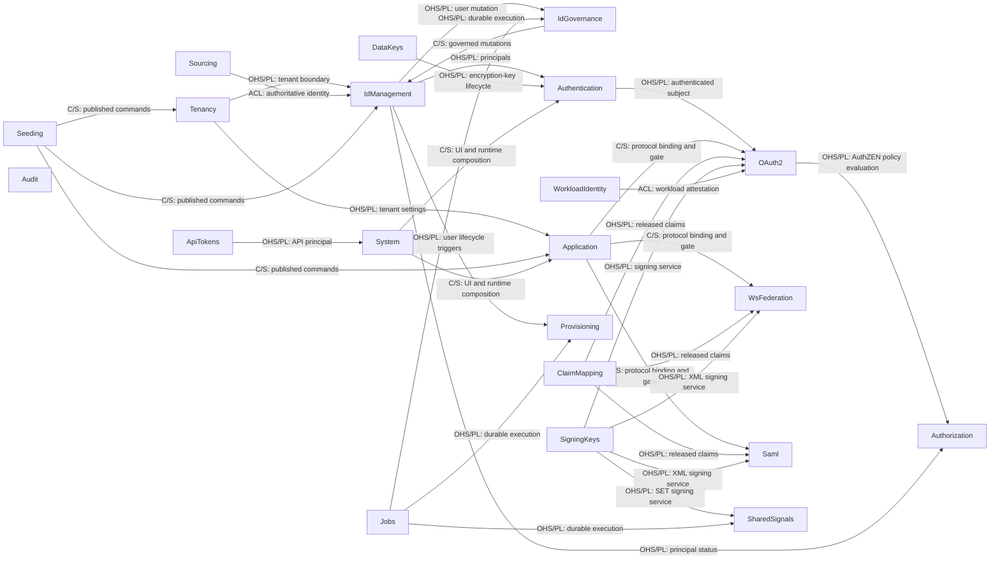

# Whole-System Specification

システム全体が従う仕様と設計を集めた場所である。ここに置くのは、二つ以上の Bounded Context が同じ従い方をしなければならず、Context ごとに違う従い方をすることが選択ではなく欠陥であるものだけである。

1 つの Context が単独で満たし検証できる振る舞いと設計は、ここには置かない。それはその Context の `docs/contexts/<context>/` にある。モデルと API の契約は隣接する TypeSpec が、変更ごとの検討と経緯は work item が持つ。エンドポイント、フィールド、画面といった個別機能の詳細もここには無い。

実装から仕様を引くときは、パッケージ名に対応する Context を見る。Context に属さない技術的な共通機能は `backend/shared/` に集約している。

人が書く製品文書と開発文書はこの `docs/` に集める。機械が読む契約である TypeSpec のソースと、そこから導いた OpenAPI の互換性ベースラインだけが `spec/` にあり、2 つの木は `contexts/<context>/` で対応する。1 つの Context の散文は `docs/contexts/oauth2/`、その契約は `spec/contexts/oauth2/` にある。生成物はすべて追跡しない `spec/generated/` へ出るので、`docs/` の下にあるものはすべて人が書いたものである。

開発ツールのバージョンとリポジトリのコマンドマップはルートの `mise.toml` に集約する。同じ固定バージョンは mise の利用者単位の共有ストアを再利用し、リポジトリ固有の導入手順や別のタスクランナーを併存させない。

## Context Map

この図は DDD の Context Map であり、ドメイン上の関係と統合境界を示す。ソースコードの import 関係を網羅するものではない。矢印は Supplier（上流）から Customer（下流）へ向かう。`OHS/PL` は Published Language を伴う Open Host Service、`C/S` は Customer/Supplier、`ACL` は Anti-Corruption Layer を表す。

ドメインイベントによる関係だけは、図に描かない。発行する Context のほぼすべてが同じ形でこの関係に立ち、組み立て地点にある 1 つの配信点を共有するので、どちらの向きにも import を生まない。矢印を Context の数だけ引いても、区別のある関係が読み取りにくくなるだけである。**ドメインイベントを発行する Context は、それだけで公開イベントの供給側である。** 受け取るのは監査記録を持つ Audit と、アカウントのセキュリティ通知を送る Authentication の 2 つで、どちらも発行元の型ではなく共通のワイヤ表現の上で動く。配信点の機構と、そこで何が契約になるかは [structure.md](structure.md#cross-context-events) が持つ。

次の表が、全 Bounded Context の責務と実装場所の索引である。`Subdomain` は、事業上の差別化とモデルの複雑さによる `Core` / `Supporting` / `Generic` の区分であり、ある Context が今の区分にある理由はその Context の `decisions.md` が、区分が何を左右し何を左右しないかは [design-rules.md](design-rules.md#subdomains-and-design-investment) が持つ。

| Specification context | Subdomain | Go package | Responsibility |
| --- | --- | --- | --- |
| [System](contexts/system/README.md) | Supporting | `backend/cmd/internal/bootstrap`, `backend/shared/http/server_http`, `frontend/` | 起動、実行時機能の選択、経路の組み立て、健全性、フロントエンド UI。 |
| [Tenancy](contexts/tenancy/README.md) | Supporting | `backend/tenancy` | Tenant と realm、テナント単位の設定、ユーザーの属性スキーマ、制御面のテナント管理。 |
| [IdManagement](contexts/identity-management/README.md) | Core | `backend/idmanagement` | User、Group、Agent、自身のプロフィール、アイデンティティのライフサイクル、CEL による動的メンバーシップ規則と再評価。 |
| [IdGovernance](contexts/identity-governance/README.md) | Supporting | `backend/idgovernance` | LifecycleWorkflow のポリシーとオーケストレーション。記録の正は IdManagement に残る。 |
| [Authentication](contexts/authentication/README.md) | Core | `backend/authentication` | 資格情報の検証、MFA、ログインセッション、ステップアップ認証、パスワードの変更とリセット、認証イベント。 |
| [OAuth2](contexts/oauth2/README.md) | Core | `backend/oauth2` | OAuth 2.0 と OIDC のプロトコルエンドポイント、クライアント、同意、トークン、ロールのポリシー。 |
| [Application](contexts/application/README.md) | Supporting | `backend/application` | Application のカタログ、プロトコルのバインディング、割り当て、ポータルの並び順と分類。 |
| [Authorization](contexts/authorization/README.md) | Core | `backend/authorization` | リソース 1 件ごとの細粒度認可。テナントごとの認可モデル（リソース型と関係の定義）、関係タプル、深さ制限つきのグラフ評価、整合トークンを担う。判定の合成そのものは行わず、関係の成否を事実として OAuth2 側の AuthZEN の `Authorizer` ポートへ渡す。 |
| [Audit](contexts/audit/README.md) | Supporting | `backend/audit` | 全 Context にまたがる監査イベントの Read Model。検索属性の登録簿、個人識別情報の変換、管理 API、保持期間を担う。 |
| [ClaimMapping](contexts/claim-mapping/README.md) | Supporting | `backend/claimmapping` | プロトコルに依存しないクレーム開示ポリシー、アイデンティティ属性からクレームへのマッピング、フェイルクローズな検証。 |
| [Provisioning](contexts/provisioning/README.md) | Supporting | `backend/provisioning` | SCIM 2.0 による外向きのプロビジョニング。IdMagic の User と Group を正として、下流の SaaS へライフサイクルを反映する。 |
| [Sourcing](contexts/sourcing/README.md) | Supporting | `backend/sourcing` | 上流の権威からの内向きのアイデンティティ取り込み。取り込み元のバインディング、外部の不変 ID との相関、上流の権威に追随する削除と無効化を担う。取り込み元ごとに 1 つの機能単位として構成し、現在は `sourcing/scim` だけを持つ。 |
| [ApiTokens](contexts/api-tokens/README.md) | Generic | `backend/apitoken` | 管理 API と SCIM API を認証するテナント単位の API アクセストークン（`idmagic_pat_` で始まる）。発行、失効、一覧、スコープの語彙を担う。 |
| [Jobs](contexts/jobs/README.md) | Generic | `backend/jobs` | テナント境界を保つ汎用の非同期ジョブ基盤。 |
| [Seeding](contexts/seeding/README.md) | Supporting | `backend/seeding` | 環境ごとの構成、プレビュー、機密情報を伏せた計画、適用ポリシー。業務データとその永続化は、記録の正を持つ各 Context に残る。 |
| [SigningKeys](contexts/signing-keys/README.md) | Supporting | `backend/signingkeys` | テナントと用途で区切られた鍵のメタデータ、X.509 資格情報、ローテーション、Repository のポート、管理 API と JWKS の HTTP エンドポイント、メモリ、PostgreSQL、Vault の各アダプター。JWT と XML の署名処理はプロトコルのアダプターに残す。 |
| [DataKeys](contexts/data-keys/README.md) | Generic | `backend/datakeys` | MFA の TOTP シードなど、データベースに保存する必要がある可逆なシークレットを保護するテナントごとの `DataEncryptionKey`（DEK）のメタデータとライフサイクル。署名鍵は `SigningKeys`、`EnvelopeCrypto` ポートは `backend/shared/security` にある。 |
| [WsFederation](contexts/ws-federation/README.md) | Generic | `backend/wsfederation` | WS-Federation のパッシブプロファイル、WS-Trust のアクティブ STS、フェデレーションメタデータ、MEX、RP の信頼、リクエスト元テナントによる XML 署名。 |
| [Saml](contexts/saml/README.md) | Generic | `backend/saml` | SAML 2.0 IdP、SP の信頼、メタデータ、SSO と SLO、リクエスト元テナントによる XML 署名。 |
| [WorkloadIdentity](contexts/workloadidentity/README.md) | Core | `backend/workloadidentity` | エージェントの実行環境に対するワークロードアイデンティティフェデレーション。登録済みの外部アテステーション発行者（`WorkloadTrustBundle`）と、`subject` のパターンから `Agent` への対応付け（`AgentWorkloadBinding`）を持つ。OAuth2 のトークン交換はこれを使い、長期シークレットを配布せずに外部の JWT-SVID を IdMagic のトークンへ交換する。 |
| [SharedSignals](contexts/sharedsignals/README.md) | Supporting | `backend/sharedsignals` | OpenID Shared Signals Framework（SSF）と RFC 8417 の Security Event Token（SET）による継続的アクセス評価（CAEP）およびエージェントのほぼ即時の失効。 |

## Documents

| File | Content |
|---|---|
| [product-overview.md](product-overview.md) | 製品が解く問題、想定する利用者、対象外 |
| [structure.md](structure.md) | ディレクトリ、依存の向き、層の構成、アーキテクチャスタイル |
| [design-rules.md](design-rules.md) | サブドメインの区分、Aggregate の境界、モジュールのインターフェース、Seam、型、作用、エラーを評価する設計規則 |
| [glossary.md](glossary.md) | Context を跨いで意味が固定される語 |
| [standards.md](standards.md) | 製品全体が従う外部規範 |
| [api-rules.md](api-rules.md) | 外部に見える契約の規則 |
| [observability.md](observability.md) | 相関、ログ、メトリクス |
| [deployment.md](deployment.md) | 実行単位、配備の構成、可用性 |
| [capacity.md](capacity.md) | サービス目標、参照運用プロファイル、容量算出、縮退順序 |
| [database.md](database.md) | データベース設計方針 |
| [authorization.md](authorization.md) | 主体、スコープ、認可の境界 |
| [threat-model.md](threat-model.md) | 信頼境界とそこで信用しないもの、資産、識別した脅威と応える制御 |
| [scenarios.md](scenarios.md) | Context を跨がないと成り立たない振る舞い |

## Procedure Planes

手順は上の正本文書と混ぜない。開発の進め方、環境、生成、CI、テスト、リリースは [development/](development/) にあり、障害時と手動運用の手順は [runbooks/](runbooks/) にある。リリース固有の告知と移行情報は `releases/changes/` と `releases/upgrades/` に置き、現在状態を説明する正本文書へリンクする。Pull Request の規則はルートの [CONTRIBUTING.md](../CONTRIBUTING.md) が持つ。
