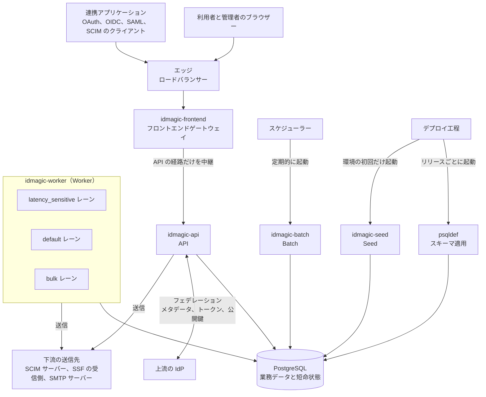
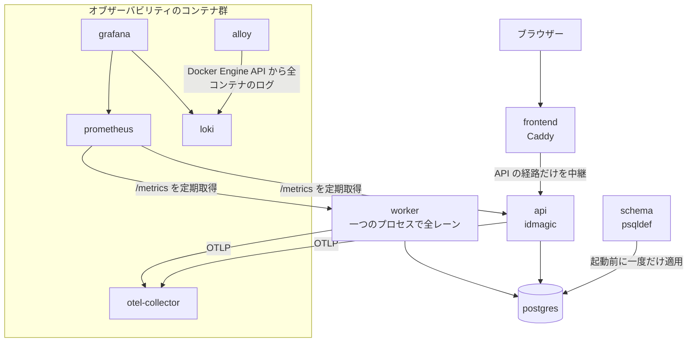
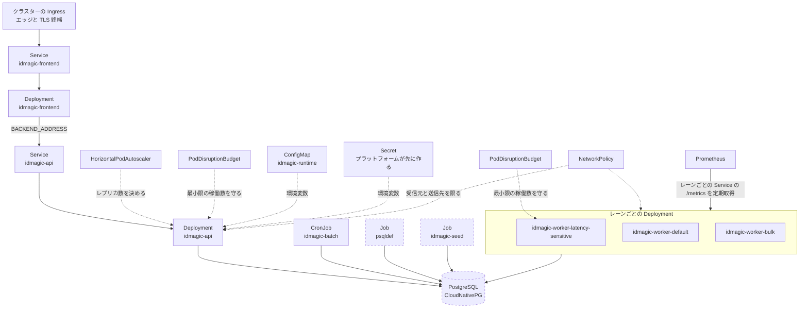
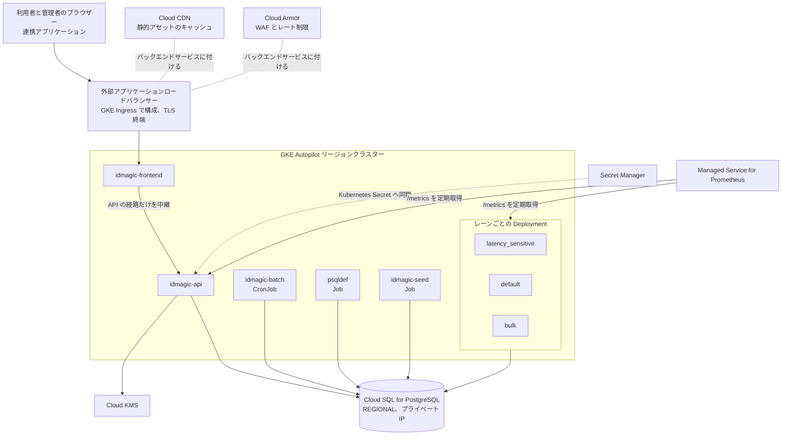

# デプロイメントアーキテクチャ

この文書は、[ランタイムアーキテクチャ](runtime.md)が宣言する実行単位を、どこへ置き、どうつなぐかを示す。
`infra/` の下にある Docker Compose ファイル、Kubernetes マニフェスト、Terraform を、この文書では**構成ファイル**と呼ぶ。

## 共通トポロジー

**共通トポロジー**は、どのデプロイ先でも変わらない構成要素の並びと、通信の向きである。
製品名を含まず、特定のクラウドへ適用した構成も表さない。

図は次の順に読む。

1. 利用者と管理者はブラウザーから、連携アプリケーションは直接、同じエッジへ到達する。
2. エッジは TLS を終端し、リクエストを `idmagic-frontend` へ渡す。
3. `idmagic-frontend` は、フロントエンドの静的アセット（HTML、CSS、JavaScript）を自分で返し、API の経路に当たるリクエストだけを `idmagic-api` へ中継する。
4. `idmagic-api` は PostgreSQL を読み書きし、フェデレーションでは上流の IdP と通信する。
5. `idmagic-worker` は PostgreSQL のキューからジョブを取り出し、下流へ送る。
6. `idmagic-batch` はスケジューラーが、`psqldef` と `idmagic-seed` はデプロイ工程が起動する。いずれも処理を終えると停止する。

### 構成要素

| 構成要素 | 役割 | 保持する状態 | 実行形態 |
| --- | --- | --- | --- |
| エッジ | TLS の終端と、健全な `idmagic-frontend` への負荷分散 | なし | デプロイ先のロードバランサーまたは Ingress |
| `idmagic-frontend` | 静的アセットの配信と、API の経路の中継。両者を同じオリジンに並べ、Cookie と CSRF 対策の前提を保つ | なし | 複数インスタンスの常駐プロセス |
| `idmagic-api` | OAuth2、OIDC、SAML、SCIM、管理 API などの HTTP リクエストの処理 | なし。正となる状態は PostgreSQL に置き、どのインスタンスも同じ判断をする | 複数インスタンスの常駐プロセス |
| `idmagic-worker` | キューに記録された遅延処理と再試行の実行 | PostgreSQL 上のジョブ状態 | 実行レーン（`latency_sensitive`、`default`、`bulk`）ごとの常駐プロセス。台数はレーンごとに決める |
| `idmagic-batch` | 保持期限による削除、署名鍵の更新などの保守処理 | PostgreSQL 上の処理対象 | スケジューラーが処理ごとに起動する一回限りのプロセス |
| `idmagic-seed` | 環境の初期データの投入 | PostgreSQL 上の初期データ | 環境の作成直後に一度だけ起動するプロセス |
| `psqldef` | 宣言的なスキーマ定義の適用 | PostgreSQL のスキーマ | リリースごとに、新しい `idmagic-api` の起動前に一度だけ起動するプロセス |
| PostgreSQL | 業務データ、BLOB、認証セッション、認可コード、ジョブの保持 | IdMagic の全状態 | デプロイ先のマネージドサービスまたはオペレーター |
| 上流の IdP | 外部の OIDC プロバイダーと SAML IdP。`idmagic-api` がメタデータ、トークン、公開鍵を取得する | 対象外 | 外部サービス |
| 下流の送信先 | ユーザーとグループを反映する SaaS の SCIM サーバー、失効を伝える SSF の受信側、メールを送る SMTP サーバー。`idmagic-api` と `idmagic-worker` が送信する | 対象外 | 外部サービス |

レーンを別のプロセスに分けるのは、あるレーンの滞留が別のレーンの処理枠を食わないようにするためである。
ローカル Docker Compose だけは、一つのプロセスで全レーンを処理する。

## デプロイプロファイル

共通トポロジーの各構成要素を、具体の製品とリソースへ割り当てた構成を**デプロイプロファイル**と呼ぶ。
リポジトリは三つを持つ。

| プロファイル | 構成ファイル | 用途 | 検証状況 |
| --- | --- | --- | --- |
| ローカル Docker Compose | `infra/docker/` | ローカル開発、デモ、復元試験 | `mise run check-compose` が構成を検査し、`mise run dev-compose` が日常の開発で起動する |
| 汎用 Kubernetes | `infra/k8s/` | クラスターへのデプロイ | `mise run check-k8s` がレンダリングとスキーマを検査する。適用した環境の稼働実績はリポジトリから確認できない |
| Google Cloud | `infra/k8s/` と GKE 向けの overlay（未作成） | GKE Autopilot とマネージドサービスによる、単一 VPC、単一リージョンの構成 | GKE 向けの構成ファイルはまだ無い。`infra/deploy/gcp/` にあるのは、採らなかった Cloud Run 案のひな型である |

どのプロファイルも選べる候補であり、適用済みまたは検証済みの本番構成ではない。
本番環境がいずれを採用しているかは、このリポジトリだけからは確認できない。

キャパシティ算出の設計入力である[想定ワークロード](../design/performance/capacity.md#想定ワークロード)とは別の概念である。
前者は想定する負荷、デプロイプロファイルは構成要素の置き場所を指す。

### 構成要素の配置先

構成ファイルがまだ無い配置は、末尾に（仮）と書く。

| 構成要素 | ローカル Docker Compose | 汎用 Kubernetes | Google Cloud |
| --- | --- | --- | --- |
| エッジ | 持たない。`frontend` サービスがホストのポートを直接開く | クラスターの Ingress。構成ファイルは宣言しない | GKE Ingress で構成する外部アプリケーションロードバランサー |
| `idmagic-frontend` | `frontend` サービス | Deployment と Service `idmagic-frontend` | 汎用 Kubernetes と同じ |
| `idmagic-api` | `api` サービスの単一インスタンス | Deployment と Service `idmagic-api` | 汎用 Kubernetes と同じ |
| `idmagic-worker` | `worker` サービス。一つのプロセスで全レーンを処理する | レーンごとの Deployment `idmagic-worker-latency-sensitive`、`-default`、`-bulk` | 汎用 Kubernetes と同じ |
| `idmagic-batch` | 常設のサービスを持たない | 保守処理ごとの CronJob | 汎用 Kubernetes と同じ |
| `idmagic-seed` | 持たない。`api` が起動時に `SEED_PROFILE` の投入を一度だけ行う | 初回だけ起動する Job（仮） | 汎用 Kubernetes と同じ（仮） |
| `psqldef` | `schema` サービス | リリースパイプラインが起動する Job（仮） | 汎用 Kubernetes と同じ（仮） |
| PostgreSQL | `postgres` サービス | CloudNativePG オペレーターが管理するクラスター（仮） | Cloud SQL for PostgreSQL |

`idmagic-seed` の実行ファイルは `backend/cmd/idmagic-seed` にあるが、`infra/docker/Dockerfile` が作るイメージには入っていない。
Job として起動するには、イメージへ加える必要がある（仮）。

### プロファイルごとの構成

各図の破線の要素は（仮）であり、構成ファイルがまだ無い。

#### ローカル Docker Compose

一台のホストに全サービスを並べる。
`frontend` サービスの Caddy が同一オリジンを組み立て、エッジは持たない。

`schema` が正常終了するまで、`api` と `worker` は起動しない。
`alloy` はホストのログディレクトリではなく Docker Engine API を読むため、ホストのログドライバーの設定に依存しない。

#### 汎用 Kubernetes

クラウド事業者に依存しない構成である。
エッジはクラスターの Ingress に任せる。

`latency_sensitive` だけが PodDisruptionBudget を持つのは、ノードの退避やロールアウトの最中も、このレーンの処理枠を一つ以上残すためである。

#### Google Cloud

汎用 Kubernetes の構成を GKE Autopilot で動かし、エッジ、データベース、シークレット、鍵をマネージドサービスに任せる。
構成ファイルがまだ無いため、この構成は全体が（仮）である。

各構成要素の説明と、GKE Autopilot を採った判断は[プラットフォーム設計](../design/infrastructure/platform.md#google-cloud)が持つ。

## デプロイの不変条件

どのプロファイルでも守る条件である。

| 不変条件 | 違反時の影響 |
| --- | --- |
| `idmagic-api` を複数インスタンスで動かすなら `PERSISTENCE=postgres` にする | メモリ実装はインスタンス間で状態を共有しないため、認証セッションや認可コードを作ったインスタンス以外へリクエストが届いた時点で、その状態は見つからない |
| `idmagic-api` のレプリカ数は HorizontalPodAutoscaler だけが決め、Deployment には書かない | 両方が値を持つと、構成ファイルを適用するたびにレプリカ数が固定値へ戻され、自動スケールが決めた数と取り合いになる |
| シークレットは環境ごとの外部の Secret から注入し、構成ファイルには値を書かない | Git の履歴へ入った値は後から取り消せず、リポジトリを読める全員が読める |
| ロードバランサーへ受付の停止を伝えてから、処理中のリクエストを終わらせる | 逆の順序では、ロードバランサーがまだ振り分けてくるリクエストを、閉じた受け口が拒否する |
| スキーマの変更は、新旧のアプリケーションが同時に動ける拡張と縮小の段階に分ける | ローリング更新の途中では新旧両方のバージョンが同じデータベースを読み書きするため、片方しか解釈できない形へ一度に変えると、更新中のリクエストが失敗する |

## 関連文書

各プロファイルのコンピューティング、シークレットの注入、スキーマ適用、スケール単位は[プラットフォーム設計](../design/infrastructure/platform.md)、エッジ、ファイアウォールルール、DNS は[ネットワーク設計](../design/infrastructure/network.md)が持つ。
負荷に応じた拡張は[スケーリング・負荷設計](../design/performance/scaling.md)、障害時の配置と切替は[可用性設計](../design/reliability/availability.md)が持つ。
