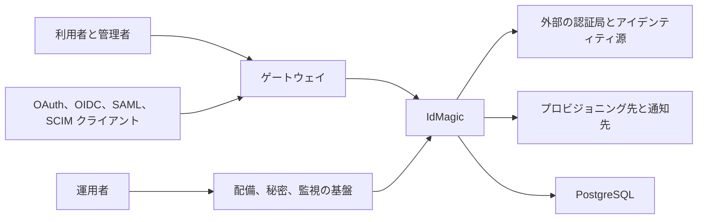

# システムコンテキスト

IdMagic のシステム境界には、ブラウザー UI、公開プロトコルと API、管理 API、永続ジョブとバッチが含まれる。
クラウドの計算資源、データベースサービス、DNS、TLS 証明書、外部のアイデンティティプロバイダーとプロビジョニング先、監視と通知のサービスは境界外にあり、定義した契約を通じて接続する。

| 外部当事者 | IdMagic の責任 | 外部側の責任 |
| --- | --- | --- |
| 利用者とテナント管理者 | 認証、管理、自己サービスの UI と API | 資格情報と登録情報を適切に扱う |
| プロトコルクライアント | 宣言したプロトコル契約を実施する | リダイレクト URI、鍵、クライアント資格情報を管理する |
| 上流の認証局とアイデンティティ源 | レスポンスを検証し、内部モデルへ変換する | 発行した識別子とアサーションの完全性を保つ |
| 下流の受信先 | 再試行と失敗を定義した範囲で扱う | 受理結果と利用可能性を契約どおり返す |
| 基盤提供者と運用者 | 健全性、指標、ログ、配備可能な成果物を提供する | DNS、TLS、秘密、データベース、計算資源、通知経路を構成する |

信頼しない入力と制御は[脅威モデル](../design/security/threat-model.md)、ネットワーク境界は[ネットワーク設計](../design/infrastructure/network.md)が持つ。
