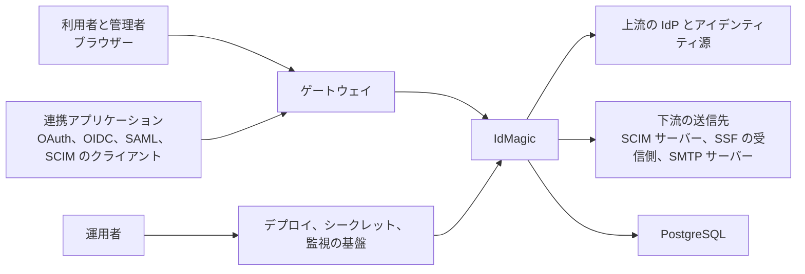

# システムコンテキスト

IdMagic のシステム境界には、ブラウザー UI、公開プロトコルと API、管理 API、永続ジョブとバッチが含まれる。
クラウドのコンピューティング、データベースサービス、DNS、TLS 証明書、上流の IdP とアイデンティティ源、下流の送信先、監視と通知のサービスは境界外にあり、定義した契約を通じて接続する。

| 外部当事者 | IdMagic の責任 | 外部当事者の責任 |
| --- | --- | --- |
| 利用者とテナント管理者 | 認証、管理、セルフサービスの UI と API | 資格情報と登録情報を適切に扱う |
| 連携アプリケーション | 宣言したプロトコルの契約を実施する | リダイレクト URI、鍵、クライアントの資格情報を管理する |
| 上流の IdP とアイデンティティ源 | レスポンスを検証し、内部のモデルへ変換する | 発行した識別子とアサーションの完全性を保つ |
| 下流の送信先 | 再試行と失敗を、定義した範囲で扱う | 受理の結果と可用性を、契約どおりに返す |
| 基盤の提供者と運用者 | ヘルスチェック、メトリクス、ログ、デプロイできる成果物を提供する | DNS、TLS、シークレット、データベース、コンピューティング、通知経路を構成する |

## ゲートウェイとプラットフォームの実体

図の「ゲートウェイ」と「デプロイ、シークレット、監視の基盤」は役割であり、それを担う製品はシステム境界の外で決まる。
[デプロイメントアーキテクチャ](deployment.md)のデプロイプロファイルごとの担い手は、次のとおりである。
構成ファイルがまだ無いものは、末尾に（仮）と書く。

| 役割 | ローカル Docker Compose | 汎用 Kubernetes | Google Cloud |
| --- | --- | --- | --- |
| ゲートウェイ | `frontend` サービスの Caddy が、一つのコンテナで同一オリジンを組み立てる | `idmagic-frontend` の Caddy が同一オリジンを組み立て、TLS の終端はクラスターの Ingress が担う | GKE Ingress で構成する外部アプリケーションロードバランサーが TLS を終端し、その後ろの `idmagic-frontend` が同一オリジンを組み立てる。Cloud CDN が静的アセットをキャッシュする（仮） |
| デプロイの基盤 | Docker Compose | Kubernetes のコントロールプレーンとリリースパイプライン | GKE Autopilot、Artifact Registry、リリースパイプライン（仮） |
| シークレットの基盤 | 構成ファイルに書いた開発用の値 | プラットフォームが先に作る Kubernetes Secret | Secret Manager と Cloud KMS（仮） |
| 監視の基盤 | Prometheus、Loki、Alloy、Grafana のコンテナ | `infra/k8s/monitoring/` の同じ仕組みのマニフェスト、または Prometheus Operator | Managed Service for Prometheus と Cloud Logging（仮）。収集の契約は[オブザーバビリティ設計](../design/observability/README.md)が持つ |

信頼しない入力と制御は[脅威モデル](../design/security/threat-model.md)、ネットワークの境界は[ネットワーク設計](../design/infrastructure/network.md)が持つ。
