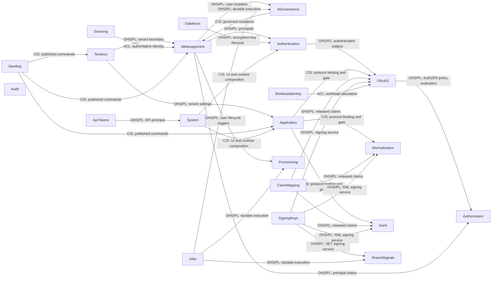

# 論理アーキテクチャ

この文書は、IdMagic を構成する Bounded Context、その責務、Context 間の関係を示す。

## アーキテクチャ様式

IdMagic は、一つの Go モジュール内で Bounded Context のモデル境界を保つ Modular Monolith である。独立したデータ所有権、担当チーム、サービス目標が必要になるまではサービスへ分割しない。ドメイン層とユースケース層は外部技術へ依存せず、ポートを通じて PostgreSQL、HTTP、通知などのアダプターへ接続する。

コードの依存方向と配置は[構造](../../domain/structure.md)で、境界とモジュールを評価する規則は[設計ガイドライン](../application/design-guidelines.md)で定める。
論理単位をプロセスへ割り当てる方法は[ランタイムアーキテクチャ](runtime.md)で定める。
画面は利用者の操作単位で分け、その構成は[フロントエンド設計](../application/frontend.md#機能スライスと-bounded-context-の対応)で定める。

## Context Map

この図はドメイン上の関係と統合境界を示す。
矢印は Supplier から Customer へ向かう。

| 用語 | 意味 |
| --- | --- |
| Supplier | 情報や機能を提供する Context |
| Customer | Supplier の情報や機能を利用する Context |
| Published Language（PL） | Context 間で共有する公開済みの表現 |
| Open Host Service（OHS） | 複数の利用側へ公開する統合用サービス |
| Customer/Supplier（C/S） | 供給側と利用側の協力関係 |
| Anti-Corruption Layer（ACL） | 外部のモデルを自分のモデルへ変換する層 |
| Subdomain | 業務上の問題領域を分けた単位 |
| Core | 製品の差別化に直結する Subdomain |
| Supporting | Core を支える固有の Subdomain |
| Generic | 一般的な解法を利用できる Subdomain |

ドメインイベントの関係は図に描かない。発行する Context は共通のワイヤ表現を使い、組み立て地点にある一つの配信点を通じて Audit と Authentication の通知機構へ事実を渡すため、Context 間の import を生まない。契約となる語彙は [Context 間イベント](../../domain/structure.md#context-間イベント) で定める。

## Context の責務

| 仕様上の Context | Subdomain | Go パッケージ | 責務 |
| --- | --- | --- | --- |
| [System](../../domain/system/README.md) | Supporting | `backend/cmd/internal/bootstrap`, `backend/shared/http/server_http`, `frontend/` | 起動、機能選択、経路の組み立て、健全性、画面 |
| [Tenancy](../../domain/tenancy/README.md) | Supporting | `backend/tenancy` | Tenant と realm、テナント設定、属性スキーマ、制御面の管理 |
| [IdManagement](../../domain/identity-management/README.md) | Core | `backend/idmanagement` | User、Group、Agent、プロフィール、アイデンティティのライフサイクル |
| [IdGovernance](../../domain/identity-governance/README.md) | Supporting | `backend/idgovernance` | LifecycleWorkflow のポリシーとオーケストレーション |
| [Authentication](../../domain/authentication/README.md) | Core | `backend/authentication` | 資格情報、MFA、ログインセッション、ステップアップ、認証イベント |
| [OAuth2](../../domain/oauth2/README.md) | Core | `backend/oauth2` | OAuth 2.0 と OIDC のプロトコル、クライアント、同意、トークン |
| [Application](../../domain/application/README.md) | Supporting | `backend/application` | Application、プロトコルのバインディング、割り当て、表示分類 |
| [Authorization](../../domain/authorization/README.md) | Core | `backend/authorization` | 細粒度認可モデル、関係タプル、グラフ評価、整合トークン |
| [Audit](../../domain/audit/README.md) | Supporting | `backend/audit` | 全 Context の監査イベントを統合する Read Model と保持 |
| [ClaimMapping](../../domain/claim-mapping/README.md) | Supporting | `backend/claimmapping` | プロトコル非依存のクレーム開示ポリシーとマッピング |
| [Provisioning](../../domain/provisioning/README.md) | Supporting | `backend/provisioning` | IdMagic を正とする外向き SCIM プロビジョニング |
| [Sourcing](../../domain/sourcing/README.md) | Supporting | `backend/sourcing` | 上流の権威からの内向きアイデンティティ取り込み |
| [ApiTokens](../../domain/api-tokens/README.md) | Generic | `backend/apitoken` | 管理 API と SCIM API のテナント単位アクセストークン |
| [Jobs](../../domain/jobs/README.md) | Generic | `backend/jobs` | テナント境界を保つ非同期ジョブ基盤 |
| [Seeding](../../domain/seeding/README.md) | Supporting | `backend/seeding` | 環境構成のプレビュー、計画、初期データ適用 |
| [SigningKeys](../../domain/signing-keys/README.md) | Supporting | `backend/signingkeys` | 用途別署名鍵、証明書、ローテーション、提供元アダプター |
| [DataKeys](../../domain/data-keys/README.md) | Generic | `backend/datakeys` | 可逆な秘密情報を保護するテナント別 DEK のライフサイクル |
| [WsFederation](../../domain/ws-federation/README.md) | Generic | `backend/wsfederation` | WS-Federation、WS-Trust、メタデータ、RP の信頼 |
| [Saml](../../domain/saml/README.md) | Generic | `backend/saml` | SAML 2.0 IdP、SP の信頼、SSO、SLO、メタデータ |
| [WorkloadIdentity](../../domain/workloadidentity/README.md) | Core | `backend/workloadidentity` | 外部アテステーションと Agent の対応付け |
| [SharedSignals](../../domain/sharedsignals/README.md) | Supporting | `backend/sharedsignals` | SSF、SET、CAEP による継続的アクセス評価と失効 |
