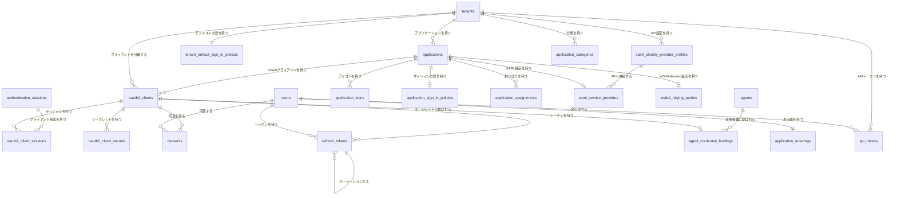
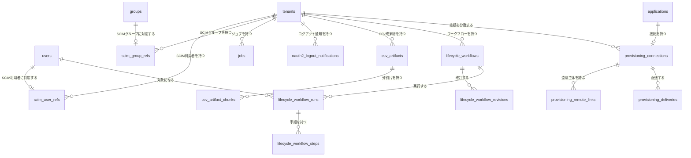
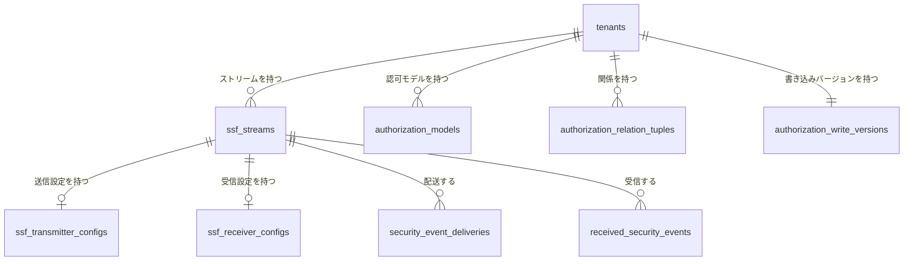

# データベース設計

## スキーマの読み方

現行の物理スキーマは [`infra/schema/postgres.sql`](../../../infra/schema/postgres.sql) が一次情報である。
同ファイルは、WAL に記録する `LOGGED` テーブルと、クラッシュ復旧で内容が消えてもよい `UNLOGGED` テーブルを宣言する。
列、索引、検査制約、外部キー、削除規則の完全な定義は同ファイルで確認する。

本節は、物理スキーマにあるすべてのテーブルを機能領域ごとに、ER 図とテーブル一覧の組で示す。
ER 図はテーブルの存在と外部キーだけを示し、列を描かない。
線は外部キーを表し、図をまたぐ参照先は該当する図にも再掲する。
外部キーのないテーブルも、存在を見落とさないように図へ含める。
多重度は現在の `NULL` 許容と一意性を要約したものであり、最終的な制約は一次情報の SQL に従う。

テーブル一覧は、SQL からは読み取れないテーブルの意味を記す。
各テーブルは、自身が属する図のテーブル一覧に一度だけ現れ、再掲した図の一覧には現れない。

| 列 | 内容 |
| --- | --- |
| テーブル | テーブル名 |
| 役割 | そのテーブルが存在する理由。列の言い換えではない |
| 所有 Context | テーブルへ書き込む Bounded Context。Context に属さない技術基盤は「共通基盤」とする |
| テーブル種別 | `LOGGED` または `UNLOGGED` |
| `tenant_id` 列 | `単独主キー`（`tenant_id` だけで主キーを構成する）、`複合主キーの一部`、`非キー列`（主キーに含まれない列）、`なし`（列が存在しない）。どれを選ぶかは [`tenant_id` の保持区分](#tenant_id-の保持区分)が定める |

`mise run check-schema-tables` は、テーブル一覧のテーブル名の集合、テーブル種別、`tenant_id` 列の区分が `postgres.sql` と一致することを確かめる。
役割と所有 Context は検査の対象外なので、スキーマを変えるときに同じ変更の中で見直す。

### テナント、利用者、認証

```mermaid
erDiagram
    tenants {
    }
    tenant_quotas {
    }
    tenant_usages {
    }
    tenant_brandings {
    }
    notification_templates {
    }
    tenant_branding_assets {
    }
    users {
    }
    mfa_factors {
    }
    mfa_enrollment_bypasses {
    }
    webauthn_credentials {
    }
    recovery_codes {
    }
    trusted_devices {
    }
    notification_preferences {
    }
    known_sign_in_devices {
    }
    signing_keys {
    }
    tenant_data_encryption_keys {
    }
    password_history {
    }
    password_reset_tokens {
    }
    authentication_sessions {
    }
    email_change_tokens {
    }
    tenants ||--|| tenant_quotas : 上限を持つ
    tenants ||--|| tenant_usages : 使用量を持つ
    tenants ||--|| tenant_brandings : 外観を持つ
    tenants ||--o{ notification_templates : 通知文面を持つ
    tenants ||--o{ tenant_branding_assets : 素材を持つ
    tenants ||--o{ users : 利用者を持つ
    tenants ||--o{ mfa_enrollment_bypasses : 例外を持つ
    tenants ||--o{ trusted_devices : 信頼済み端末を持つ
    tenants ||--o{ signing_keys : 署名鍵を持つ
    tenants ||--o{ tenant_data_encryption_keys : データ暗号鍵を持つ
    tenants ||--o{ authentication_sessions : セッションを持つ
    users ||--o{ mfa_factors : 認証要素を持つ
    users ||--o{ mfa_enrollment_bypasses : 適用される
    users ||--o{ webauthn_credentials : 資格情報を持つ
    users ||--o{ recovery_codes : 回復コードを持つ
    users ||--o{ trusted_devices : 端末を信頼する
    users ||--|| notification_preferences : 通知設定を持つ
    users ||--o{ known_sign_in_devices : 既知端末を持つ
    users ||--o{ password_history : 履歴を持つ
    users ||--o{ password_reset_tokens : 再設定する
    users ||--o{ authentication_sessions : サインインする
    users ||--o{ email_change_tokens : メールを変更する
```

| テーブル | 役割 | 所有 Context | テーブル種別 | `tenant_id` 列 |
| --- | --- | --- | --- | --- |
| `tenants` | テナントそのもの。realm、状態、テナント単位で上書きした方針を記録する | Tenancy | `LOGGED` | なし |
| `tenant_quotas` | テナントが作成できるリソースの上限 | Tenancy | `LOGGED` | 単独主キー |
| `tenant_usages` | 上限と照合する現在の使用量。リソースを作成するたびに全件を数えずに上限を判定するための集計 | Tenancy | `LOGGED` | 単独主キー |
| `tenant_brandings` | サインイン画面や通知に使う外観の設定 | Tenancy | `LOGGED` | 単独主キー |
| `notification_templates` | テナントが上書きした通知メールの文面。行がなければ組込みの文面を使う | Tenancy | `LOGGED` | 複合主キーの一部 |
| `tenant_branding_assets` | 外観の設定が参照するロゴとファビコンの画像本体 | Tenancy | `LOGGED` | 非キー列 |
| `users` | 利用者の Aggregate。属性、ロール、ライフサイクルの状態、パスワードハッシュを格納する | IdManagement | `LOGGED` | 非キー列 |
| `mfa_factors` | 利用者が登録した TOTP などの第二要素と、その暗号化済みシークレット | Authentication | `LOGGED` | なし |
| `mfa_enrollment_bypasses` | 管理者が発行する、MFA の登録期限の一回限りの免除。消費、失効、期限切れを記録する | Authentication | `LOGGED` | 非キー列 |
| `webauthn_credentials` | 登録済みの WebAuthn 資格情報（パスキーを含む）と署名カウンター | Authentication | `LOGGED` | なし |
| `recovery_codes` | 第二要素を失ったときに使う回復コードのハッシュ | Authentication | `LOGGED` | なし |
| `trusted_devices` | MFA を省略できる信頼済み端末。Cookie のセレクターと検証子のハッシュで照合する | Authentication | `LOGGED` | 非キー列 |
| `notification_preferences` | 利用者が受信を止めたセキュリティ通知の分類 | Authentication | `LOGGED` | なし |
| `known_sign_in_devices` | 過去にサインインした端末の指紋。未知の端末からのサインインを通知するために使う | Authentication | `LOGGED` | なし |
| `signing_keys` | トークンとアサーションに署名する鍵の世代と公開鍵 | SigningKeys | `LOGGED` | 非キー列 |
| `tenant_data_encryption_keys` | 可逆な秘密情報を暗号化するテナントごとの DEK。ラップ済みの鍵と、バージョンごとの状態を記録する | DataKeys | `LOGGED` | 非キー列 |
| `password_history` | 再利用を禁じるための過去のパスワードハッシュ | Authentication | `LOGGED` | なし |
| `password_reset_tokens` | パスワードの再設定と初期設定のリンクに埋める使い捨てトークンのハッシュ | Authentication | `LOGGED` | なし |
| `authentication_sessions` | サインイン済みのブラウザーセッション。認証時刻、認証方式、MFA の登録待ちと段階的な認証の状態を記録する | Authentication | `LOGGED` | 非キー列 |
| `email_change_tokens` | メールアドレス変更の確認リンクに埋める使い捨てトークンのハッシュ | IdManagement | `LOGGED` | なし |

### フェデレーション、グループ、監査、エージェント

```mermaid
erDiagram
    tenants {
    }
    users {
    }
    identity_provider_connections {
    }
    federated_identities {
    }
    federated_login_attempts {
    }
    federated_response_replays {
    }
    groups {
    }
    group_members {
    }
    dynamic_group_rules {
    }
    tenant_user_attribute_schemas {
    }
    tenant_group_attribute_schemas {
    }
    audit_events {
    }
    authentication_event_buckets {
    }
    tenant_correlation_salts {
    }
    audit_event_search_attributes {
    }
    agents {
    }
    authorization_detail_types {
    }
    mcp_resource_servers {
    }
    workload_trust_bundles {
    }
    agent_workload_bindings {
    }
    agent_revocation_epochs {
    }
    tenants ||--o{ identity_provider_connections : 接続を持つ
    identity_provider_connections ||--o{ federated_identities : 外部主体を結ぶ
    identity_provider_connections ||--o{ federated_login_attempts : 試行を処理する
    users ||--o{ federated_identities : 外部主体と結ばれる
    users ||--o{ federated_login_attempts : 試行に結ばれる
    tenants ||--o{ federated_response_replays : 再送を記録する
    tenants ||--o{ groups : グループを持つ
    groups ||--o{ group_members : メンバーを持つ
    users ||--o{ group_members : 所属する
    groups ||--o| dynamic_group_rules : 動的規則を持つ
    tenants ||--|| tenant_user_attribute_schemas : 利用者属性を定義する
    tenants ||--|| tenant_group_attribute_schemas : グループ属性を定義する
    audit_events ||--o{ audit_event_search_attributes : 検索属性を持つ
    tenants ||--o{ agents : エージェントを持つ
    users ||--o{ agents : 所有する
    tenants ||--o{ authorization_detail_types : 認可詳細型を持つ
    tenants ||--o{ mcp_resource_servers : リソースサーバーを持つ
    tenants ||--o{ workload_trust_bundles : 信頼束を持つ
    tenants ||--o{ agent_workload_bindings : 対応を持つ
    workload_trust_bundles ||--o{ agent_workload_bindings : 主体を許可する
    agents ||--o{ agent_workload_bindings : ワークロードに結ばれる
    agents ||--|| agent_revocation_epochs : 失効世代を持つ
```

| テーブル | 役割 | 所有 Context | テーブル種別 | `tenant_id` 列 |
| --- | --- | --- | --- | --- |
| `identity_provider_connections` | 外部 IdP（OIDC、SAML）との接続設定。クレームの対応付け、アカウント連携と JIT 作成の方針を含む | Authentication | `LOGGED` | 非キー列 |
| `federated_identities` | 外部 IdP の主体と、このテナントの利用者の対応 | Authentication | `LOGGED` | 複合主キーの一部 |
| `federated_login_attempts` | 外部 IdP へ送り出したサインインの state、nonce、PKCE。戻ってきた応答を照合するまで保持する | Authentication | `LOGGED` | 複合主キーの一部 |
| `federated_response_replays` | 受け取った外部 IdP の応答の ID。同じ応答の再送を拒否する | Authentication | `LOGGED` | 複合主キーの一部 |
| `groups` | グループの Aggregate。属性、ロール、所属の決め方（静的、動的）を格納する | IdManagement | `LOGGED` | 非キー列 |
| `group_members` | グループと利用者の所属。手動か動的規則かという所属の由来も記録する | IdManagement | `LOGGED` | なし |
| `dynamic_group_rules` | 動的グループの所属を決める式と、式が参照する属性 | IdManagement | `LOGGED` | 非キー列 |
| `tenant_user_attribute_schemas` | テナントが定義する利用者の拡張属性 | IdManagement | `LOGGED` | 単独主キー |
| `tenant_group_attribute_schemas` | テナントが定義するグループの拡張属性 | IdManagement | `LOGGED` | 単独主キー |
| `audit_events` | 各 Context が発行した監査イベント。追記だけで保持する | Audit | `LOGGED` | 非キー列 |
| `authentication_event_buckets` | 同じ鍵から続く認証失敗を 5 分の時間枠で数える集計。攻撃による急増で監査イベントの行を増やさない | Authentication | `LOGGED` | 複合主キーの一部 |
| `tenant_correlation_salts` | 利用者名や IP アドレスを相関用にハッシュするときのテナントごとのソルト | 共通基盤 | `LOGGED` | 単独主キー |
| `audit_event_search_attributes` | 監査イベントの検索属性の索引。個人識別情報は変換済みの値だけを置く | Audit | `LOGGED` | 非キー列 |
| `agents` | エージェントの Aggregate。所有者、状態、ロールを格納する | IdManagement | `LOGGED` | 非キー列 |
| `authorization_detail_types` | テナントが受け付ける `authorization_details` の型の定義 | OAuth2 | `LOGGED` | 複合主キーの一部 |
| `mcp_resource_servers` | トークンの宛先として登録した MCP のリソースサーバーと、そのスコープ | OAuth2 | `LOGGED` | 非キー列 |
| `workload_trust_bundles` | ワークロード ID のトークンを検証する信頼ドメインと鍵 | WorkloadIdentity | `LOGGED` | 非キー列 |
| `agent_workload_bindings` | 信頼ドメインのワークロード主体とエージェントの対応 | WorkloadIdentity | `LOGGED` | 非キー列 |
| `agent_revocation_epochs` | エージェントの失効世代。世代を進めると、それより前に発行したトークンを受け付けない | SharedSignals | `LOGGED` | 非キー列 |

`audit_events`、`authentication_event_buckets`、`tenant_correlation_salts`、`audit_event_search_attributes` は、監査データの保持や匿名化を独立して制御するため、`tenants` テーブルへの外部キーを置かない。

### アプリケーション、OAuth、SAML、WS-Federation

| テーブル | 役割 | 所有 Context | テーブル種別 | `tenant_id` 列 |
| --- | --- | --- | --- | --- |
| `applications` | アプリケーションの Aggregate。ポータルに並ぶ単位で、プロトコルごとの設定を束ねる | Application | `LOGGED` | 非キー列 |
| `oauth2_clients` | OAuth 2.0 と OIDC のクライアントの登録内容 | OAuth2 | `LOGGED` | 非キー列 |
| `oauth2_client_sessions` | 一つのサインインセッションでトークンを受け取ったクライアント。ログアウトを伝える先を決める | OAuth2 | `LOGGED` | 複合主キーの一部 |
| `oauth2_client_secrets` | ローテーション中に並存するクライアントシークレットのハッシュと期限 | OAuth2 | `LOGGED` | なし |
| `consents` | 利用者がクライアントに与えた同意とスコープ | OAuth2 | `LOGGED` | なし |
| `refresh_tokens` | リフレッシュトークンのハッシュ。ローテーションの系譜をたどって再利用を検知する | OAuth2 | `LOGGED` | なし |
| `agent_credential_bindings` | エージェントと、そのエージェントが使う OAuth クライアントの対応 | IdManagement | `LOGGED` | なし |
| `application_icons` | アプリケーションのアイコン画像本体 | Application | `LOGGED` | なし |
| `application_sign_in_policies` | アプリケーション単位のサインイン方針 | Application | `LOGGED` | なし |
| `tenant_default_sign_in_policies` | 個別のサインイン方針が設定されていないアプリケーションに適用するデフォルトのサインイン方針 | Application | `LOGGED` | 単独主キー |
| `application_assignments` | アプリケーションを使える利用者とグループ、ポータルに表示するかどうか | Application | `LOGGED` | なし |
| `saml_identity_provider_profiles` | SAML IdP として名乗る設定の組。SP ごとに選ぶ | Saml | `LOGGED` | 複合主キーの一部 |
| `saml_service_providers` | SAML SP の登録内容 | Saml | `LOGGED` | 複合主キーの一部 |
| `wsfed_relying_parties` | WS-Federation の Relying Party の登録内容 | WsFederation | `LOGGED` | 複合主キーの一部 |
| `application_orderings` | 利用者ごとの、ポータルでのアプリケーションの並び順 | Application | `LOGGED` | なし |
| `application_categories` | ポータルでアプリケーションをまとめる分類 | Application | `LOGGED` | 複合主キーの一部 |
| `api_tokens` | 管理 API 用に利用者へ発行した長期トークンの記録と失効の状態 | ApiTokens | `LOGGED` | 非キー列 |

### SCIM、ライフサイクル、プロビジョニング、ジョブ

| テーブル | 役割 | 所有 Context | テーブル種別 | `tenant_id` 列 |
| --- | --- | --- | --- | --- |
| `scim_user_refs` | SCIM クライアントが指定した外部 ID と利用者の対応 | Sourcing | `LOGGED` | 複合主キーの一部 |
| `scim_group_refs` | SCIM クライアントが指定した外部 ID とグループの対応 | Sourcing | `LOGGED` | 複合主キーの一部 |
| `jobs` | 非同期ジョブのキュー。リースと再試行の状態を管理する | Jobs | `LOGGED` | 非キー列 |
| `oauth2_logout_notifications` | バックチャネルログアウト通知の一件ごとの配送状態 | OAuth2 | `LOGGED` | 非キー列 |
| `csv_artifacts` | CSV インポートの入力と結果の成果物。本体は分割片に置く | IdManagement | `LOGGED` | 非キー列 |
| `csv_artifact_chunks` | 成果物の本体を分けた断片 | IdManagement | `LOGGED` | なし |
| `lifecycle_workflows` | 利用者の変化を契機に実行するワークフローの定義 | IdGovernance | `LOGGED` | 非キー列 |
| `lifecycle_workflow_revisions` | ワークフロー定義の改訂。実行は開始時の改訂を固定して参照する | IdGovernance | `LOGGED` | 非キー列 |
| `lifecycle_workflow_runs` | 一人の利用者に対するワークフローの一回の実行 | IdGovernance | `LOGGED` | 非キー列 |
| `lifecycle_workflow_steps` | 実行の各手順の結果 | IdGovernance | `LOGGED` | なし |
| `provisioning_connections` | アプリケーションへ利用者とグループを送り出す SCIM 接続の設定と健全性 | Provisioning | `LOGGED` | 非キー列 |
| `provisioning_remote_links` | 送り出した利用者やグループと、接続先での ID の対応 | Provisioning | `LOGGED` | 非キー列 |
| `provisioning_deliveries` | 接続先への一件ごとの配送と、その状態 | Provisioning | `LOGGED` | 非キー列 |

### 再生成可能な認証状態と流量制御

この図のテーブルは、認証リクエスト、短命なコード、再送検知、流量制御など、期限付きで正本の業務状態から切り離せるデータだけを格納する。
大半は `UNLOGGED` テーブルであり、クラッシュ復旧後やフェイルオーバー後に内容が失われ得る。
失われても、利用者が認証をやり直せば済むからである。

`oauth2_access_token_denylist` と `login_throttle_counters` は、同じ種類の短命な状態だが `LOGGED` テーブルにする。
前者が失われると失効させたアクセストークンが期限まで再び通り、後者が失われるとロックアウトが解ける。
どちらもフェイルクローズの前提が崩れるため、WAL への書き込みの費用を払う。

```mermaid
erDiagram
    tenants {
    }
    users {
    }
    oauth2_clients {
    }
    oauth2_authorization_requests {
    }
    oauth2_authorization_codes {
    }
    oauth2_par_requests {
    }
    oauth2_device_codes {
    }
    oauth2_approval_requests {
    }
    oauth2_replay_jtis {
    }
    oauth2_access_token_denylist {
    }
    webauthn_sessions {
    }
    login_throttle_counters {
    }
    endpoint_rate_limit_counters {
    }
    saml_authnrequest_replays {
    }
    tenants ||--o{ oauth2_authorization_requests : 認可要求を持つ
    tenants ||--o{ oauth2_authorization_codes : 認可コードを持つ
    tenants ||--o{ oauth2_par_requests : PAR要求を持つ
    tenants ||--o{ oauth2_device_codes : デバイスコードを持つ
    users ||--o{ oauth2_device_codes : 承認する
    tenants ||--o{ oauth2_approval_requests : 承認要求を持つ
    oauth2_clients ||--o{ oauth2_approval_requests : 承認を求める
    users ||--o{ oauth2_approval_requests : 承認する
    tenants ||--o{ oauth2_replay_jtis : 再送識別子を持つ
    tenants ||--o{ oauth2_access_token_denylist : 拒否対象を持つ
    tenants ||--o{ webauthn_sessions : WebAuthn状態を持つ
    tenants ||--o{ login_throttle_counters : サインイン回数を持つ
    tenants ||--o{ endpoint_rate_limit_counters : API回数を持つ
    tenants ||--o{ saml_authnrequest_replays : SAML再送を持つ
```

| テーブル | 役割 | 所有 Context | テーブル種別 | `tenant_id` 列 |
| --- | --- | --- | --- | --- |
| `oauth2_authorization_requests` | 認可エンドポイントで受け付け、サインインの完了を待っている要求 | OAuth2 | `UNLOGGED` | 非キー列 |
| `oauth2_authorization_codes` | 発行した認可コードと、交換済みかどうか | OAuth2 | `UNLOGGED` | 非キー列 |
| `oauth2_par_requests` | PAR で先に預かった認可要求 | OAuth2 | `UNLOGGED` | 非キー列 |
| `oauth2_device_codes` | デバイス認可フローのコードと承認の状態 | OAuth2 | `UNLOGGED` | 非キー列 |
| `oauth2_approval_requests` | CIBA の承認要求と、クライアントのポーリングの状態 | OAuth2 | `UNLOGGED` | 非キー列 |
| `oauth2_replay_jtis` | 一度だけ受け付ける JWT の `jti`。同じ JWT の再送を拒否する | OAuth2 | `UNLOGGED` | 複合主キーの一部 |
| `oauth2_access_token_denylist` | 失効させたアクセストークンの `jti`。トークンの期限まで拒否する | OAuth2 | `LOGGED` | 複合主キーの一部 |
| `webauthn_sessions` | WebAuthn の登録と認証で発行したチャレンジ | Authentication | `UNLOGGED` | 複合主キーの一部 |
| `login_throttle_counters` | サインイン失敗の回数とロックアウトの期限 | Authentication | `LOGGED` | 複合主キーの一部 |
| `endpoint_rate_limit_counters` | エンドポイントごとの流量制御の回数 | 共通基盤 | `UNLOGGED` | 複合主キーの一部 |
| `saml_authnrequest_replays` | 受け取った SAML AuthnRequest の ID。同じ要求の再送を拒否する | Saml | `UNLOGGED` | 複合主キーの一部 |

### セキュリティイベントと認可関係

| テーブル | 役割 | 所有 Context | テーブル種別 | `tenant_id` 列 |
| --- | --- | --- | --- | --- |
| `ssf_streams` | SSF の送信ストリームまたは受信ストリーム | SharedSignals | `LOGGED` | 非キー列 |
| `ssf_transmitter_configs` | 送信ストリームの配送先と、配送時の認証 | SharedSignals | `LOGGED` | 非キー列 |
| `ssf_receiver_configs` | 受信ストリームで信頼する発行者と鍵 | SharedSignals | `LOGGED` | 非キー列 |
| `security_event_deliveries` | 送信する SET の一件ごとの配送状態と再試行 | SharedSignals | `LOGGED` | 非キー列 |
| `received_security_events` | 受信した SET と、その検証結果、反映した時刻 | SharedSignals | `LOGGED` | 非キー列 |
| `authorization_models` | テナントの関係ベース認可のモデル定義と、そのバージョン | Authorization | `LOGGED` | 非キー列 |
| `authorization_relation_tuples` | リソースと主体の関係 | Authorization | `LOGGED` | 複合主キーの一部 |
| `authorization_write_versions` | 関係を書き込むたびに進む、テナント単位のバージョン番号 | Authorization | `LOGGED` | 単独主キー |

### 所有と書き込みの境界

各 Context は、永続化ポートを通じて自身が担当するテーブルを読み書きする。
現在、次の書き込みだけが所有 Context の外から行われる。

| 書き込む Context | 対象のテーブル | 書き込む内容 |
| --- | --- | --- |
| Application | `oauth2_clients`、`saml_service_providers`、`wsfed_relying_parties` | プロトコル設定の行を、作成したアプリケーションへ結び付ける `application_id` |
| IdManagement | `password_history` | CSV インポートで設定したパスワードの履歴 |
| IdManagement | `audit_events` | CSV インポートの確定と同じトランザクションで記録する監査イベント |
| IdManagement | `jobs` | グループの CSV インポートの確定と同じトランザクションで投入するジョブ |

いずれも、一つのトランザクションで確定しなければ整合が崩れる書き込みである。
これ以外の書き込みを所有 Context の外へ加えるときは、上の一覧へ行を足し、同じトランザクションで確定する必要を説明する。

スキーマを変えるときは、テーブルの追加と削除、外部キーの変更、テーブル種別を確認し、同じ変更の中で ER 図とテーブル一覧を更新する。
変更の進め方は[スキーマ管理](schema-management.md)が定める。

## ポートとアダプター

永続化ポートと Repository の実装は、対応する Context に属する。Context 固有のメモリと PostgreSQL のアダプターは `backend/<context>/{db_memory,db_postgres}` に置き、共有のデータベース接続プール、行の読み取り、トランザクションのヘルパーは `backend/shared/storage/db_postgres` に置く。一時的な状態も PostgreSQL に統合するため、2 種類目のデータストアは運用しない。

`db_postgres` の静的な SQL 文はすべて `sqlc` の入力とし、型安全な Go コードを生成しなければならない。SQL 文字列を直接渡す `Pool.Query` と `Pool.Exec` は、問い合わせの構造が実行時まで決まらず、`sqlc` の型生成を利用できない場合に限って許される。

PostgreSQL の構造をどう変え、どう適用するかは[スキーマ管理](schema-management.md)が定める。

## 列型の選択

列型の選択を一貫させるため、次の規則を適用する。

- **自由形式の文字列、長さ無制限**：`TEXT` を使う。制約のない `varchar` は使わない。
- **長さの上限がある文字列**：`TEXT` + `CHECK (char_length(col) <= N)` を使う。`varchar(N)` は使わない。上限を宣言と別の場所に置かず、他の `CHECK` と同じ書き方で並べるためである。`N` の決め方は [文字列長の上限](../application/api-guidelines.md#文字列長の上限) に従う。フォーマットが固定された識別子は `CHECK (... ~ regex)` で併せて守る。
- **内部で生成する ID**：IdMagic が `spec.NewUUIDv4()` で生成する列は `UUID` とする。Go 側は `string` で保持し、pgx のテキスト用符号器（`RegisterUUIDAsText`）が両者を変換する。
- **外部が決める ID**：`entity_id` や `wtrealm` など、外部が値を決める ID は `TEXT` とする。IdMagic が採番する値ではなく、UUID とも限らないためである。索引の鍵の成分になる場合は、`CHECK (char_length(col) <= N AND octet_length(col) <= M)` を 1 つの制約として置く。同じ列に `CHECK` を 2 つ並べると psqldef の差分が収束しない。
- **時刻**：すべて `TIMESTAMPTZ` とし、マイクロ秒の精度を正とする。スキーマで丸めない。
- **有限の値集合**：`TEXT` + `CHECK (col IN (...))` とする。PostgreSQL の列挙型は避ける。値の追加に `ALTER TYPE` が必要で、[宣言的なスキーマ](schema-management.md#宣言的スキーマ)の差分取りと相性が悪いためである。
- **JSONB**：結合や絞り込みが必要な値、外部キーや一意性の制約の対象になる値などは JSONB の中に置かない。

## `tenant_id` の保持区分

`users.id` と `oauth2_clients.client_id` は全テナントで一意なので、子の行はその鍵だけで親を参照し、**テナント単位の複合外部キーは使わない**。全体で一意な親からテナントを特定できるという理由だけで、子のテーブルへ `tenant_id` 列を重複して置かない。`tenant_id` は、検索、制約、保持期間、監査のいずれかに必要な場合にだけ追加する。

- **テナントに属する Aggregate**：`tenant_id` 列を置く。
- **テナント単位で外部に由来する自然キー**：外部の ID がテナント内でしか一意でないため、`tenant_id` を複合主キーの一部にする（`scim_user_refs` と `scim_group_refs` は `(tenant_id, scim_id)`）。
- **全体で一意な親の子**：全体で一意な鍵（`user_id` と `client_id`）で識別し、テナントごとの検索や保持期間が必要でない限り `tenant_id` 列を置かない。
  - ただし `authentication_sessions` では、不透明な Cookie 値であるセッション ID をすべてのリクエストで照合するため、`tenant_id` をフェイルクローズな多層防御の条件として使う。テナントごとの有効なセッション一覧にも必要である。不透明なトークン、認可コード、チャレンジを鍵とする一時的な認証情報も同様に扱う。

## 可逆な秘密情報のエンベロープ暗号

データベースに保存する必要がある可逆なシークレットは、平文で保存しない。差し替え可能な `EnvelopeCrypto` プロバイダーのマスターキーでテナントごとの `DataEncryptionKey`（DEK）をラップし、その DEK で各シークレットを AEAD 暗号化する。AEAD と鍵セットの処理は [Tink](https://developers.google.com/tink) に委ね、nonce、認証タグ、追加認証データの組み立てを自作しない。追加認証データには `(tenant, context, table, record id, field)` と DEK のバージョンを使う。このため、暗号文を別のテナント、テーブル、フィールドへ複製しても復号できない。

- `EnvelopeCrypto`（Tink を使う AEAD と鍵セットのポート、および OpenBao と平文鍵セットによるマスターキー提供元のアダプター）は、`certificates_mtls`、`passwords_argon2id`、`tokens_jose` と並べて `backend/shared/security` に置く。これは業務上の Aggregate ではなく、技術上の共通機能である。
- `backend/datakeys`（`DataKeys` Context）は、ラップされた DEK のメタデータとライフサイクル（初期化、ローテーション、無効化、破棄）だけを担い、`EnvelopeCrypto` ポート自体は定義しない。`SigningKeys` が `transit/sign` を暗号化、復号、データ鍵の機能から分離しているのと同じ構成である。
- ローテーションでは新しい DEK のバージョンを以後の書き込み用に有効化し、直前のバージョンを復号可能な `retiring` のまま残す。`backend/jobs` の `JobKind` と `HandlerRegistry` に登録した再開可能な再暗号化ジョブがすべての参照を移行し終えた後にだけ、古いバージョンを破棄できる。`FieldMigrator` ポート（`backend/datakeys/ports`）により、各 Context は自身の一括再暗号化処理と残件数の算出を登録する。これにより、`DataKeys` はこのポートを利用する Context のスキーマへ依存しない。ローテーションは登録された移行処理ごとにジョブを自動投入し、いずれかの移行処理が残件を報告している間はラップされた DEK の消去を拒否する。
- アンラップに失敗した場合、プロバイダーへ到達できない場合、追加認証データが一致しない場合、または改ざんを検知した場合は、フェイルクローズで復号を拒否する。呼び出し元は平文へフォールバックしたり、項目を読み飛ばしたりしない。
- マスターキーの提供元は OpenBao（Vault Transit 互換の HTTP API）である。開発環境とローカル環境では Tink の平文鍵セットを使うため、OpenBao は不要である。提供元は設計上差し替え可能である。
- 唯一の HTTP 接点は、読み取り専用で `system_admin` に限定した `GET /api/admin/data-keys/health`（`backend/datakeys/handlers_http`）である。各テナントで有効な DEK のバージョンとステータス、マスターキー提供元の名前と到達性を報告し、鍵素材は決して返さない。ローテーション、無効化、破棄は内部操作とし、管理用エンドポイントを公開しない。

署名鍵の秘密鍵はこの規範の対象ではない。`signing_keys.private_jwk` に何が入るかは `KeyProvider` の選択で決まり、その規範は [SigningKeys Context の判断](../../domain/signing-keys/decisions.md) が定める。

DEK の破棄では `tenant_data_encryption_keys` の行を削除せず、`wrapped_dek` を `NULL` にして暗号学的に消去する。これにより、鍵素材を失った後も `active`、`retiring`、`disabled`、`destroyed` というライフサイクルの履歴を参照できる。
