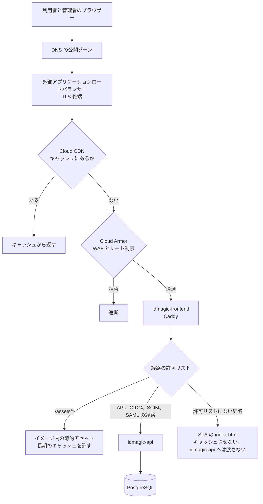
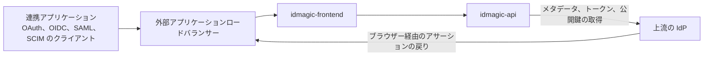
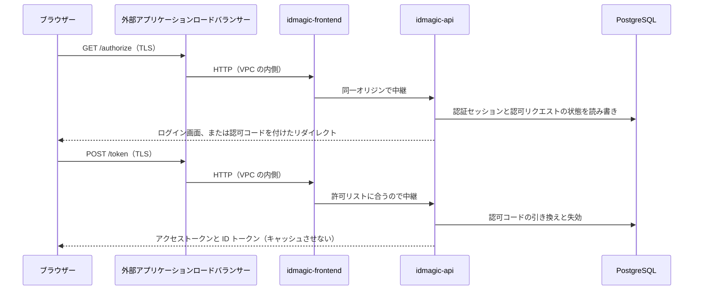
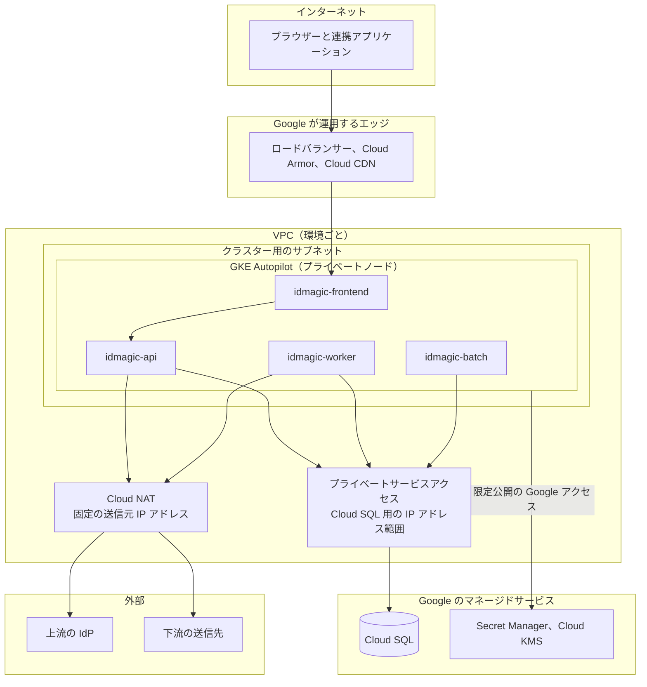

# ネットワーク設計

## 対象範囲

エッジでの TLS 終端と L7 の防御、セグメンテーション、ファイアウォールルール、Egress、DNS と証明書、リスナーの公開範囲、管理アクセスを扱う。
コンピューティング、ストレージ、IAM、構成管理は[プラットフォーム設計](platform.md)、デプロイプロファイルの一覧と構成要素は[デプロイメントアーキテクチャ](../../architecture/deployment.md)が持つ。
信頼境界と攻撃者の想定そのものは[脅威モデル](../security/threat-model.md)が持つ。

表の内容の末尾にある（仮）の意味と、設定値をこの文書に書かない理由は、[プラットフォーム設計](platform.md#この文書の読み方)と同じである。
IP アドレスの範囲、ポート番号、ルールの優先度、暗号スイートの指定は、構成ファイルに書いた値を正しい値とする。

## 共通の不変条件

デプロイプロファイルによらず守る二つである。

**リバースプロキシで同一オリジンへ集約する。**
エッジで TLS を終端し、静的な画面と `idmagic-api` を同じオリジンの下に並べる。
`idmagic-api` を別のオリジンで直接公開すると、Cookie の送信条件、CSRF 対策、セキュリティヘッダー、経路の判定の前提が崩れる。
同じ制御を別の場所で実装しない限り、直接公開しない。

**Egress をデフォルトで拒否する。**
`idmagic-api` と `idmagic-worker` の送信先は、DNS、PostgreSQL、上流の IdP、下流の送信先、OTLP の受け口に限る。
列挙した以外への送信を拒否することで、侵入された後にデータを外へ持ち出す経路と、外部を呼び出す経路を狭める。
外部連携を有効にする環境では、必要な宛先を明示的に追加する。

どのリソースがこの二つを実施するかは、プロファイルごとに異なる。

## 受信の流れ

ブラウザーからのリクエストが、どこで何を判定されるかを示す。
Google Cloud プロファイルの構成で描く。

Cloud Armor のバックエンドセキュリティポリシーは、キャッシュに無かったリクエストにだけ適用される。
キャッシュするのは静的アセットだけなので、`idmagic-api` へ向かうリクエストはすべて Cloud Armor の判定を通る。

ロードバランサーは経路で振り分けず、すべてのリクエストを `idmagic-frontend` へ送る。
`idmagic-api` へ渡す経路を判定するのは、Caddy の設定にある許可リストだけである。
ローカル Docker Compose と汎用 Kubernetes のマニフェストは、ロードバランサー、Cloud CDN、Cloud Armor に当たるものを持たず、`idmagic-frontend` から始まる。

連携アプリケーションも同じエッジと `idmagic-frontend` を通る。

経路の許可リストは Caddy の設定ファイルを正とする。
一覧をこの文書へ書き写すと、設定を変えた時点で食い違う。

## トークン取得の流れ

認可リクエストとトークンリクエストが、それぞれどの境界を越えるかを示す。

TLS を終端した後は、VPC の内側を暗号化せずに運ぶ。
内側へ入れるものを絞ることが前提になるので、その絞り方を「セグメンテーションと信頼境界」と「ファイアウォールルール」で決める。

## エッジの TLS 終端と L7 の防御

| 項目 | 内容 |
| --- | --- |
| 同一オリジンへの集約 | 静的な画面と `idmagic-api` を同じオリジンで公開する。どの経路を `idmagic-api` へ渡すかは、Caddy の設定にある許可リストが決める |
| HTTP の扱い | TCP/80 へのリクエストを HTTPS へ恒久的にリダイレクトし、暗号化していないリクエストをアプリケーションへ渡さない（仮） |
| TLS のバージョン | 1.2 を最低とし、1.3 を優先する。1.2 を受け付けなくする判断は、クライアントの実態を確かめてから行う（仮） |
| セキュリティヘッダー | `idmagic-api` のレスポンスにはアプリケーションの境界ミドルウェアが付け、静的な HTML には Caddy の設定が付ける。重複しないよう分担している |
| WAF のルール | 既知の攻撃パターンに対する標準のルールセットを有効にする。最初は遮断せず記録だけする期間を置き、その後に遮断へ切り替える。最初から遮断すると、正常なクライアントを遮断したことに気付けない（仮） |
| エッジでのレート制限 | 送信元の IP アドレスごとの上限をエッジに置く。アプリケーション側の流量制御はテナントと資格情報の単位で働くため、アプリケーションへ届く前に落とす層とは目的が違う（仮） |
| キャッシュより前での遮断 | 未決定。キャッシュから返る応答にはバックエンドセキュリティポリシーが効かない。静的アセットへのアクセスも IP アドレスや国で遮断する必要があれば、エッジセキュリティポリシーを追加する |
| 大量のアクセスへの防御 | 帯域を埋める攻撃はロードバランサーが吸収する範囲に任せ、アプリケーション層の枯渇はエッジのレート制限で防ぐ（仮） |
| 静的アセットのキャッシュ | ファイル名に内容のハッシュを含むアセットは長期間キャッシュさせ、HTML はキャッシュさせない。どちらも Caddy の設定が `Cache-Control` ヘッダーで指定する。テナントごとに応答が変わるため、キャッシュのキーに Host を含める |
| Cloud CDN がキャッシュする応答 | 送信元の `Cache-Control` ヘッダーに従うモードにし、キャッシュしてよいと明示した応答だけを保持する。`idmagic-api` の応答をデフォルトでキャッシュさせないためで、トークンやセッションを含む応答が別の利用者へ返る事故を防ぐ（仮） |
| バックエンドへの接続 | ロードバランサーは `idmagic-frontend` の Pod へ直接つなぐ（コンテナネイティブの負荷分散）。ノードを経由しないため、Pod の入れ替わりが振り分けに直接反映される（仮） |
| ロードバランサーのヘルスチェック | Caddy が自分で返す静的な経路を使い、`/health` は使わない。`/health` は `idmagic-api` へ中継されるため、データベースの障害で全 `idmagic-frontend` が異常と判定され、静的な画面まで返せなくなる（仮） |
| 接続ドレイン | ロードバランサーの接続ドレインの時間を、アプリケーションの `DRAIN_GRACE_PERIOD_SECONDS` 以上、Pod の終了猶予未満にする。この順でないと、ロードバランサーがリクエストを送り続けているのにアプリケーションが受付を閉じる（仮） |

Google Cloud では、GKE の Ingress リソースから外部アプリケーションロードバランサーが作られ、TLS を終端する。
FrontendConfig が SSL ポリシーと HTTPS へのリダイレクトを、BackendConfig が Cloud Armor のセキュリティポリシー、Cloud CDN、接続ドレイン、ヘルスチェックを、`idmagic-frontend` のバックエンドサービスへ指定する。
Gateway API を使わないのは、GKE の Gateway API のクラスが Cloud CDN に対応していないためである。

優先して受け付けるリクエストの決め方と、縮退の順序は[スケーリング・負荷設計](../performance/scaling.md)が持つ。

## セグメンテーションと信頼境界

クラスターのノードは公開 IP アドレスを持たず、外への通信を Cloud NAT に集める。
集めることで、連携先へ伝えられる固定の送信元 IP アドレスが一つになる。

| 項目 | 内容 |
| --- | --- |
| VPC の数 | 環境ごとに一つ。開発環境の通信が本番のデータベースへ届く経路を作らない（仮） |
| VPC を持つプロジェクト | 共通のネットワーク用プロジェクトを Shared VPC のホストにして VPC を作り、環境のプロジェクトをサービスプロジェクトとしてつなぐ。IP アドレスの範囲とファイアウォールルールを変更する場所が一つにまとまる（仮） |
| サブネット | 単一のリージョンにクラスター用を一つ置き、ノード、Pod、Service に互いに重ならない範囲を割り当てる（VPC ネイティブのクラスター）。構成要素の間の境界は NetworkPolicy が引くので、構成要素ごとにサブネットを分けても境界は増えない（仮） |
| IP アドレスの範囲 | 環境ごとに重ならない連続した範囲を、同じ大きさで割り当てる。等間隔にしておけば、環境を足すときに次の範囲が計算で決まる。実際の範囲は、既存の社内ネットワークと突き合わせてから決める（仮） |
| マネージドサービスへの接続 | Cloud SQL へは、プライベートサービスアクセスで割り当てた範囲のプライベート IP アドレスで接続し、公開 IP アドレスを無効にする。Secret Manager と Cloud KMS へは、限定公開の Google アクセスで、公開 IP アドレスを持たずに到達する（仮） |
| Kubernetes 内の隔離 | NetworkPolicy が、構成要素ごとに受信元と送信先を限る |
| 構成要素間の呼び出しの制限 | `idmagic-api` への受信を、`idmagic-frontend` の Pod からだけ許可する。汎用 Kubernetes の NetworkPolicy がそう書いており、GKE でもそのまま効く。ただしラベルで相手を選ぶ制限であり、相手の身元を暗号技術で確かめてはいない |
| VPC 内の通信の暗号化 | 未決定。TLS 終端より内側は、内側へ入れるものを絞る前提で暗号化していない。その前提を変えるなら、合わせて決める。GKE Ingress は、ロードバランサーからバックエンドへの HTTPS にも対応している |

## ファイアウォールルール

許可する通信を列挙し、それ以外は拒否する。
構成要素の単位では NetworkPolicy が、クラスターと組織の単位では Google Cloud の階層型ファイアウォールポリシーと VPC ファイアウォールルールが、この表を実施する。

| 方向 | 送信元 | 宛先 | プロトコルとポート | 動作 | 目的 |
| --- | --- | --- | --- | --- | --- |
| 受信 | インターネット | ロードバランサー | TCP/443 | 許可 | インターネットから到達できる唯一の宛先 |
| 受信 | インターネット | ロードバランサー | TCP/80 | HTTPS へリダイレクト | 暗号化していないまま扱わず、古いブックマークも切らない |
| 受信 | ロードバランサーとそのヘルスチェック | `idmagic-frontend` | TCP、アプリケーション用のポート | 許可 | エッジを通った通信に限る |
| 受信 | `idmagic-frontend` | `idmagic-api` | TCP、アプリケーション用のポート | 許可 | 許可リストを通った中継だけ |
| 受信 | メトリクスの収集元 | `idmagic-api`、`idmagic-worker` | TCP、`/metrics` を返すポート | 許可 | Prometheus などが `/metrics` を定期的に取得する（スクレイプする）ため |
| 受信 | 運用者 | 管理用のエンドポイント | 身元を確認した TCP/443 | 許可 | 常設の踏み台サーバーを置かない |
| 受信 | それ以外すべて | `idmagic-frontend`、`idmagic-api`、`idmagic-worker` | すべて | 拒否 | L7 の防御と経路の許可リストを迂回させない |
| 送信 | `idmagic-api`、`idmagic-worker`、`idmagic-batch` | PostgreSQL | TCP/5432 | 許可 | |
| 送信 | `idmagic-api`、`idmagic-worker`、`idmagic-batch` | DNS | UDP/53、TCP/53 | 許可 | |
| 送信 | `idmagic-api`、`idmagic-worker`、`idmagic-batch` | GKE のメタデータサーバー | GKE が指定するアドレスとポート | 許可 | GKE のみ。Workload Identity で IAM のトークンを取得するため |
| 送信 | `idmagic-api`、`idmagic-worker` | Secret Manager、Cloud KMS | TCP/443 | 許可 | 起動時と、鍵を使うとき |
| 送信 | `idmagic-api`、`idmagic-worker` | OTLP の受け口 | TCP、コレクターのポート | 許可 | |
| 送信 | `idmagic-api`、`idmagic-worker` | 上流の IdP、下流の送信先 | TCP/443、SMTP のポート | 宛先を列挙して許可 | 連携を有効にした環境だけ |
| 送信 | `idmagic-api`、`idmagic-worker`、`idmagic-batch` | それ以外すべて | すべて | 拒否 | 侵入後の持ち出しと外部の呼び出しを狭める |

ルールを評価する順序は、この表の並びと同じにする。
拒否の行を許可の行より先に置くと、後ろの許可に届かない。
デフォルトの拒否は、どの許可にも当たらなかったときの動作として最後に置く。
優先度の番号は構成ファイルが持つ。

送信元と宛先は、IP アドレスではなくワークロードの識別子で書く。
NetworkPolicy ではラベルセレクター、VPC ファイアウォールルールではノードのサービスアカウントで指定する。
IP アドレスで書くと、Pod とノードが入れ替わるたびにルールが古くなる。
IP アドレスで書くしかないのは、インターネットからの受信、ロードバランサーとヘルスチェックの送信元の範囲、Cloud SQL に割り当てた範囲、外部の連携先の四つである。
VPC ファイアウォールルールはノードに適用されるため、同じノードで動く構成要素を区別できない。
構成要素の間を区別するのは NetworkPolicy だけである。

### プロファイルごとの実施の仕組み

| 制御 | ローカル Docker Compose | 汎用 Kubernetes | Google Cloud |
| --- | --- | --- | --- |
| L7 の受信の判定（WAF、レート制限） | なし | Ingress コントローラーの機能による | Cloud Armor のセキュリティポリシーを、BackendConfig で `idmagic-frontend` のバックエンドサービスへ付ける（仮） |
| クラスターへの受信の制限 | なし | クラスターの運用基盤による | VPC ファイアウォールルールで、ノードへの受信をロードバランサーとヘルスチェックの送信元の範囲に限る（仮） |
| 構成要素への受信元の制限 | なし（同じネットワーク内で相互に到達可能） | NetworkPolicy の `ingress` を `podSelector` で書く | 汎用 Kubernetes と同じ NetworkPolicy を、Dataplane V2 が実施する |
| 構成要素からの送信先の制限 | なし | NetworkPolicy の `egress` | 汎用 Kubernetes と同じ NetworkPolicy。クラスターの外の宛先は `ipBlock` で書く（仮） |
| 組織全体で外せない禁止 | なし | なし | 階層型ファイアウォールポリシーをフォルダーに適用する。環境のプロジェクトの管理者は外せない（仮） |
| マネージドサービスへのアクセスの範囲 | なし | なし | VPC Service Controls のサービス境界で、境界の外からのアクセスを拒否する（仮） |
| 構成要素間の呼び出しの許可 | なし | NetworkPolicy の `podSelector` | 汎用 Kubernetes と同じ |
| データベースへの接続 | 同じネットワーク内 | NetworkPolicy の `egress` を、PostgreSQL の Pod のラベルで書く | NetworkPolicy の `egress` を、Cloud SQL に割り当てた範囲の `ipBlock` で書く（仮） |
| 外向き通信の宛先の制限 | なし | NetworkPolicy の `egress` | ノードは Cloud NAT を経て外へ出る。宛先は NetworkPolicy の `egress` で限り、VPC ファイアウォールルールの送信でノード単位の上限を重ねる（仮） |

Google Cloud では三段に重ねる。
階層型ファイアウォールポリシーは、環境のプロジェクトを操作できる人でも外せない禁止を置く。
VPC ファイアウォールルールは、ノードとクラスターへの出入りを限る。
NetworkPolicy は、クラスターの中で構成要素どうしを分ける。
上の段は下の段を変更できる人から守るためにあり、下の段は上の段では区別できない単位を分けるためにある。

ローカル Docker Compose がどの制御も持たないのは、一台のホストの同じネットワークに全サービスを置いているからである。
この構成はファイアウォールルールの表を満たさない。

## Egress の制御

| 項目 | 内容 |
| --- | --- |
| 許可する送信先 | 共通の不変条件が列挙する範囲に限る |
| 汎用 Kubernetes での実施 | NetworkPolicy が DNS と PostgreSQL だけを許可する。外部連携を使う環境では宛先を明示的に追加する |
| Google Cloud での実施 | プライベートノードのクラスターにしてノードに公開 IP アドレスを与えず、外への通信を Cloud NAT に集める。宛先は NetworkPolicy の `egress` で構成要素ごとに限り、`ipBlock` で書く（仮） |
| GKE で追加する宛先 | Cloud SQL に割り当てた範囲、限定公開の Google アクセスの宛先、GKE のメタデータサーバー。汎用 Kubernetes の NetworkPolicy は DNS と PostgreSQL の Pod しか許可しないため、そのままでは Workload Identity でトークンを取得できない（仮） |
| 送信元 IP アドレスの通知 | Cloud NAT に固定の IP アドレスを確保し、受信側で許可してもらうために連携先へ伝える（仮） |
| 宛先の列挙の管理 | 未決定。連携先が増えるたびにルールを足す運用になる。ドメイン名で許可する仕組みを入れるかを決めていない |

## DNS と証明書の管理責任

DNS レコード、公開証明書、ワイルドカード証明書の発行と更新は、IdMagic ではなくデプロイ基盤が行う。
`TENANT_BASE_DOMAIN` を使うのは、ワイルドカードの DNS レコードと証明書を用意し、キャッシュのキーに Host を含めた場合に限る。
発行者 URL、Cookie のスコープ、WebAuthn の RP ID はドメイン名の構成に依存するため、切り替えを単なる DNS の変更として扱わない。

| 項目 | 内容 |
| --- | --- |
| テナントへの到達形式 | パス形式かサブドメイン形式である。どちらを選ぶかで、発行者 URL、Cookie のスコープ、WebAuthn の RP ID が決まる |
| デフォルトの到達形式 | パス形式にする。ワイルドカードの DNS レコードと証明書を用意せずに始められ、後からサブドメイン形式を追加できる（仮） |
| 公開 DNS ゾーンの置き場所 | 共通のネットワーク用プロジェクトの Cloud DNS に公開ゾーンを作り、環境ごとに別のドメイン名を同じゾーンの下に置く（仮） |
| 内部の名前解決 | VPC 内の限定公開ゾーンで、マネージドサービスの名前を解決する（仮） |
| パス形式の証明書 | GKE Ingress の Google マネージド証明書（ManagedCertificate）に、発行と更新を任せる（仮） |
| サブドメイン形式の証明書 | Google マネージド証明書はワイルドカードに対応しないため、サブドメイン形式を使う環境だけ、自分で管理するワイルドカード証明書を用意し、Ingress に事前共有証明書として付ける。更新は自分で行う（仮） |
| 証明書の有効期限の監視 | 自分で管理する証明書は、有効期限が近づいた時点で通知する。Google マネージド証明書は自動更新に任せ、更新の失敗だけを通知する（仮） |

## リスナーと公開範囲

構成要素が待ち受けるリスナーと、そこへ到達できる相手である。
ポート番号は構成ファイルを正とし、ここでは役割と公開範囲を書く。

| 構成要素 | リスナー | 提供内容 | 許可する接続元 |
| --- | --- | --- | --- |
| `idmagic-frontend` | アプリケーション用 1 個 | 静的アセット、`idmagic-api` への中継 | エッジ。インターネットから到達できる唯一のリスナー |
| `idmagic-api` | アプリケーション用 1 個 | プロトコル、管理 API、ヘルスチェック、`/metrics` | `idmagic-frontend`、メトリクスの収集元 |
| `idmagic-worker` | メトリクス専用 1 個 | `/metrics` | メトリクスの収集元 |
| `idmagic-batch` | なし（一回実行して終了するため） | なし | なし |

この表で効いている判断は二つある。

**`idmagic-api` は `/metrics` を専用のリスナーに分けていない。**
アプリケーションと同じリスナーで `/metrics` を返す。
分けない代わりに、`/metrics` を公開経路から外す役目を Caddy の許可リストが負う。
現在の許可リストは `/health` を含み `/metrics` を含まないため、エッジからは `/metrics` に到達しない。
この許可リストへ `/metrics` を加えると、その時点で認証の無い公開経路に載る。

**`idmagic-worker` はアプリケーションのエンドポイントを持たない。**
メトリクス専用のリスナーだけを持つため、受信を許可する相手はメトリクスの収集元だけになる。
ヘルスチェックのエンドポイントも持たないので、`livenessProbe` と `readinessProbe` を設定しない。

## 管理アクセス

運用者が本番環境を操作する経路を、操作ごとに決める。

| 操作 | アクセス経路 | 監査記録 |
| --- | --- | --- |
| 構成ファイルの適用 | パイプラインのみ。人による本番への直接適用は禁止（仮） | パイプラインの実行履歴 |
| クラスターのコントロールプレーンへの接続 | IAM で許可したプリンシパルのみ。公開 IP アドレスからの接続は禁止。人には閲覧権限のみ付与（仮） | Kubernetes の監査ログ |
| メトリクスとログの閲覧 | 認証を必須とする監視基盤の画面。エッジを通る無認証の経路には載せない | なし |
| データベースへの直接接続 | クラウド事業者の認証プロキシ経由のみ（仮） | 接続と実行した SQL の監査ログ |
| コンテナへのシェル接続 | なし（distroless の非 root イメージはシェルとパッケージ管理を含まない） | なし |
| デバッグ用のエフェメラルコンテナの追加 | 本番では禁止。追加する権限を人に付与しない（仮） | 権限付与の変更の監査ログ |
| シークレットの値の閲覧 | 人には禁止。復旧が必要な場合は新しい値へ入れ替える（仮） | 権限付与の変更の監査ログ |
| 緊急時の権限の昇格 | 期限付きで付与し、期限到来時に自動で解除（仮） | 昇格の申請と付与の監査ログ |

コンテナにシェルで入る経路が無いことは、攻撃面を狭める選択であると同時に、障害の調査をログ、メトリクス、トレースだけで済ませられるようにしておく要求でもある。
コンテナに入って調べる手段が無いので、[オブザーバビリティ設計](../observability/README.md)が定める信号が足りなければ、調査はそこで行き詰まる。

常設の踏み台サーバーを置かないのは、置いた時点から、その接続鍵を誰が持っているかを管理し続ける必要が生じるためである。
身元を確認するプロキシであれば、接続のたびにその時点の権限を評価できる。

## プロファイルの比較

上の各節を、プロファイルごとに並べ直したものである。

| 観点 | ローカル Docker Compose | 汎用 Kubernetes | Google Cloud |
| --- | --- | --- | --- |
| エッジ | `frontend` サービスのコンテナがホストのポートを開く | `idmagic-frontend` の Service。エッジを担う Ingress はマニフェストに含まない | GKE Ingress で構成する外部アプリケーションロードバランサー。Cloud Armor が L7 の防御を、Cloud CDN がキャッシュを担う（仮） |
| TLS 終端 | 終端しない。HTTP のまま動く | クラスターの Ingress またはロードバランサーが終端する | ロードバランサーが終端する。SSL ポリシーは FrontendConfig が指定する（仮） |
| 静的アセット | Caddy が同一オリジンで返す | 同じ Caddy のイメージが返す | 同じ Caddy のイメージが返し、Cloud CDN がキャッシュしてよい応答だけを保持する（仮） |
| 名前解決 | `localhost` と、Compose のサービス名 | クラスター内は Service 名。公開ドメイン名はデプロイ基盤が管理する | Cloud DNS。マネージドサービスの名前は限定公開ゾーンで解決する（仮） |
| 証明書 | なし | デプロイ基盤が発行と更新を行う | パス形式は Google マネージド証明書、サブドメイン形式は自分で管理するワイルドカード証明書（仮） |
| ファイアウォールルール | なし | NetworkPolicy | 階層型ファイアウォールポリシー、VPC ファイアウォールルール、NetworkPolicy の三段（仮） |
| Egress | 制限しない | DNS と PostgreSQL だけを許可する | Cloud NAT に集め、固定の送信元 IP アドレスを持つ。宛先は NetworkPolicy で限る（仮） |
| 管理アクセス | 監視基盤の画面が、認証なしでホストのポートに開く。開発専用の構成 | `idmagic-worker` の `/metrics` はメトリクス専用の Service にあり、NetworkPolicy が取得元を限る | コントロールプレーンは IAM で許可したプリンシパルだけ。データベースは認証プロキシを経由する（仮） |

ローカル Docker Compose はこの文書の規則の例外ではなく、規則を満たさない構成である。
TLS を終端せず、ファイアウォールルールを持たず、監視基盤の画面を認証なしでホストに開くため、開発者の手元を超えて公開しない。

## 確定していない項目の扱い

**採用するデプロイ先が決まると確定できる項目**：VPC の数と、VPC を持つプロジェクト、サブネットと IP アドレスの範囲、マネージドサービスへの接続方法、Egress の集約、公開 DNS ゾーンと証明書の置き場所、コントロールプレーンと運用者の接続経路。

**このリポジトリの中で確定できる項目**：GKE 向けの overlay に書く NetworkPolicy と Probe、HTTP のリダイレクト、TLS の最低バージョン、WAF のルールと切り替えの手順、エッジでのレート制限、Cloud CDN がキャッシュする応答、ロードバランサーのヘルスチェックと接続ドレイン、デフォルトの到達形式、データベースへの直接接続の記録、エフェメラルコンテナの禁止。
外部からの入力を待っておらず、構成ファイルへ書けば確定する。

**未決定のまま残る項目**：キャッシュより前での遮断、VPC 内の通信の暗号化、宛先の列挙の管理。
一つ目は静的アセットへのアクセスを遮断する要求が出てから、二つ目は VPC の内側へ入れるものを絞る前提が変わるときに、三つ目は連携先の数が増えてから判断する。
