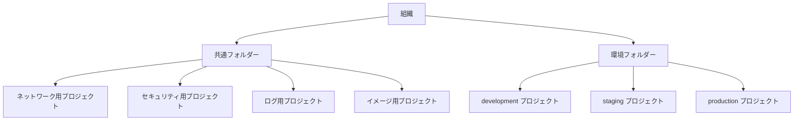
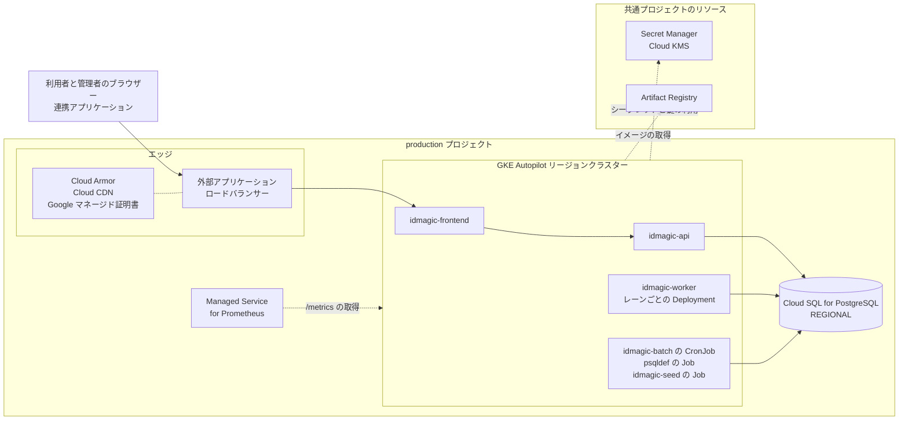

# プラットフォーム設計

## 対象範囲

IdMagic を動かすコンピューティング、ストレージ、コンテナイメージのサプライチェーン、サービスアカウントと IAM、リリース、構成管理を扱う。
デプロイプロファイルの一覧と構成要素の配置先は[デプロイメントアーキテクチャ](../../architecture/deployment.md)が持ち、この文書は配置先の表を繰り返さない。
エッジ、セグメンテーション、ファイアウォールルール、DNS は[ネットワーク設計](network.md)が持つ。

## この文書の読み方

表の内容の末尾にある（仮）は、この文書が選んだ案であり、構成ファイルにもコードにもまだ反映していないことを示す。
適用済みでも検証済みでもなく、採用する環境が決まった時点で、この案を出発点にして確定する。
（仮）の付かない行は、構成ファイルかコードがすでにそう実装している。
選ぶ材料がまだ無い行は「未決定」と書き、何が揃えば選べるかを添える。

レプリカ数、リソースの要求量と上限、タイムアウト、終了猶予のような設定値は、構成ファイルに書いた値を正しい値とし、この文書には書かない。
同じ値を二か所に書くと、片方だけが更新されて食い違うためである。
その代わりに、この文書から構成ファイルを機械的に生成することはできない。

## プロファイルの比較

同じ観点を同じ順序で並べ、プロファイル間の差を読み取れる形にする。

| 観点 | ローカル Docker Compose | 汎用 Kubernetes | Google Cloud |
| --- | --- | --- | --- |
| コンピューティング | 一台のホストの Docker。各サービスは一インスタンス | 構成要素ごとの Deployment と、保守処理ごとの CronJob | GKE Autopilot のリージョンクラスター。汎用 Kubernetes のマニフェストに GKE 向けの overlay を重ねる（仮） |
| データベース | `postgres` コンテナ。永続ボリュームを宣言しないため、停止すると状態が消える | CloudNativePG オペレーターが管理する PostgreSQL クラスター（仮） | Cloud SQL for PostgreSQL。可用性の種類を REGIONAL（同期スタンバイ）にする |
| スキーマ適用 | `schema` サービスが `psqldef` を実行し、その正常終了を `api` と `worker` の起動条件にする | リリースパイプラインが `psqldef` の Job を起動し、完了を待ってから Deployment を更新する（仮） | 汎用 Kubernetes と同じ（仮） |
| スケール単位 | 独立に増減できる単位を持たない | `idmagic-api` は HorizontalPodAutoscaler、`idmagic-worker` はレーンごとの Deployment、`idmagic-frontend` はレプリカ数で増減する。PodDisruptionBudget が、計画的な中断のときに最小限の稼働数を守る | 汎用 Kubernetes と同じ。ノードの台数は Autopilot が Pod の要求量から決める |
| メトリクスとログの収集経路 | `api` と `worker` が OTLP をコレクターへ送る。Prometheus が `/metrics` を定期的に取得する。Alloy が Docker Engine API から全コンテナのログを読んで Loki へ送る | `infra/k8s/monitoring/` が同じ仕組みのマニフェストを持つ。Alloy は DaemonSet で動き、`/metrics` の取得は Prometheus または ServiceMonitor が行う | `/metrics` は Managed Service for Prometheus が PodMonitoring の指定に従って取得し、コンテナの標準出力は Cloud Logging が収集する（仮）。シグナルの契約は[オブザーバビリティ設計](../observability/README.md)が持つ |

ステートフルな基盤は、どのプロファイルでも PostgreSQL 一つである。
業務データ、BLOB、認証セッション、認可コード、ジョブのような短命状態を同じデータベースへ置き、二つ目のステートフル基盤を持たない。

汎用 Kubernetes のマニフェストは、現在 PostgreSQL とスキーマ適用を持たない。
これでは、このプロファイルだけでは IdMagic が動かない。
PostgreSQL を CloudNativePG で、スキーマ適用と初期データ投入を Job で持たせ（仮）、プロファイル単体で動く状態を目標にする。

## 命名とラベル

名前の組み立て規則は、構成ファイルが持つ個々の名前と違い、構成要素を足すたびに再び使う決定である。

| 命名対象 | 命名規則 |
| --- | --- |
| Kubernetes の Deployment と Service | `idmagic-<構成要素>`。レーンを持つ構成要素は `idmagic-worker-<レーン>` とし、レーン名のアンダースコアをハイフンに置き換える |
| Kubernetes のラベルセレクター | `app.kubernetes.io/name` に製品名、`app.kubernetes.io/component` に構成要素を置き、この二つだけで選ぶ。`part-of` は選択に使わない |
| Kubernetes の Secret | `idmagic-<環境>-<用途>-secrets`。用途は `worker` とそれ以外で分ける |
| コンテナのポート | 番号ではなく名前で参照する。アプリケーション用は `http`、メトリクス専用は `metrics` |
| クラウドのリソース | `idmagic-<環境>-<リソースの種類>`（仮） |
| リソースのラベル | `env`、`component`、`owner`、`cost-center` の四つ（仮） |

ポートを名前で参照するのは、Probe と Service の定義がポート番号の変更に追従しなくて済むようにするためである。

## Probe（コンテナの状態確認）

Kubernetes がコンテナの状態を確かめるために、`idmagic-api` の HTTP エンドポイントを定期的に呼ぶ。

| Probe | エンドポイント | 判定内容 | 失敗時の動作 |
| --- | --- | --- | --- |
| `startupProbe` | `/startupz` | 初期化の完了 | 成功するまで他の Probe を評価しない。失敗が続くとコンテナを再起動する |
| `livenessProbe` | `/livez` | プロセスの応答可否。データベースの障害だけでは失敗としない | コンテナの再起動 |
| `readinessProbe` | `/readyz` | 新しいリクエストの処理可否。データベースに到達できなければ失敗とする | Service の振り分け先からの除外。コンテナは再起動しない |

`livenessProbe` と `readinessProbe` を分けるのは、データベースの障害でコンテナの再起動を繰り返させないためである。
再起動してもデータベースへ到達できない状態は直らず、復旧した時点で全インスタンスの再接続が一度に押し寄せる。

`idmagic-worker` はアプリケーションの HTTP エンドポイントを持たないため、`livenessProbe` と `readinessProbe` を持たない。
`idmagic-frontend` は現在 Probe を持たない。
静的な経路で `readinessProbe` を設定する（仮）。

## リソース階層と環境の分離

Google Cloud ではプロジェクトが IAM、課金、API の有効化の単位になるため、プロジェクトの境界がそのまま環境の分離の単位になる。

| 項目 | 内容 |
| --- | --- |
| 環境の数と名前 | `development`、`staging`、`production` の三つ。同じ構成ファイルを段階的に適用するには、本番と同じ形をした手前の環境が要る。Kubernetes の `overlays/` は現在 `dev` と `prod` だけを持つ（仮） |
| 環境の分離単位 | 環境ごとに別のプロジェクトへ置く。プロジェクトをまたいで権限を与える操作が明示的になり、開発用の権限が本番へ及ばない（仮） |
| 共通プロジェクト | ネットワーク、セキュリティ（鍵とシークレット）、ログ、コンテナイメージの四つを、環境から独立したプロジェクトへ置く（仮） |
| フォルダー構成 | 組織の下に共通フォルダーと環境フォルダーを置く。組織のポリシー制約と階層型ファイアウォールポリシーを、フォルダーの単位で適用できる（仮） |
| 組織のポリシー制約 | 外部 IP の付与、サービスアカウント鍵の作成、バケットの一般公開、データベースの公開 IP を組織全体で禁じ、共有先を自組織のドメインに限る。いずれも一度作られると後から気付きにくい（仮） |
| リソースのラベル | 全リソースへ「命名とラベル」の四つのラベルを付け、費用をこの四つの軸で分けられるようにする（仮） |
| リージョンの数 | 単一のリージョンに閉じる。構成要素とデータベースの間の遅延と、リージョン間の転送料金を抑えるためである |
| 使うリージョン | `asia-northeast1`。主な利用者の所在と、データを国内に置く要求への備えによる（仮） |
| 複数リージョンへの展開 | 行わない。[可用性設計](../reliability/availability.md)が広域障害への要求を出していない段階で二重化すると、費用と切り替えの複雑さだけが増える。単一リージョンの構成はリージョン全体の障害に耐えられない、という制限を受け入れる（仮） |

## コンピューティング

| 項目 | 内容 |
| --- | --- |
| 構成要素ごとのリソースの要求量と上限 | `base/` が要求量と上限を宣言し、`overlays/prod/` が本番用の値で上書きする。GKE Autopilot は要求量に対して課金し、CPU とメモリの比が許容範囲から外れた要求は Autopilot が引き上げる |
| 要求量の根拠 | [キャパシティ設計](../performance/capacity.md#サイジング計算式)のサイジング計算式の前提値を暫定で使う。計算式が求める「レプリカあたりの持続可能な処理率」はまだ測っていないため、ステージングで測った後に置き換える（仮） |
| リクエストのタイムアウト | ロードバランサーのバックエンドのタイムアウトを、アプリケーションのリクエストのタイムアウトより長くする。短いと、アプリケーションが処理を続けているのにクライアントへ 502 が返る（仮） |
| コンピューティングクラス | Autopilot の汎用のコンピューティング プラットフォームから始める。負荷の傾向を測るまで、性能重視のクラスや Arm へ寄せる根拠がない（仮） |
| ノードの OS とパッチの適用 | 汎用 Kubernetes では、クラスターを提供する運用基盤が行う。GKE Autopilot では Google が行う |
| クラスターのアップグレード | リリースチャネルは Regular とし、メンテナンスの時間枠を利用の少ない時間帯に置く。自動アップグレードを止めると、サポート期間の切れたバージョンに取り残される（仮） |
| 終了猶予 | `terminationGracePeriodSeconds` が Pod の終了猶予を決め、アプリケーションの `DRAIN_GRACE_PERIOD_SECONDS` はその内側に収める |

## コンテナイメージのサプライチェーン

ソースコードからコンテナイメージを作り、各環境で起動するまでの経路である。

| 項目 | 内容 |
| --- | --- |
| バックエンドのベースイメージ | `gcr.io/distroless/static-debian12:nonroot`。CGO を使わない静的リンクの実行ファイルを置くため、シェルとパッケージ管理を持たないイメージで足りる |
| バックエンドのイメージに入る実行ファイル | `idmagic`、`idmagic-worker`、`idmagic-batch` の三つ。`idmagic-seed` は入っていない |
| フロントエンドのイメージ | Caddy のイメージに、ビルドした静的アセットを入れる |
| レジストリ | Kubernetes のマニフェストは `ghcr.io` を参照する。Google Cloud では Artifact Registry を使う（仮） |
| 本番でのイメージの指定 | ダイジェストで固定する。`overlays/prod/` はダイジェストのプレースホルダーを持ち、リリースパイプラインが置き換える |
| 環境間でのイメージの同一性 | 同じダイジェストのイメージを三つの環境へ順に適用し、環境ごとにビルドし直さない（仮） |
| 脆弱性スキャン | レジストリへ登録した時点で走査し、深刻度が最も高い未修正の脆弱性を含むイメージは本番へ進めない。`mise run audit-dependencies` は依存関係を調べるが、イメージのレイヤーは走査しない（仮） |
| 署名と検証 | パイプラインがイメージに署名し、クラスターは署名の検証を通ったイメージだけを起動する。検証しないと、レジストリへ直接登録されたイメージを区別できない（仮） |
| ビルドの来歴 | どのコミットとどのビルダーから作ったかを記録した来歴を、イメージに添付する（仮） |

## サービスアカウントと IAM

| 項目 | 内容 |
| --- | --- |
| コンテナの実行ユーザー | root 以外で動かし、特権の昇格を禁じ、ルートファイルシステムを読み取り専用にし、Linux capability をすべて外す |
| Kubernetes の ServiceAccount | 汎用 Kubernetes のマニフェストでは全構成要素が `idmagic` を共有する。Kubernetes API を呼ばないため、Role を与えない |
| Google Cloud での実行主体 | GKE の Workload Identity Federation で、Kubernetes の ServiceAccount をそのまま IAM のプリンシパルとして扱う。構成要素ごとに権限を分けるため、GKE 向けの overlay で ServiceAccount を構成要素ごとに分ける（仮） |
| 運用者への権限の付与 | 職務ごとのグループ（基盤管理、運用、閲覧）へ与え、個人へ直接与えない。異動のたびに個人単位で外し忘れる余地を残さないためである（仮） |
| 本番への変更の経路 | 本番のリソースを変更するのはパイプラインのサービスアカウントだけとし、人には閲覧権限を与える。障害対応で人が変更するときは、期限付きで権限を昇格し、その記録を残す（仮） |
| パイプラインの認証 | 外部の CI からは Workload Identity 連携で認証し、長期間有効なサービスアカウント鍵を作らない。鍵ファイルは一度配ると回収できない（仮） |

構成要素ごとに必要な操作は次のとおりである。
どのロールがその操作を与えるかはクラウド事業者ごとに違うが、必要な操作の集合は変わらない。

| 構成要素 | データベース権限 | シークレット権限 | 鍵の権限 | その他の権限 |
| --- | --- | --- | --- | --- |
| `idmagic-api` | 接続、読み取り、書き込み | 起動時に使うシークレットの読み取り | 署名鍵を外部の鍵管理に置く場合の暗号化と復号 | なし |
| `idmagic-worker` | 接続、読み取り、書き込み | 起動時に使うシークレットの読み取り | 同上 | 下流の送信先の資格情報の読み取り |
| `idmagic-batch` | 接続、読み取り、書き込み | 起動時に使うシークレットの読み取り | 同上 | なし |
| `idmagic-seed` | 接続、書き込み | 起動時に使うシークレットの読み取り | なし | なし |
| `idmagic-frontend` | なし | なし | なし | なし（静的アセットはイメージに含む） |
| `psqldef` | DDL の実行 | DDL 用の接続情報の読み取り | なし | なし |

表で分けた目的は、与えない操作を明示することにある。
どの構成要素も、シークレットの一覧、鍵の作成と破棄、他の構成要素のシークレットを必要としない。
`idmagic-frontend` はデータベースへ接続する必要がまったくない。

運用者と管理者がプラットフォームをどう操作できるかは、ここでいう権限の話である。
IdMagic 自身が提供する認可は[認可設計](../security/authorization.md)が持ち、混ぜない。

## ストレージ

| 項目 | 内容 |
| --- | --- |
| 業務データと短命状態 | すべて PostgreSQL に置く。構造は[データベース設計](../data/database.md)が持つ |
| BLOB | PostgreSQL に置く。オブジェクトストレージを二つ目の状態の置き場所にしない |
| 静的アセット | `idmagic-frontend` のイメージへビルド時に入れ、オブジェクトストレージへ別に置かない。キャッシュは[ネットワーク設計](network.md)が持つ |
| 保存データの暗号化 | データベースを、共通プロジェクトの鍵による顧客管理の暗号鍵（CMEK）で暗号化する（仮）。鍵の管理主体とローテーションは[シークレットと鍵の設計](../security/secrets.md)が決める |
| Kubernetes Secret の保護 | クラスターのアプリケーション層のシークレット暗号化を有効にし、共通プロジェクトの鍵で暗号化する。Secret Manager から同期した値がクラスター内にも置かれるためである（仮） |
| ストレージの増加 | 自動増加を有効にし、使用率が上限に近づいた時点で通知する。自動増加だけに任せると、増え続ける原因に気付かない（仮） |
| 保持期間 | 値は各 Context の仕様と[品質要求](../../requirements/quality.md)が、値を変えるときの順序は[データライフサイクル設計](../data/lifecycle.md#保持期間を変えるときの順序)が持つ |

## バックアップと復旧

| 項目 | 内容 |
| --- | --- |
| 取得の手段 | `infra/backup/` のスクリプトが `pg_dump` の出力と、検証用のチェックサムを作る |
| 定期実行 | マネージドサービスの自動バックアップを日次で取り、ポイントインタイムリカバリを併用する。スクリプトは、論理的な取り出しと復元試験のために残す（仮） |
| 保管先 | 本番のバックアップを別のリージョンへ複製する。リージョン全体の障害では、同じリージョンの複製ごと失われる（仮） |
| 保持期間 | 一か月を超える期間を保持する。データの論理的な破損は発生から時間が経って気付くため、直近の数日分では戻る先が残らない（仮） |
| 復元試験 | 月に一度、取得したバックアップから復元し、`mise run restore-drill` と同じ手順で確かめる（仮） |
| 復旧目標と復旧の手順 | [リカバリ設計](../reliability/recovery.md)が持つ。目標値は未検証である |

## スキーマ適用と初期データ投入

| 項目 | 内容 |
| --- | --- |
| スキーマを適用する時点 | デプロイ工程で、新しい `idmagic-api` を動かす前に適用する。アプリケーションの起動時には適用しない。レプリカが同時に起動する環境では、起動時の適用が同じ DDL を並行して実行してしまう |
| 破壊的な変更 | `--enable-drop` を使わない。列や表の削除は、拡張と縮小に分けた縮小の段階として明示的に行う |
| 適用する主体と権限 | パイプラインだけが使う DDL 用のロールで適用し、アプリケーションの接続ロールには DDL の権限を与えない。同じロールを使うと、アプリケーションの欠陥がスキーマまで壊せる（仮） |
| Kubernetes での適用 | リリースパイプラインが `psqldef` のイメージで Job を起動し、完了を確かめてから Deployment を更新する（仮） |
| 初期データの投入 | 環境を作った直後に `idmagic-seed` の Job を一度だけ起動する。そのためにバックエンドのイメージへ `idmagic-seed` を加える（仮）。ローカルでは `api` が起動時に `SEED_PROFILE` で投入する |

## シークレットと鍵

| 項目 | 内容 |
| --- | --- |
| 起動時シークレットの供給元 | プロファイルごとの供給元、プロセスへの渡り方、保存時の保護は[シークレットと鍵の設計](../security/secrets.md#起動時シークレットの供給元)が持つ |
| 署名鍵の保管先 | デフォルトはデータベースである。全レプリカで JWKS が一致する代わりに、秘密鍵が平文でデータベースとそのバックアップに入る |
| 鍵素材を外部の鍵管理に置く場合 | 条件は[シークレットと鍵の設計](../security/secrets.md)が持つ |
| ローテーション | [シークレットと鍵の設計](../security/secrets.md)が持つ |
| 鍵とシークレットの置き場所 | 共通のセキュリティ用プロジェクトへ集め、環境のプロジェクトの実行主体に IAM で利用を許可する。環境ごとに置くと、誰がどの鍵を使えるかを環境の数だけ確かめることになる（仮） |
| Secret Manager からクラスターへの同期 | 未決定。アプリケーションは環境変数でシークレットを読むため、ファイルとしてマウントする方式はそのままでは使えない。Kubernetes Secret へ同期する仕組みの選定が要る |

## リリース

| 項目 | 内容 |
| --- | --- |
| 更新の方式 | Deployment のローリング更新である |
| 環境へ適用する順序 | `development`、`staging`、`production` の順に、同じダイジェストのイメージを適用する（仮） |
| 段階的な公開 | 本番では新しいバージョンのレプリカを少数だけ先に起動し、エラー率とレイテンシーを確かめてから全体を置き換える（仮） |
| ロールバック | 一つ前のリリースのダイジェストを適用する |
| スキーマとアプリケーションの順序 | [デプロイメントアーキテクチャ](../../architecture/deployment.md#デプロイの不変条件)の不変条件が定める |
| 停止時の処理 | ロードバランサーへ受付の停止を伝えた後、処理中のリクエストとジョブに猶予を与えてから終了する |

## 構成管理

`infra/k8s/base/` は環境に共通のマニフェスト、`overlays/` は環境ごとの差分、`infra/docker/` はローカルの構成を持つ。
アプリケーションの設定項目、デフォルト値、検証規則は、コードから生成する [`CONFIGURATION.md`](../../../CONFIGURATION.md) が示す。
シークレットとイメージのダイジェストはデプロイ時に注入し、Git の構成ファイルへは書かない。

| 項目 | 内容 |
| --- | --- |
| Kubernetes のマニフェストの管理 | Kustomize の base と overlay で管理する |
| GKE 向けの差分 | `infra/k8s/overlays/` に GKE 向けの overlay を足す。中身は「Google Cloud」の節の「汎用 Kubernetes のマニフェストから変える点」の表のとおり（仮） |
| クラウドのリソースの管理 | Terraform を使う。クラスター、VPC、Cloud SQL、IAM、証明書、ポリシーを Terraform が持ち、クラスターの中身は Kubernetes のマニフェストに任せる（仮） |
| Terraform の状態ファイルの保管 | 共通プロジェクトの Cloud Storage バケットに置き、オブジェクトのバージョンを残す。同時に適用しないための排他も同じ仕組みで行う（仮） |
| Terraform の分割単位 | 組織とプロジェクトを作る単位、共通リソースの単位、環境ごとのワークロードの単位の三つに分け、単位の間を出力と入力で結ぶ。担当する人の範囲と一致させるためである（仮） |
| 適用前の検査 | 変更の差分を出した後、組織のポリシー制約に反する構成をパイプラインが拒否する。`mise run check-k8s` はレンダリングとスキーマを検査するが、方針への違反は調べない（仮） |
| クォータと上限 | リージョンの vCPU、Pod と Service に割り当てる IP アドレスの範囲、データベースの接続数を、サイジング計算式が求める値より余裕を持って確保する。HPA の上限まで Pod が増えたときに、ノードかアドレスが先に尽きると、上限の値が意味を失う（仮） |

## 監査とセキュリティ監視

| 項目 | 内容 |
| --- | --- |
| アプリケーションのメトリクス、ログ、トレース | [オブザーバビリティ設計](../observability/README.md)が収集と保持の契約を持つ |
| 監査ログの集約 | 組織の集約ログシンクで、全環境の管理操作の記録を共通のログ用プロジェクトのログバケットへ転送し、一年を超えて保持する。環境のプロジェクトに置いたままだと、その環境の権限を得た人が消せる（仮） |
| 構成の変化の検知 | 公開設定と権限付与の変更を監査ログから検出して通知する。組織のポリシー制約で拒否できる構成は事前に止まるが、制約の外の構成は後から気付くしかない（仮） |
| 実行中のコンテナの監視 | 未決定。実行時の脅威検知を入れるかを決めていない。distroless の非 root イメージと読み取り専用のファイルシステムで攻撃面を狭めた後に、残る検知の必要性を評価する |

脅威と攻撃者の想定は[脅威モデル](../security/threat-model.md)が持つ。
この文書が扱うのは、その想定に対して基盤側で何を監視するかである。

## 費用

Google Cloud プロファイルの本番環境一つに対する見積もりである。
実測値ではなく、採用する環境と契約が決まるまで確定しない。

GKE Autopilot の汎用ワークロードは、Pod が要求する CPU とメモリの量に対して課金される。
`overlays/prod/` の要求量を、最小のレプリカ数で合計すると次のとおりである。

| 構成要素 | Pod あたりの要求量 | 最小レプリカ数 | 要求量の合計 |
| --- | --- | --- | --- |
| `idmagic-api` | 1 vCPU、1 GiB | 3（HPA の下限） | 3 vCPU、3 GiB |
| `idmagic-frontend` | 0.25 vCPU、0.25 GiB | 3 | 0.75 vCPU、0.75 GiB |
| `idmagic-worker-latency-sensitive` | 0.25 vCPU、0.25 GiB | 2 | 0.5 vCPU、0.5 GiB |
| `idmagic-worker-default` | 0.25 vCPU、0.25 GiB | 1 | 0.25 vCPU、0.25 GiB |
| `idmagic-worker-bulk` | 0.25 vCPU、0.5 GiB | 2 | 0.5 vCPU、1 GiB |
| 合計 | | | 5 vCPU、5.5 GiB |

| 費用項目 | 月額（USD） | 算出根拠 |
| --- | --- | --- |
| GKE Autopilot の Pod | 180 前後 | 上の合計に、料金表が最初に表示するリージョンの単価（1 時間あたり vCPU 0.0445、メモリ 1 GiB 0.0049225）と 730 時間を掛けた値 |
| クラスターの管理料金 | 73 | 1 クラスターあたり 1 時間 0.10。請求先アカウントごとに月 74.40 の無料枠があり、1 クラスター分に相当する |
| Cloud SQL for PostgreSQL の高可用性構成 | 300–450 | 2–4 vCPU、8–16GB、100GB SSD。Cloud Run 案の見積もりから引き継いだ値で、検証していない |
| ロードバランサーと Cloud CDN | 30–60 | 同上 |
| Secret Manager、Cloud KMS、ログ、外向きの転送 | 30–60 | 同上 |
| 合計 | 610–820 前後 | 管理料金を無料枠で相殺できれば 540–750 前後 |

Pod の単価は料金表が最初に表示するリージョンのもので、`asia-northeast1` の単価ではない。
東京リージョンの単価は一般に高いため、この行は下限の目安として読む。
CronJob と Job の実行時間、HPA が下限より増やした分は含まない。

ステートフルな基盤が PostgreSQL 一つで短命状態も同じ場所に置くため、二つ目のキャッシュ基盤の固定費はかからない。
Kubernetes Engine の確約利用割引を使うと、vCPU の単価は 1 年契約でおよそ 2 割、3 年契約でおよそ 4.5 割下がる。

上の表は本番環境一つだけを数えている。
環境を三つ作るとクラスターも三つになり、無料枠を超える二つ分の管理料金と、`staging` と `development` の Pod の分が加わる。
複数のリージョンへ展開すると、クラスターとデータベースが二重になり、リージョン間の転送が加わるため、この表は使えない。

他の二つのプロファイルはクラウド事業者の料金表を持たないため、見積もりを書かない。

## プロファイルごとの構成

### ローカル Docker Compose

開発者の手元での開発、デモ、復元試験のための構成である。

ログは Alloy が Docker Engine API から読む。
ホストのログディレクトリを前提にしないため、ホストのログドライバーの設定に依存しない。

このプロファイルは、TLS の終端、シークレットの隔離、レーンの分離、レプリカの冗長化、データベースの永続化、保守処理の定期実行を提供しない。
本番の前提を欠く構成なので、開発と復元試験の範囲を超えて使わない。

### 汎用 Kubernetes

クラウド事業者に依存しない、クラスターへのデプロイのための構成である。

`idmagic-worker` をレーンごとの Deployment に分けるのは、あるレーンの取り出しと実行の余力が、別のレーンの滞留に食われないようにするためである。
一つのプロセスで全レーンを処理すると、`bulk` の滞留が `latency_sensitive` の取り出しを遅らせる。

現在のマニフェストは、エッジと証明書、PostgreSQL、スキーマ適用、初期データ投入を持たない。
エッジと証明書はクラスターの運用基盤が提供する前提とする。
PostgreSQL は CloudNativePG オペレーターのクラスターとして、スキーマ適用と初期データ投入は Job として、このプロファイルに加える（仮）。
CloudNativePG を選ぶのは、ストリーミングレプリケーション、自動フェイルオーバー、オブジェクトストレージへのバックアップを、オペレーターが Kubernetes のリソースとして管理するためである。

### Google Cloud

GKE Autopilot のリージョンクラスターと Cloud SQL for PostgreSQL を、単一の VPC と単一のリージョンに置く構成である。
クラスターの中身は汎用 Kubernetes のマニフェストを使い、GKE に固有の差分だけを overlay に持つ。
構成ファイルがまだ無いため、この節の構成は全体が（仮）である。

#### リソース階層

組織の下に共通フォルダーと環境フォルダーを置き、その下にプロジェクトを並べる。

環境プロジェクトと共通プロジェクトの関係は、図の線ではなく次の表で示す。

| 共通プロジェクト | 保持するリソース | 環境プロジェクトからの利用方法 |
| --- | --- | --- |
| ネットワーク用プロジェクト | Shared VPC の VPC とサブネット、公開 DNS ゾーン、Cloud NAT、ファイアウォールルール | 環境プロジェクトは Shared VPC のサービスプロジェクトとして参加し、ホストのサブネットにクラスターを置く |
| セキュリティ用プロジェクト | Cloud KMS の鍵、Secret Manager のシークレット | 環境プロジェクトの実行主体へ、必要な鍵とシークレットの利用だけを IAM で許可する |
| ログ用プロジェクト | 監査ログを保持するログバケット | 組織の集約ログシンク（組織配下の全プロジェクトのログを一か所へ転送する設定）が、環境プロジェクトの監査ログをここへ転送する |
| イメージ用プロジェクト | Artifact Registry | 三つの環境のクラスターが、ダイジェストで指定した同じイメージを取得する |

環境プロジェクトのうち、`staging` は `production` と同じ構成、`development` は冗長化しない構成にする。

#### production プロジェクトの構成

実線はリクエストとデータの流れ、破線は設定や管理の関係を表す。

#### 構成要素

| 構成要素 | 役割 |
| --- | --- |
| 外部アプリケーションロードバランサー | インターネットからの唯一の入口。TLS を終端し、`idmagic-frontend` の Pod へ直接振り分ける。クラスター内の Ingress リソースから GKE が作る |
| Ingress、BackendConfig、FrontendConfig | ロードバランサーの構成を Kubernetes のリソースとして書く。BackendConfig は Cloud Armor、Cloud CDN、接続ドレイン、ヘルスチェックを、FrontendConfig は SSL ポリシーと HTTPS へのリダイレクトを指定する |
| Cloud Armor | ロードバランサーのバックエンドサービスに付くセキュリティポリシー。WAF のルールとレート制限を評価する |
| Cloud CDN | ロードバランサーのバックエンドサービスに付くキャッシュ。`idmagic-frontend` が保存を許した静的アセットだけを保持する |
| Google マネージド証明書 | 公開ドメインの TLS 証明書。Google が発行と更新を行う |
| `idmagic-frontend` | Caddy のコンテナ。イメージに入った静的アセットを返し、API の経路に当たるリクエストだけを `idmagic-api` へ中継する。静的な画面と API を同じオリジンに並べるため、`idmagic-api` の前に置く |
| `idmagic-api`、`idmagic-worker`、`idmagic-batch` | [デプロイメントアーキテクチャ](../../architecture/deployment.md#構成要素)の構成要素と同じ |
| `psqldef` の Job | リリースパイプラインが、新しい `idmagic-api` を動かす前に起動し、スキーマを適用する |
| `idmagic-seed` の Job | 環境を作った直後に一度だけ起動し、初期データを投入する |
| Cloud SQL for PostgreSQL | 唯一の状態の置き場所。REGIONAL は、同じリージョンの別ゾーンに同期スタンバイを置く構成である。プライベート IP だけで接続を受ける |
| Managed Service for Prometheus | GKE Autopilot でデフォルトで有効な、Prometheus 互換のメトリクス収集。PodMonitoring の指定に従って `/metrics` を取得する |
| リリースパイプライン | 図には描かない。`psqldef` の Job をリリースごとに、`idmagic-seed` の Job を環境の作成直後に起動する |

#### リリースの流れ

同じダイジェストのイメージを三つの環境へ順に適用する。
環境ごとにビルドし直すと、本番で動くイメージをどの環境でも試していないことになる。

#### アーキテクチャの選択

| 判断領域 | 採用 | 採用理由 | 不採用の選択肢 |
| --- | --- | --- | --- |
| コンピューティング | GKE Autopilot のリージョンクラスター | 汎用 Kubernetes のマニフェストが表す設計を、置き換えずに動かせる。ノードの管理を Google に任せ、Pod の要求量に対して課金される | Cloud Run（次の表）。GKE Standard は、ノードプールの大きさとパッチを自分で管理する自由度が、この規模では利点にならない |
| エッジ | GKE Ingress | GKE の Gateway API のクラスは Cloud CDN に対応していない。Ingress は BackendConfig で Cloud CDN と Cloud Armor の両方を指定できる | Gateway API |
| 静的アセットの配信元 | `idmagic-frontend` のイメージ。Cloud CDN でキャッシュする | API へ中継する経路の判定を Caddy の一か所だけに保てる | Cloud Storage のバケット。ロードバランサーの URL マップで経路を分けることになり、経路の判定が二か所に分かれる |
| データベース | Cloud SQL for PostgreSQL の REGIONAL | 同期スタンバイ、バックアップ、パッチの適用をマネージドサービスに任せられる | クラスター内の CloudNativePG。汎用 Kubernetes では使うが、マネージドサービスがあるなら運用を持ち込まない |
| シークレット | Secret Manager を正本とし、Kubernetes Secret へ同期する | アプリケーションは環境変数でシークレットを読む | Secret Manager のシークレットをファイルとしてマウントする方式 |
| メトリクスとログ | Managed Service for Prometheus と Cloud Logging | GKE Autopilot でデフォルトで有効であり、収集基盤を自分で動かさなくてよい | クラスター内の Prometheus、Alloy、Loki |

Cloud Run と比べた結果は次のとおりである。
可用性だけを比べれば、Cloud Run の Service もリージョン内の複数ゾーンへ自動で複製されるため、大きな差はない。
差が出るのは、汎用 Kubernetes のマニフェストが表す設計を、そのまま実現できるかどうかである。

| 設計要件 | GKE Autopilot での実現 | Cloud Run での実現 |
| --- | --- | --- |
| レーンごとの `idmagic-worker` と台数の増減 | 可能（Deployment をそのまま使用） | 不可。worker pools の自動スケールの基準は CPU 使用率と Pub/Sub の滞留に限られ、PostgreSQL のキューの滞留を使えない |
| HPA のスケール挙動（即時の増加と、待機を挟む減少） | 可能（マニフェストをそのまま使用） | 同等の粒度では指定不可 |
| `latency_sensitive` の PodDisruptionBudget | 可能（マニフェストをそのまま使用） | 相当する機能なし |
| 終了猶予の指定 | 可能（`terminationGracePeriodSeconds`） | 不可。SIGTERM から SIGKILL までは 10 秒固定 |
| `/metrics` の定期取得 | 可能（Managed Service for Prometheus がデフォルトで有効） | サービスごとにサイドカーが必要 |
| 構成要素ごとの NetworkPolicy | 可能（Dataplane V2 がデフォルトで有効） | 不可。ファイアウォールルールと IAM による置き換えが必要 |
| API 経路の判定箇所の一元化 | 可能（Caddy のみ） | `idmagic-api` をロードバランサーから直接公開する場合、URL マップにも経路の判定が必要 |

Cloud Run 案のひな型は `infra/deploy/gcp/` に残してある。
その見積もりは、Cloud Run（`idmagic-api` 2 インスタンスと worker pools）が月 180–250 USD、それ以外は「費用」の表と同じで、合計 540–830 USD だった。
レーンの分離と終了猶予が不要になった場合、または Cloud Run の worker pools が PostgreSQL のキューの滞留を基準に台数を増減できるようになった場合は、この選択を見直す。

#### 汎用 Kubernetes のマニフェストから変える点

汎用 Kubernetes のマニフェストは、そのままでは GKE で期待どおりに動かない箇所を持つ。
GKE 向けの overlay で次のとおり変える。

| 変更対象 | 汎用 Kubernetes | GKE 向け overlay |
| --- | --- | --- |
| PostgreSQL への Egress | `app.kubernetes.io/name: postgresql` の Pod をラベルで許可 | プライベートサービスアクセスで割り当てた IP アドレス範囲を `ipBlock` で許可（Cloud SQL はクラスター外にあるため） |
| メタデータサーバーへの Egress | 許可なし | GKE のメタデータサーバーを許可（Workload Identity によるトークン取得のため） |
| `/metrics` の取得元 | `app.kubernetes.io/name: prometheus` の Pod | Managed Service for Prometheus の収集用 Pod |
| `/metrics` の取得対象の指定 | ServiceMonitor、または Prometheus の静的設定 | PodMonitoring |
| ServiceAccount | 全構成要素で `idmagic` を共有 | 構成要素ごとに分割し、Workload Identity Federation で IAM のプリンシパルへ対応付け |
| エッジ | 宣言なし | Ingress、BackendConfig、FrontendConfig |
| `idmagic-frontend` の Probe | なし | 静的な経路による `readinessProbe` |
| ログの収集 | Alloy の DaemonSet と Loki | なし（Cloud Logging がコンテナの標準出力を収集） |
| PostgreSQL | CloudNativePG のクラスター（仮） | なし（Cloud SQL へ接続） |

#### 既知の制限

署名鍵のデフォルトの保管先がデータベースであるため、バックアップの保存先を暗号化することが前提になる。
Secret Manager からクラスターへシークレットを同期する仕組みが決まっていない。
GKE 向けの overlay も Terraform もまだ無く、この節の記述はすべて構成ファイルに裏付けられていない。

## 確定していない項目の扱い

（仮）と未決定の項目は、確定に必要な入力の違いで三つに分かれる。

**採用するデプロイ先が決まると確定できる項目**：リージョン、リソース階層、組織のポリシー制約、クラウドの実行主体と権限、Terraform の分割、クラスターのリリースチャネルとメンテナンスの時間枠、クォータ、費用。

**測定が済むと確定できる項目**：リソースの要求量の根拠、コンピューティングクラス、リクエストのタイムアウト、ストレージの上限。
[キャパシティ設計](../performance/capacity.md)の前提をステージングで測るまで、現在の値は見積もりのままである。

**このリポジトリの中で確定できる項目**：GKE 向けの overlay、汎用 Kubernetes の PostgreSQL とスキーマ適用と初期データ投入の Job、イメージへの `idmagic-seed` の追加、脆弱性スキャン、署名と検証、ビルドの来歴、スキーマを適用するロール、バックアップの定期実行と保持、段階的な公開、環境へ適用する順序、適用前の検査。
外部からの入力を待っておらず、構成ファイルとコードへ書けば確定する。

**未決定のまま残る項目**：Secret Manager からクラスターへの同期の仕組みと、実行中のコンテナの監視。
