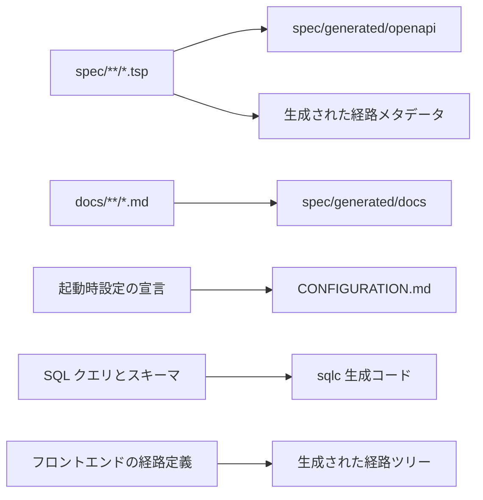

# ローカル開発

## 環境の準備

ツールの版とコマンドは `mise.toml` が正本である。ただし **mise 自身は `mise.toml` では導入できない**ので、最初の 1 つだけは外から入れる。

```bash
brew install mise         # macOS
curl https://mise.run | sh # それ以外
```

`mise.toml` は `min_version` で必要な下限を宣言している。これより古い mise は設定を読んだ時点で止まるので、上のいずれかで入れ直す。

続けて、固定したツールとリポジトリの依存を導入する。

```bash
mise install
mise run setup
```

利用できる処理は `mise tasks` で確認する。Go、Bun、Docker、各種生成器を直接呼ばず、対応する `mise run <task>` を使う。

## ローカルスタック

組み込み PostgreSQL、バックエンド API、永続ジョブのワーカー、フロントエンドを含む Docker 不要のローカルスタックを起動する。

```bash
mise run dev
```

初回実行時は組み込み PostgreSQL のバイナリをダウンロードする。開発データは一時的で、スタックの停止時に削除される。ブラウザーで <http://localhost:5173/> を開き、ローカルデモ認証を選択する。`alice` はテナント管理者、`root` はテナント管理者とシステム管理者を兼ね、どちらも開発用パスワードは `demo-password-1234` である。

目的に応じて次のスタックも使える。

```bash
mise run dev-memory
mise run dev-compose
mise run demo-ciba
```

`dev-memory` は永続ジョブとワーカーを使わない最小構成である。`dev-compose` は PostgreSQL、OpenTelemetry Collector、Prometheus、API、UI ゲートウェイを <http://localhost:8080/> で起動する。

## ビルドと検証

```bash
mise run build-go
mise run build-ui
mise run verify
```

Go の版情報は `VERSION`、`GIT_COMMIT`、`BUILD_DATE` から埋め込む。`VERSION` を指定しなければ開発版の `0.0.0-dev` になる。リリース用の値と成果物の扱いは [リリース](release.md) が定める。

変更中は全体検証を繰り返さず、[検証のはしご](specification-first-workflow.md#5-verification-ladder) に従って、変更したものについて失敗しうる最も狭い `mise` タスクから実行する。変更が 1 パッケージを越えたら `mise run test-go-changed` が、作業ツリーで変わったパッケージとその逆依存だけを最後のゲートと同じ構成で実行する。

`verify` はブラウザー E2E を含まない。起動に Go のビルド、API サーバー、開発サーバー、初期データの投入を要するのはこのテストだけで、その費用を静的検査と単体テストのたびに払う理由がないからである。画面に届く変更を仕上げるときは次を実行する。CI にも独立した job がある。

```bash
mise run test-ui-e2e
mise run verify-full
```

`verify`、`verify-spec`、`check` は最初の失敗で打ち切らず、落ちたゲートを全部並べて終わる。1 回の実行で受け取った一覧をまとめて直せる。ゲートごとの所要時間は次で測る。前後で 2 回実行した表を並べれば、速くなったかどうかを体感ではなく実測で言える。

```bash
mise run time-verify
```

work item に着手するときは、読むべきものを次で出す。規範 ID から仕様本文、TypeSpec の宣言位置、その ID を名指す既存のテストと実装、先行する work item までをたどり、`initial_context` の下書きを出力する。

```bash
mise run brief -- wi-123
```

## 生成の関係

生成物は編集せず、入力を変更して対応するタスクで再生成する。



| 変更した入力 | 再生成 |
| --- | --- |
| TypeSpec または正準 Markdown | `mise run spec-render`、必要に応じて `mise run generate-contract` |
| 起動時設定の宣言 | `mise run generate-config-reference` |
| SQL または sqlc のクエリ | `mise run sqlc-generate` |
| フロントエンドの経路 | `mise run generate-routes` |

生成結果を含むかどうかは各タスクの所有規則に従う。`spec/generated/` は追跡しない派生表示であり、リリース用の OpenAPI 互換性ベースラインは [リリース](release.md) でだけ更新する。

## 外部サービスのローカル代替

メール配信の確認には Mailpit などのローカル SMTP サーバーを使い、本番の資格情報を開発環境へ持ち込まない。起動時設定の型、既定値、条件付き要件、機密区分は [CONFIGURATION.md](../../CONFIGURATION.md) を参照する。
