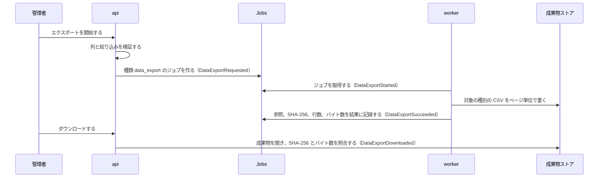

# データエクスポートの設計

この文書は、[データエクスポート](README.md)の規則を保証する仕組みを扱う。

| 話題 | 記述した場所 |
| --- | --- |
| アーキテクチャ | [アーキテクチャ](#アーキテクチャ) |
| 設計判断 | 該当なし：規則の判断の欄と、Context の[重要な設計判断](../design/decisions.md)に置く |
| アプリケーション | 該当なし：Context の設計に従う |
| データ | [データ](#データ) |
| セキュリティ | 該当なし：仕様のセキュリティ上の考慮に置く |
| 信頼性 | [信頼性](#信頼性) |
| 性能 | 該当なし：成果物の上限とストリーム処理は Context の[性能](../design/performance.md)に従う |
| オブザーバビリティ | 該当なし：Context の設計に従う |
| 検証 | 該当なし：Context の設計に従う |
| インフラストラクチャ | 該当なし：Context の設計に従う |
| リスク | 該当なし：Context の[リスク](../design/risks.md)に従う |

## アーキテクチャ

| 構成要素 | 責務 |
| --- | --- |
| `StartDataExport` | 列と絞り込みを、対象の種別ごとの許可リストで検証し、ジョブを作る |
| `DataExportHandler` | `worker` で CSV を生成する。対象の種別ごとのエクスポーター（User、Group、メンバーシップ）を選ぶだけで、列とセルの書き方は種別の実装が持つ |
| `DownloadDataExport` | ダウンロードできる状態を確かめ、成果物の SHA-256 とバイト数がジョブの結果と一致する場合だけファイルを返す |
| 対象ごとの範囲（`ExportScope`） | 種別ごとの HTTP の経路（`/users/exports`、`/groups/exports`、`/groups/{id}/members/exports`）が、ほかの種別や Group のエクスポートを解決しないようにする |

## データ

| データ | 内容 |
| --- | --- |
| 状態 | ジョブの状態から導く。`succeeded` のジョブは、完了の時刻（ジョブの `updated_at`）に 30 日を加えた時刻以降に読むと `expired` として返す。`expired` を保存した状態として持たない |
| 成果物 | テナント単位の不変な成果物ストアに置く。ジョブの記録は参照とダイジェストだけを持つ。成果物は完了の時点で作り、作成から 30 日を過ぎると Batch の保持期限の削除が消すので、`expired` になる時点でファイル本体も消える |

## 信頼性

| 症状 | 原因 | 直し方 |
| --- | --- | --- |
| エクスポートが `failed` で終わる | CSV の生成が失敗した（実効ポリシーの上限の超過など）。ジョブは再試行しない | `error_code` を確かめ、列や対象を変えて開始し直す |
| `succeeded` のエクスポートをダウンロードできない | 成果物ストアの成果物が、ジョブの結果のダイジェストと一致しない | 開始し直す。照合に失敗した成果物は返さない |

