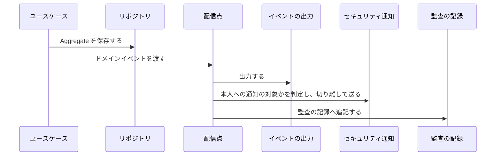

# イベントと監査の記録

この文書は、IdManagement の操作が発行するドメインイベントと、それが監査の記録、通知、下流の Context へ届く経路を扱う。
どのイベントをどの条件で発行するかは、各機能仕様の規則が定める。

## 経路

IdManagement の変更は、性質の違う三つの経路で外へ知らせる。

| 経路 | 使う操作 | 確定との関係 | 失敗したとき |
| --- | --- | --- | --- |
| ドメインイベントの配信点 | 管理 API とセルフサービス API の操作、ジョブの状態の変化 | Aggregate を保存した後に、ユースケースが `Emit` を呼ぶ | 配信点は失敗をログに残すだけで、操作の結果を変えない |
| CSV の行の監査の記録 | CSV のインポートの適用 | 行の Aggregate と同じトランザクションで、監査の表へ直接書く | 行ごと確定しない |
| 境界のポート | User の変更（`UserMutationCommitter`、`ProvisioningNotifier`）、Group の変更（Group の `ProvisioningNotifier`） | ワークフローの実行は User の保存と同じトランザクションで確定する。下流への通知は保存の後に呼ぶ | ワークフローは保存ごと確定しない。User の通知の失敗はログに残して成功を返し、Group の通知の失敗はエラーを返す（REQ-IDMANAGEMENT-064） |

## ドメインイベントの配信点

アプリケーションの組み立ては、ユースケースの `Emit` に一つの配信点をつなぐ。
`api` と `worker` のどちらで動くユースケースも同じ配信点を使うので、監査の網羅は操作を実行したプロセスに依存しない。

| 段 | 内容 |
| --- | --- |
| イベントの出力 | ワイヤ表現の JSON を標準出力へ一行ずつ書く |
| セキュリティ通知 | `Authentication` のアカウントのセキュリティ通知が、同じワイヤ表現から本人へ知らせる事実を選ぶ。送信は切り離して走り、配信点は待たない |
| 監査の記録 | イベントのワイヤ表現を、`Audit` の監査の記録へ追記する。テナントの ID はペイロードの `tenantId` から取る |

監査の記録への追記は、Aggregate の保存とは別に、保存の後で行う。
追記の失敗と、保存と追記の間のプロセスの停止では、変更は残り、監査の記録だけが欠ける。
配信点は失敗を「照合が必要」としてログに残す。

## CSV の行の監査の記録

CSV のインポートの適用は、配信点を使わない。
行ごとの Aggregate、パスワードの履歴、使用量、監査の記録を一つのトランザクションで確定し、監査の表へ直接書く。
一つの適用が数万の行を確定するので、行の確定と監査の記録を同じ単位にして、行の成否と記録の有無を一致させる。

## 発行しないもの

| 場面 | 発行しないイベント | 理由 |
| --- | --- | --- |
| 値の変わらない更新、すでにその状態の操作 | その操作のイベント | 各規則が冪等な操作として定める |
| 動的な所属の増減 | `GroupMemberAdded`、`GroupMemberRemoved` | 全件の再評価が `DynamicMembershipEvaluated` を一つ発行する（REQ-IDMANAGEMENT-070） |
| メールアドレスの変更の確定 | `UserUpdated` | `EmailChanged` を発行する（REQ-IDMANAGEMENT-054） |
