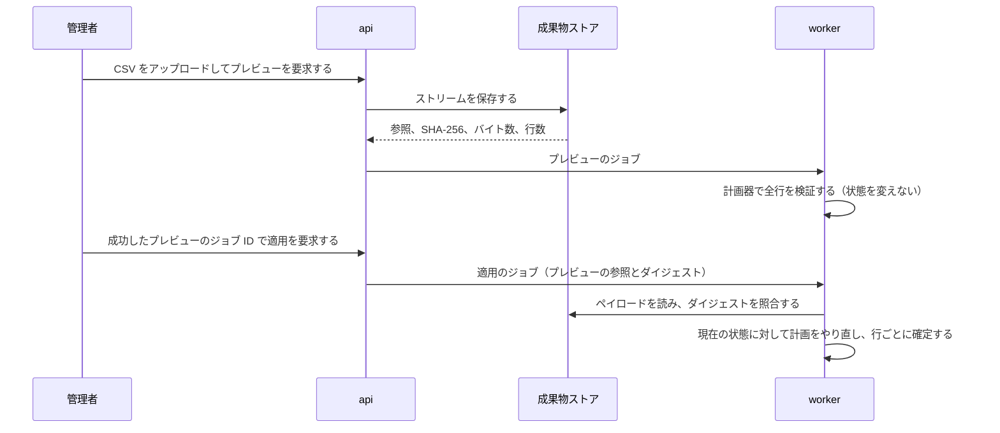

# CSV の往復変換

この文書は、User と Group の CSV のエクスポートとインポートが共有する仕組みを扱う。
CSV は二つ目のプロビジョニングの権威ではなく、IdManagement が備える部分更新の窓口である。
転送の上限と、往復で守る性質は、機能仕様の規則が定める。

## 共有するものと、種別ごとに分けるもの

| 部品 | 共有するか | 理由 |
| --- | --- | --- |
| 転送ポリシー、解析器と直列化器、可逆なセル変換、不変な成果物ストア | User と Group で共有する | 種別ごとに違うのは、どの機械キーを受理するかだけである。解析器はその判定だけを受け取る |
| 列の語彙 | 種別ごとに分ける | 組み込みの書き込み可能列、読み取り専用列、禁止列は、種別ごとに閉じた集合である |
| 計画器 | 種別ごとに分ける | 不変な項目、外部の権威の規則、ライフサイクルの操作は Aggregate ごとの不変条件であり、一つに一般化すると両方の規則が読めなくなる |

列の語彙と可逆なセル変換はドメインに置く。
エクスポートとインポートは、HTTP のラベルや UI のロケールに依存せず、一つの定義を共有する。
User のテナント定義の列は、実効的な属性スキーマを解決した後にだけ `custom:<key>` として加える。
これにより、解析を決定的に保ちながら、テナントのスキーマを CSV 処理とは独立して変えられる。

## 解析と変換

| 性質 | 仕組み |
| --- | --- |
| 列がないことと、空の列を区別する | 解析器は列の有無とセルの内容を別々に保持する。列がなければ項目を変えず、空の列は項目を消す意味を持ち得る |
| 不正なヘッダーを早く拒否する | どの行も計画する前に、未知のヘッダー、重複するヘッダー、シークレットを含むヘッダーを拒否する |
| 表計算の数式として解釈されない | 危険な先頭文字と既存の先頭アポストロフィーに、可逆な形で接頭辞を付ける。レコードの引用は RFC 4180 の変換器に任せる |
| 往復で値が変わらない | カンマ、引用符、複数行の値を含めて `decode(encode(value)) == value` が成り立つ。報告専用のエクスポートで使う、情報を失うアポストロフィーのエスケープは受け付けない |

## プレビューと適用

| 段 | 保証すること | 仕組み |
| --- | --- | --- |
| プレビュー | CSV を受け取るのは一度だけである | テナント単位の不変な成果物ストアがストリームを受け取る。ジョブのパラメーターと結果は、メタデータと要約だけを保存し、CSV の本文を含まない |
| プレビュー | 状態を変えない | 計画器は、既存の Aggregate を不変な ID、次にテナント内で一意な名前（User はユーザー名、Group は `name`）で解決し、型付きの値と行の間の衝突を検証して、行操作を生成するだけである |
| 適用 | プレビューしたペイロードだけを実行する | 成功したプレビューのジョブ ID だけを受け付け、別の CSV やクライアントが示すダイジェストは受け付けない。SHA-256 は実行対象をプレビュー時のペイロードに束縛する内部の完全性検査であり、署名ではなく、認可を置き換えない |
| 適用 | 同時の変更を見逃さない | プレビュー時の計画を実行せず、現在の状態に対して同じ計画器をもう一度実行する |
| 適用 | 行の失敗が他の行を巻き戻さない | 受理した各行は、Aggregate の項目、直接付与するロール、従属する記録、監査イベントを一つのトランザクションで確定する。失敗した行は部分的な変更を残さない |

判断：[CSV の適用をプレビューで保存したペイロードに束縛する](decisions.md#csv-の適用をプレビューで保存したペイロードに束縛する)。

## 行のエラーの報告

大量の行のエラーは、成果物ストアの固定件数のページへ直列化し、リソース固有のエラーテーブルやジョブの JSON に置かない。
結果の API は、管理 API のテナントとクエリに束縛した署名付きカーソル、`limit`、RFC 8288 の `Link`、`Pagination-*` ヘッダーを使う。
エラーの通し番号はページとページ内の位置へ直接対応するので、深い位置を読むときに先行するエラーを走査しない。

## 外部の権威の保護

取り込み元の所有権ガードは、既存の User または Group が外部の権威の管理下にあるかを返す。
所有権を確認できない場合と、確認に失敗した場合は、外部の管理下として扱って行を拒否する。
CSV という便宜的な経路が、より強い上流の権威を暗黙に上書きしないためである。
