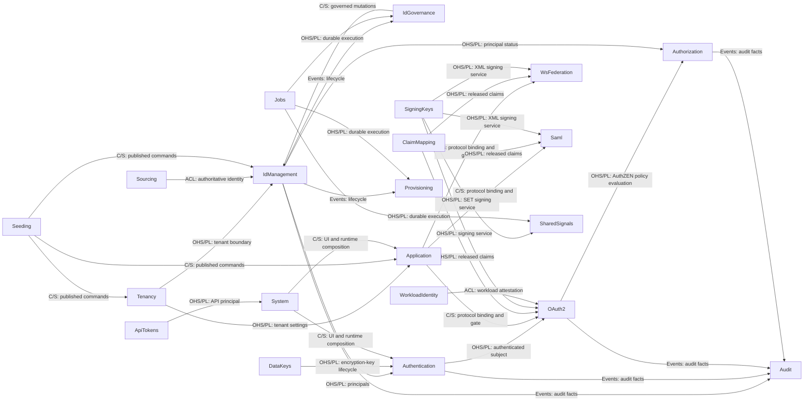

# Whole-System Specification

この文書は、システム全体に適用する仕様と設計を記録する。一つの Bounded Context に属する振る舞いと設計は、その Context の `spec/contexts/<context>/` に置く。API とモデルの契約は隣接する TypeSpec に、変更ごとの検討と実装の経緯は work item に記録する。

エンドポイント、フィールド、画面など、個別機能の詳細はここに置かない。それぞれ `spec/contexts/*/*.tsp`、コード、UI 文書を正とする。

## Reading order

機能の変更では、次の順に読む。

1. この文書。システム全体の設計と所有権の所在をつかむ。全体の規則が要るときだけ、下の索引が指すファイルを開く。
2. 所有する Context の `README.md` と、そこが指す種類ごとのファイル、`models.tsp`、`main.tsp`。変更に先立って仕様を更新する。
3. 進行中の work item。変更ごとの設計と実装の経緯を確認する。
4. Go の実装。`domain/`、`usecase/`、`ports/`、関連する `<role>_<technology>/` アダプターの順に読む。
5. `backend/shared/` と `backend/cmd/internal/bootstrap/`。横断的な HTTP や永続化の振る舞いを変更するときだけ読む。
6. UI を変更するときは `spec/contexts/system/` と `frontend/src/features/README.md` を先に読む。

実装から仕様を探す場合は、原則としてパッケージ名に対応する Context を参照する。Context に属さない技術的な共通機能は `backend/shared/` に集約している。

## Context Map

この図は DDD の Context Map であり、ドメイン上の関係と統合境界を示す。ソースコードの import 関係を網羅するものではない。矢印は Supplier（上流）から Customer（下流）へ向かう。`OHS/PL` は Published Language を伴う Open Host Service、`C/S` は Customer/Supplier、`ACL` は Anti-Corruption Layer、`Events` は公開イベントによる関係を表す。

次の表が、全 Bounded Context の責務と実装場所の索引である。

| Specification context | Go package | Responsibility |
| --- | --- | --- |
| [System](contexts/system/SPECIFICATION.md) | `backend/cmd/internal/bootstrap`, `backend/shared/http/server_http`, `frontend/` | 起動、経路の組み立て、健全性、フロントエンド UI。 |
| [Tenancy](contexts/tenancy/README.md) | `backend/tenancy` | Tenant と realm、テナント単位の設定、ユーザーの属性スキーマ、制御面のテナント管理。 |
| [IdManagement](contexts/identity-management/SPECIFICATION.md) | `backend/idmanagement` | User、Group、Agent、自身のプロフィール、アイデンティティのライフサイクル、CEL による動的メンバーシップ規則と再評価。 |
| [IdGovernance](contexts/identity-governance/README.md) | `backend/idgovernance` | LifecycleWorkflow のポリシーとオーケストレーション。記録の正は IdManagement に残る。 |
| [Authentication](contexts/authentication/SPECIFICATION.md) | `backend/authentication` | 資格情報の検証、MFA、ログインセッション、ステップアップ認証、パスワードの変更とリセット、認証イベント。 |
| [OAuth2](contexts/oauth2/README.md) | `backend/oauth2` | OAuth 2.0 と OIDC のプロトコルエンドポイント、クライアント、同意、トークン、ロールのポリシー。 |
| [Application](contexts/application/README.md) | `backend/application` | Application のカタログ、プロトコルのバインディング、割り当て、ポータルの並び順と分類。 |
| [Authorization](contexts/authorization/README.md) | `backend/authorization` | リソース 1 件ごとの細粒度認可。テナントごとの認可モデル（リソース型と関係の定義）、関係タプル、深さ制限つきのグラフ評価、整合トークンを所有する。判定の合成そのものは持たず、関係の成否を事実として OAuth2 が所有する AuthZEN の `Authorizer` ポートへ渡す。 |
| [Audit](contexts/audit/README.md) | `backend/audit` | 全 Context にまたがる監査イベントの Read Model。検索属性の登録簿、個人識別情報の変換、管理 API、保持期間を所有する。 |
| [ClaimMapping](contexts/claim-mapping/README.md) | `backend/claimmapping` | プロトコルに依存しないクレーム開示ポリシー、アイデンティティ属性からクレームへのマッピング、フェイルクローズな検証。 |
| [Provisioning](contexts/provisioning/README.md) | `backend/provisioning` | SCIM 2.0 による外向きのプロビジョニング。IdMagic の User と Group を正として、下流の SaaS へライフサイクルを反映する。 |
| [Sourcing](contexts/sourcing/README.md) | `backend/sourcing` | 上流の権威からの内向きのアイデンティティ取り込み。取り込み元のバインディング、外部の不変 ID との相関、上流の権威に追随する削除と無効化を所有する。取り込み元ごとに 1 つの機能単位として構成し、現在は `sourcing/scim` だけを持つ。 |
| [ApiTokens](contexts/api-tokens/README.md) | `backend/apitoken` | 管理 API と SCIM API を認証するテナント単位の API アクセストークン（`idmagic_pat_` で始まる）。発行、失効、一覧、スコープの語彙を担う。 |
| [Jobs](contexts/jobs/README.md) | `backend/jobs` | テナント境界を保つ汎用の非同期ジョブ基盤。 |
| [Seeding](contexts/seeding/README.md) | `backend/seeding` | 環境ごとの構成、プレビュー、機密情報を伏せた計画、適用ポリシー。業務データとその永続化は、記録を所有する各 Context に残る。 |
| [SigningKeys](contexts/signing-keys/README.md) | `backend/signingkeys` | テナントと用途で区切られた鍵のメタデータ、X.509 資格情報、ローテーション、Repository のポート、管理 API と JWKS の HTTP エンドポイント、メモリ、PostgreSQL、Vault の各アダプター。JWT と XML の署名処理はプロトコルのアダプターに残す。 |
| [DataKeys](contexts/data-keys/README.md) | `backend/datakeys` | MFA の TOTP シードなど、データベースに保存する必要がある可逆なシークレットを保護するテナントごとの `DataEncryptionKey`（DEK）のメタデータとライフサイクル。署名鍵は `SigningKeys`、`EnvelopeCrypto` ポートは `backend/shared/security` が所有する。 |
| [WsFederation](contexts/ws-federation/README.md) | `backend/wsfederation` | WS-Federation のパッシブプロファイル、WS-Trust のアクティブ STS、フェデレーションメタデータ、MEX、RP の信頼、リクエスト元テナントによる XML 署名。 |
| [Saml](contexts/saml/README.md) | `backend/saml` | SAML 2.0 IdP、SP の信頼、メタデータ、SSO と SLO、リクエスト元テナントによる XML 署名。 |
| [WorkloadIdentity](contexts/workloadidentity/README.md) | `backend/workloadidentity` | エージェントの実行環境に対するワークロードアイデンティティフェデレーション。登録済みの外部アテステーション発行者（`WorkloadTrustBundle`）と、`subject` のパターンから `Agent` への対応付け（`AgentWorkloadBinding`）を持つ。OAuth2 のトークン交換はこれを使い、長期シークレットを配布せずに外部の JWT-SVID を IdMagic のトークンへ交換する。 |
| [SharedSignals](contexts/sharedsignals/SPECIFICATION.md) | `backend/sharedsignals` | OpenID Shared Signals Framework（SSF）と RFC 8417 の Security Event Token（SET）による継続的アクセス評価（CAEP）およびエージェントのほぼ即時の失効。 |

## Documents

| File | Content |
|---|---|
| [structure.md](structure.md) | ディレクトリ、依存の向き、層の構成、アーキテクチャスタイル |
| [api-rules.md](api-rules.md) | 外部に見える契約の規則 |
| [observability.md](observability.md) | 相関、ログ、メトリクス |
| [deployment.md](deployment.md) | 実行単位、信頼境界、可用性 |
| [persistence.md](persistence.md) | データベース設計方針 |
| [authorization.md](authorization.md) | 主体、スコープ、認可の境界 |
