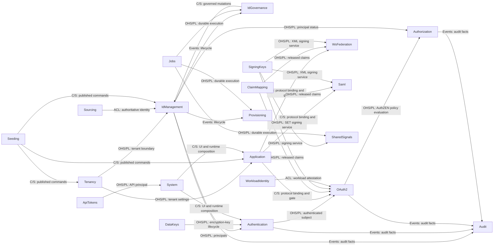

# Whole-System Specification

## Overview

本書はシステム全体の仕様であり、横断的な設計の記録である。システムが現在どう作られていて、なぜその形なのかを述べる。単一の Bounded Context に属する振る舞いと設計は、その Context 自身の `spec/contexts/<context>/SPECIFICATION.md` に置く。API とモデルの契約は隣接する TypeSpec にあり、変更ごとの設計・実装の経緯は work item にある。

移り変わる内容、すなわちエンドポイント、フィールド、画面はここに置かない。それらはコード、`spec/contexts/*/*.tsp`、UI 文書を正とする。

### Reading order

機能の変更では、次の順に読む。

1. `spec/SPECIFICATION.md`。システム全体の設計と所有権の所在をつかむ。
2. 所有する Context の `SPECIFICATION.md`、`models.tsp`、`main.tsp`。変更は仕様が先である。
3. 進行中の work item。変更ごとの設計・実装の経緯が載っている。
4. Go の実装。`domain/`、`usecase/`、`ports/`、関係する `<role>_<technology>/` アダプターの順。
5. `backend/shared/` と `backend/cmd/internal/bootstrap/`。横断的な HTTP や永続化の振る舞いに触れるときだけ読む。
6. UI に触れるときは `spec/contexts/system/SPECIFICATION.md` と `frontend/src/features/README.md` を先に読む。

逆に実装から仕様へさかのぼる場合は、パッケージ名が Context 名とほぼ対応する。例外は `backend/shared/` に集約されている。

## Design

### Structure

```text
.
├── backend/           # Go Bounded Contexts, shared, cmd/
├── frontend/          # React UI and gateway
├── spec/              # TypeSpec, canonical specification/design Markdown, and release baseline
│   └── contexts/<context>/SPECIFICATION.md
├── infra/             # container, local runtime, and database schema assets
├── load/k6/           # tenant-local OAuth SLO smoke
├── tools/             # specification, boundary, compatibility, and rendering tools
└── work-items/        # units of work, decision history, and completion records
```

依存は `spec` から実装と派生成果物へ向かって流れる。`backend` のドメイン層とユースケース層のパッケージが、アダプターやランタイムへ逆向きに依存することはない。

#### Development flow mapping

| 関心事 | 置き場所 | 詳細 |
| --- | --- | --- |
| 仕様と設計 | `spec/**/*.tsp`, `spec/**/SPECIFICATION.md` | 規範的な振る舞い、契約、現在の根拠。変更はここから始まる。 |
| 変更の記録 | `work-items/*.md` | 1 つの変更についての代替案、計画、作業、完了の記録。 |
| ドメインモデル | `backend/<context>/(<feature>/)domain` | フレームワークに依存しないドメインモデル。 |
| アプリケーションロジック | `backend/<context>/(<feature>/)usecase` | フレームワークに依存しないユースケース。 |
| ポート | `backend/<context>/(<feature>/)ports` | HTTP、永続化、通知などのポート。 |
| アダプター | `backend/<context>/(<feature>/){handlers_http,db_postgres,...}` | HTTP、永続化、通知などのアダプター。 |
| ランタイム | `backend/cmd/`, `backend/cmd/internal/bootstrap` | 起動、依存注入。 |
| インフラ基盤 | `infra` | インフラ基盤の設定コード。 |
| フロントエンド | `frontend` | フロントエンドコード。 |

### Stack

- バックエンド: Go。
- フロントエンド: React/TypeScript、Bun。
- DB: PostgreSQL。
- インフラ: Docker Compose、Kubernetes、Prometheus、Grafana、Loki、Promtail、k6。

### Context Map

この図は DDD の Context Map であり、ドメインに面した関係と統合の境界を示す。ソースコードのインポートをすべて示すものではない。矢印は supplier（上流）から customer（下流）へ向かう。`OHS/PL` は Published Language を伴う Open Host Service、`C/S` は Customer/Supplier、`ACL` は Anti-Corruption Layer、`Events` は公開イベントによる関係を意味する。



次の表が、全 Bounded Context の責務と実装場所の索引である。

| Specification context | Go package | Responsibility |
| --- | --- | --- |
| `System` | `backend/cmd/internal/bootstrap`, `backend/shared/http/server_http`, `frontend/` | 起動、経路の組み立て、健全性、フロントエンド UI。 |
| `Tenancy` | `backend/tenancy` | Tenant と realm、テナント単位の設定、ユーザーの属性スキーマ、制御面のテナント管理。 |
| `IdManagement` | `backend/idmanagement` | User、Group、Agent、自身のプロフィール、アイデンティティのライフサイクル、CEL による動的メンバーシップ規則と再評価。 |
| `IdGovernance` | `backend/idgovernance` | LifecycleWorkflow のポリシーとオーケストレーション。記録の正は IdManagement に残る。 |
| `Authentication` | `backend/authentication` | 資格情報の検証、MFA、ログインセッション、ステップアップ認証、パスワードの変更とリセット、認証イベント。 |
| `OAuth2` | `backend/oauth2` | OAuth 2.0 / OIDC のプロトコルのエンドポイント、クライアント、同意、トークン、ロールのポリシー。 |
| `Application` | `backend/application` | Application のカタログ、プロトコルの束縛、割り当て、ポータルの並び順と分類。 |
| `Authorization` | `backend/authorization` | リソース 1 件ごとの細粒度認可。テナントごとの認可モデル（リソース型と関係の定義）、関係タプル、深さ制限つきのグラフ評価、整合トークンを所有する。判定の合成そのものは持たず、関係の成否を事実として OAuth2 が所有する AuthZEN の `Authorizer` ポートへ渡す。 |
| `Audit` | `backend/audit` | 全 Context にまたがる監査イベントの Read Model。検索属性の登録簿、個人識別情報の変換、管理 API、保持期間を所有する。 |
| `ClaimMapping` | `backend/claimmapping` | プロトコルに依存しないクレーム開示ポリシー、アイデンティティ属性からクレームへのマッピング、フェイルクローズな検証。 |
| `Provisioning` | `backend/provisioning` | SCIM 2.0 による外向きのプロビジョニング。下流の SaaS へ反映するライフサイクルを担う。idmagic の User と Group が正となる情報源であり、下流はその写しである。 |
| `Sourcing` | `backend/sourcing` | 上流の権威からの内向きのアイデンティティ取り込み。取り込み元のバインディング、外部の不変 ID との相関、上流の権威に追随する削除と無効化を所有する。取り込み元ごとに 1 つの機能単位として構成し、現在は `sourcing/scim` だけを持つ。 |
| `ApiTokens` | `backend/apitoken` | 管理 API と SCIM API を認証するテナント単位の API アクセストークン（`idmagic_pat_` で始まる）。発行、失効、一覧、スコープの語彙を担う。 |
| `Jobs` | `backend/jobs` | テナント境界を保つ汎用の非同期ジョブ基盤。 |
| `Seeding` | `backend/seeding` | 環境ごとの構成、プレビュー、機密情報を伏せた計画、適用ポリシー。業務データとその永続化は、記録を所有する各 Context に残る。 |
| `SigningKeys` | `backend/signingkeys` | テナントと用途で区切られた鍵のメタデータ、X.509 資格情報、ローテーション、Repository のポート、管理 API と JWKS の HTTP エンドポイント、メモリ・PostgreSQL・Vault の各アダプター。JWT と XML の署名処理はプロトコル側のアダプターに残す。 |
| `DataKeys` | `backend/datakeys` | アプリケーションのデータベースに残さざるを得ない可逆なシークレット（MFA の TOTP seed など）のための、テナントごとの `DataEncryptionKey`（DEK）のメタデータとライフサイクル（初期化、ローテーション、無効化、破棄）。署名鍵 (`SigningKeys`) は所有せず、`EnvelopeCrypto` のポート自体も所有しない。後者は技術的な共通アダプターとして `backend/shared/security` に置く。 |
| `WsFederation` | `backend/wsfederation` | WS-Federation のパッシブプロファイル、WS-Trust のアクティブ STS、フェデレーションメタデータ、MEX、RP の信頼、リクエスト元テナントによる XML 署名。 |
| `Saml` | `backend/saml` | SAML 2.0 IdP、SP の信頼、メタデータ、SSO と SLO、リクエスト元テナントによる XML 署名。 |
| `WorkloadIdentity` | `backend/workloadidentity` | エージェントの実行環境に対するワークロードアイデンティティフェデレーション。登録済みの外部アテステーション発行者 (`WorkloadTrustBundle`) と、subject のパターンから `Agent` へのマッピング (`AgentWorkloadBinding`) を持つ。OAuth2 のトークン交換がこれを使い、長期的なシークレットなしに外部の JWT-SVID を idmagic のトークンへ交換する。 |
| `SharedSignals` | `backend/sharedsignals` | OpenID Shared Signals Framework（SSF）と RFC 8417 の Security Event Token（SET）による継続的アクセス評価（CAEP）およびエージェントのほぼ即時の失効。 |

### Conventions

Bounded Context は通常この形を取る。

```text
backend/<context>/
  domain/            # エンティティ、値オブジェクト、状態遷移、純粋な検証
  usecase/           # 仕様で定めた操作を行うアプリケーションロジック
  ports/             # Repository、ストア、外部サービスの抽象
  handlers_http/     # 受信 HTTP アダプター
  db_memory/         # メモリ版 Repository アダプター
  db_postgres/       # PostgreSQL 版 Repository アダプター
```

アダプターはそれを所有する Context または機能の直下に置き、snake_case の `<role>_<technology>` で命名する。

`backend/shared/` は、複数の Context が実際に共有する技術的な能力のための場所である。

具象のドメインイベントの構造体は、それを所有する Context の `domain/events.go` に置く。`backend/shared/spec/events.go` はイベントのエンベロープとなるインターフェースと、そのワイヤ表現への変換だけを持つ。

2 つ以上の独立した部分領域（機能）を持つ Context は、4 層の構成に機能ごとの垂直分割を追加してよい: `backend/<context>/<feature>/{domain,ports,usecase,<role>_<technology>}/`。単一の機能しか持たない Context には置かない。

```text
backend/idmanagement/
  module.go                 # Context ごとに 1 つ置く DI の組み立て
  domain/                   # 機能間で共有する型だけ（列挙、DomainEvent）
  usecase/                  # 機能をまたぐユースケース補助とエラー値だけ
  deps_http/                # Deps 型を定義する末端パッケージ
  handlers_http/            # ルート登録と機能をまたぐ統合テスト
  user/  group/  agent/     # 各機能の domain、ports、usecase、アダプター
```

#### Frontend Component Structure

仕様上の機能とそろえた UI の境界は `frontend/src/features/<feature>/` に置く。その機能のビュー、ローカルコンポーネント、ヘルパー、テスト、ローカライズ辞書 (`*.i18n.ts`) は必ずそのディレクトリに置く。特定の機能境界にひも付かない、横断的で再利用可能なコンポーネントは `frontend/src/components/` に置く。

### Cross-cutting Concerns

#### HTTP routing

HTTP ルーティングは `backend/shared/http/server_http/routes.go` で組み立てる。ここがテナント単位のルートをデフォルトのテナントと `/realms/:tenant_id` の両方に登録し、制御面のテナント管理だけを `/realms/default/admin/tenants` に分離する。

各 Context のルーティングは `backend/<context>/handlers_http/routes.go` にある。正確なエンドポイントの一覧はそのファイルを参照する。新しい HTTP API は、それを所有する Context の `routes.go` に、同じ `handlers_http` 配下のハンドラーとともに登録する。Context 固有の Repository とルーティングの接続は `backend/<context>/module.go` に集約し、中央のルーターは Module を呼ぶだけにする。

#### Request correlation

すべてのリクエストに `request_id` を割り当て、`X-Request-ID` レスポンスヘッダーで返し、そのリクエストのすべてのアプリケーションログ行に付与する (`OBSERVABILITY=otel` のときは `trace_id` と `span_id` も併せて付く)。

`X-Request-ID` は攻撃者が制御できるため、デフォルトでは **id を自前で生成し、受信した値を無視する** —安全側のデフォルトであり、直接到達できるクライアントが相関 id を偽ったり衝突させたりできない。 `REQUEST_ID_TRUST_INBOUND=true` は、信頼できる境界のプロキシがヘッダーを生成する (つまり無害化する) 場合にのみ設定する。それがあって初めて、プロキシとアプリケーションの層で単一の id を共有する価値が生まれる。クライアントの値をそのまま素通しするプロキシを信頼してはならない。いずれの場合も、再利用する受信値は長さと文字種を制限し、ヘッダーとログへの注入に対する多層防御とする。

#### Cursor pagination

管理用の一覧 API は、署名済みで版の付いたキーセット方式のカーソルを RFC 8288 の `Link` レスポンスヘッダーで運ぶ。カーソルは自身のテナント、問い合わせと並び順の同一性、方向、行の境界を束縛する。

#### HTTP error responses

汎用 API のエラーレスポンスには、デフォルトの形式として RFC 9457 Problem Details（`application/problem+json`、`type`、`title`、`status`、`detail`、`instance`）を使う。`instance` には上記のリクエスト相関用の `request_id` を載せる。HTTP ステータスコードは RFC 9110 に従い、400 はリクエストを解析できないこと（不正な JSON、必須構造の欠落）を、422 は解析できた内容が業務規則に違反すること（不正なロール、参照の不一致、ポリシー違反）を表す。

OAuth2（`backend/oauth2/handlers_http`）、SCIM（`backend/sourcing/scim/handlers_http`）、Dynamic Client Registration（RFC 7591、`backend/oauth2/handlers_http` の一部）は、各標準が定めるエラーレスポンスを返す。標準に従うクライアントとの相互運用性を保つため、これらには Problem Details を適用しない。

#### Metrics

`GET /metrics` が Prometheus / OpenMetrics 形式のメトリクスを公開する。すべてのルートのひな形についての HTTP の RED (件数、`status_code` によるエラー率、所要時間、処理中の数) に加え、SLO と警報のための認証の golden signal を含む。

| Metric | Labels | Verifies |
| --- | --- | --- |
| `http_requests_total`, `http_request_duration_seconds`, `http_requests_in_flight` | `route`, `method`, `status_code` | 接点ごとの遅延とエラー率の目標 |
| `authn_login_attempts_total` | `outcome`, `reason_class`, `method` | ログインの成否という golden signal |
| `authn_login_throttle_total` | `policy`, `outcome` | ログインのスロットルの発動率 |
| `endpoint_rate_limit_total` | `policy`, `outcome` | エンドポイントの流量制限の発動率 |
| `oauth2_token_issuance_total`, `oauth2_token_issuance_duration_seconds` | `grant_type`, `outcome` | grant 別の `/token` の発行率と遅延 |
| `http_request_aborts_total`, `operation_detached_completion_failures_total` | `kind` | 中断の扱い |

ラベルはいずれも有限の集合に限る。`tenant_id`、`user_id`、`client_id`、解決済みのリクエストのパスは決してラベルにしない。取りうる値が限られないからである。エンドポイントは常に登録されるが、プロセスが起動時に Prometheus を組み立て終えるまでは `503` を返す。公開は折り返しアドレスや管理用のネットワーク上、あるいは認証付きのプロキシの背後に限ること。

#### Logging

アプリケーションのログは標準出力への構造化された JSON Lines である (`timestamp`、`level`、`service`、 `message`、および相関のための `trace_id` / `span_id` / `request_id` — `backend/shared/logging`)。このプロセスはログをそれ以外のどこにも書かない。

**ローカル** (`infra/docker/docker-compose.dev.yaml`): Promtail が Docker Engine API (`docker_sd_configs`) ですべてのコンテナを検出し、そのログを Loki へ送る。したがってホストのログディレクトリを結び付ける必要はなく、Docker のソケットだけでよい。Grafana は初回起動時に Prometheus と Loki の両方をデータソースとして、また既存の golden signal のダッシュボードとともに設定される。 `docker compose up` だけでメトリクスとログを一緒に閲覧できる。

**Kubernetes** (`infra/k8s/monitoring/loki/`): Promtail は DaemonSet として動き、`kubernetes_sd_configs` で pod を検出して `/var/log/pods` を追尾する。Loki は永続ボリュームを持つ単一レプリカの StatefulSet として動く (ファイルシステムへの保存は開発向けのデフォルトであり、実運用の cluster ではオブジェクトストレージを使う保持設定の重ね合わせに置き換える)。

| Field | Loki treatment | Why |
| --- | --- | --- |
| `service`, `level` | index label | 有限の集合である |
| `trace_id`, `span_id`, `request_id` | structured metadata (not a label) | 値が限られない — ここでインデックスのラベルにすると組み合わせが爆発する。[Metrics](#metrics) が `tenant_id` と `user_id` について述べたのと同じ理由 |

#### HTTP server hardening

境界の HTTP サーバーは、本番で安全なタイムアウトとリクエスト本体の上限を適用する。単一の遅い、あるいは過大なクライアントが接続やメモリを枯渇させられないようにするためである (`gosec G112` / CWE-400)。上限を超えた本体は `413` で拒否する。

| Variable | Default | Purpose |
| --- | --- | --- |
| `HTTP_READ_HEADER_TIMEOUT` | `10s` | リクエストのヘッダーを読む上限時間 (slowloris の抑止) |
| `HTTP_READ_TIMEOUT` | `30s` | リクエスト全体を読む上限時間 |
| `HTTP_WRITE_TIMEOUT` | `60s` | レスポンスを書く上限時間 |
| `HTTP_IDLE_TIMEOUT` | `120s` | 持続接続の待機時間の上限 |
| `HTTP_MAX_BODY_BYTES` | `1048576` | リクエスト本体の最大バイト数 (1 MiB) |

これは多層防御であって、境界のプロキシの代わりではない。大量の氾濫と TLS handshake の slowloris に対する第一線は前段のリバースプロキシである。

#### Security response headers

境界のミドルウェアが、すべてのバックエンドのレスポンスに `X-Content-Type-Options: nosniff`、 `Referrer-Policy: no-referrer`、`X-Frame-Options: DENY`、そして厳格な `Content-Security-Policy` (`default-src 'none'; base-uri 'none'; frame-ancestors 'none'; form-action 'self'`) を適用する。 `frame-ancestors 'none'` と `X-Frame-Options: DENY` の組み合わせが枠内への埋め込みを禁じるので、ログイン、同意、ポータルの画面はクリックジャッキングされない。CSP は `'unsafe-inline'` を使わない。idmagic が描画する唯一の埋め込みスクリプトは SAML ACS と WS-Fed の POST 束縛の書式の固定された自動送信であり、これはそのレスポンス上の `script-src 'sha256-…'` の要約値で固定し、`form-action` を宛先のエンドポイントに絞っている。

**ヘッダーの所有。** CSP と `frame-ancestors` はルートごとの判断を要するため idmagic が所有する。これにより最小限のプロキシの背後でも、プロキシがなくても成り立つ。単一ページアプリケーションはゲートウェイが配信し、ゲートウェイが静的な HTML 用に自身の `script-src 'self'` の CSP を設定する。

**HSTS は TLS を終端する側のもの。** `Strict-Transport-Security` はデフォルトで無効である。平文の `http` での開発が汚染されないようにするためである。TLS がこの区間か、その手前で終端される場合にのみ有効化する。通常の構成では境界のプロキシに任せ (`HSTS_ENABLED=false`)、アプリケーション自身が表明すべき場合に `HSTS_ENABLED=true` とする (`HSTS_MAX_AGE_SECONDS` と `HSTS_INCLUDE_SUBDOMAINS` で調整する)。

画面を壊さずに CSP を厳しくするには、`CSP_REPORT_ONLY=true` で `Content-Security-Policy-Report-Only` を出し、`CSP_REPORT_URI=<url>` で違反を収集し、観察してから強制へ戻す。

#### Persistence

永続化ポートと Repository の実装は、それを所有する Context に属する。Context 固有のメモリと PostgreSQL のアダプターは `backend/<context>/{db_memory,db_postgres}` に置き、共有のデータベース接続プール、行の読み取り、トランザクションのヘルパーは `backend/shared/storage/db_postgres` に置く。一時的な状態も PostgreSQL に統合するため、2 種類目のデータストアは運用しない。

`db_postgres` の静的な SQL 文はすべて `sqlc` で型安全な問い合わせを生成しなければならない。文字列を伴う生の `Pool.Query` と `Pool.Exec` は、`sqlc` に利点がない極めて動的な問い合わせに限って許される。

PostgreSQL に構造を追加するには、まず `infra/schema/postgres.sql` の現行スキーマを更新する。構造差分は `psqldef` のプレビューで確認し、適用する（手順は `infra/schema/README.md` を参照）。CI はさらに、空のデータベースに対して `postgres.sql` が `psqldef` で収束することを強制する (`just check-schema`)。適用後のプレビューが空になること、再適用後のプレビューも空のままであることを確認する。構造差分では表現できない変更、たとえば既存データのバックフィル、値の変換、削除前のデータ退避は、作業項目の手順または専用 SQL に明記する。アプリケーション起動時にスキーマを移行する仕組みは存在しない。

#### Database design policy

##### 1. Column type selection

テーブルを追加するたびに判断が再現できるよう、選択の規則を固定する。

- **自由形式の文字列、長さ無制限**: `TEXT` を使う。制約のない `varchar` は決して使わない。
- **長さの上限がある文字列**: 固定の列ごとの長さ上限の方針に従い、`TEXT` + `CHECK (char_length(col) <= N)` か `varchar(N)` のいずれかを一貫して使う。書式が固定された識別子は `CHECK (... ~ regex)` で守る。
- **内部で生成する id**: idmagic が `spec.NewUUIDv4()` で生成する列は `UUID` とする。Go 側は `string` で保持し、pgx のテキスト用符号器の登録 (`RegisterUUIDAsText`) が両者を橋渡しする。
- **外部が決める id**: 値を外部が決める id (`entity_id`、`wtrealm`、`scim_id`、`kid`) は `TEXT` のままにする。idmagic が採番せず、UUID でもないからである。
- **時刻**: すべて `TIMESTAMPTZ` とし、マイクロ秒の精度を正とする。スキーマ側で丸めない。
- **有限の値集合**: `TEXT` + `CHECK (col IN (...))` とする。PostgreSQL の列挙型は避ける。値の追加に `ALTER TYPE` が必要で、宣言的なスキーマの差分取りと相性が悪いためである。
- **JSONB**: 結合や絞り込みが必要な値、外部キーや一意性の制約を持つ値などは JSONB の中に置かないようにする。

##### 2. tenant_id retention classes

`users.id` と `oauth2_clients.client_id` はシステムが生成する全体で一意な識別子なので、子の行はその全体で一意な鍵で親を参照し、**テナント単位の複合外部キーは使わない**。全体で一意な親をたどればテナントに到達できるというだけの理由で `tenant_id` を追加してはならない。検索、制約、保持期間、監査のいずれかに役立つときに追加する。

- **テナントが所有する aggregate**: `tenant_id` を持つ。
- **テナント単位で外部に由来する自然キー**: 外部の id がテナント内でしか一意でないため、`tenant_id` を主キーの一部にする (`scim_user_refs` と `scim_group_refs` は `(tenant_id, scim_id)`)。
- **全体で一意な親の子**: 全体で一意な鍵 (`user_id` と `client_id`) で識別し、テナントごとの検索や保持期間が必要でない限り `tenant_id` を持たない。
  - ただし `authentication_sessions` は、セッションの id がすべてのリクエストで解決される中身の見えない cookie の値なので、`tenant_id` はその照合における fail-closed な多層防御の条件であり、同時にテナントごとの有効なセッション一覧のためのインデックスでもある。中身の見えないトークン、認可コード、challenge を鍵とする一時的な認証なども同様である。

##### 3. Envelope encryption for reversible secrets

データベースに残す必要がある可逆なシークレットは、決して平文で保存しない。差し替え可能な `EnvelopeCrypto` プロバイダーが保持するマスターキーでテナントごとの `DataEncryptionKey`（DEK）をラップし、その DEK で各シークレットを直接 AEAD 暗号化する。AEAD と鍵セットの扱いはすべて [Tink](https://developers.google.com/tink) に委ね、nonce、認証タグ、追加認証データの組み立てを自作しない。すべての暗号文は `(tenant, context, table, record id, field)` と DEK のバージョンを追加認証データとしてバインドするため、テナント、テーブル、フィールドの境界を越えて複製した暗号文は復号に失敗する。

- `EnvelopeCrypto`（Tink を使う AEAD と鍵セットのポート、および OpenBao と平文鍵セットによるマスターキー提供元のアダプター）は、`certificates_mtls`、`passwords_argon2id`、`tokens_jose` と並べて `backend/shared/security` に置く。これは技術的な能力であり、業務上の Aggregate ではない。
- `backend/datakeys`（`DataKeys` Context）は、ラップされた DEK のメタデータとライフサイクル（初期化、ローテーション、無効化、破棄）だけを所有し、`EnvelopeCrypto` ポート自体は所有しない。`SigningKeys` が `transit/sign` を暗号化、復号、データ鍵の機能から分離しているのと同じ構成である。
- ローテーションでは新しい DEK の版を以後の書き込み用に有効化し、直前の版を復号可能な `retiring` のまま残す。`backend/jobs` の `JobKind` と `HandlerRegistry` に登録した再開可能な再暗号化ジョブがすべての参照を移行し終えた後にだけ、古い版を破棄できる。`FieldMigrator` ポート（`backend/datakeys/ports`）により、各 Context は自身の一括再暗号化処理と残件数の算出を登録する。これにより、`DataKeys` は利用側のスキーマへ依存しない。ローテーションは登録された移行処理ごとにジョブを自動投入し、いずれかの移行処理が残件を報告している間はラップされた DEK の消去を拒否する。
- 復号の失敗 (包みを解けない、提供元へ到達できない、追加認証データの不一致や改竄) は fail-closed である。呼び出し側は平文へ退避したり項目を読み飛ばしたりせず、アクセスを拒否する。
- マスターキーの提供元は OpenBao（Vault Transit 互換の HTTP API）である。開発環境とローカル環境では Tink の平文鍵セットを使うため、OpenBao は不要である。提供元は設計上差し替え可能である。
- 唯一の HTTP 接点は、読み取り専用で `system_admin` に限定した `GET /api/admin/data-keys/health`（`backend/datakeys/handlers_http`）である。各テナントで有効な DEK の版とステータス、マスターキー提供元の名前と到達性を報告し、鍵素材は決して返さない。ローテーション、無効化、破棄は内部操作とし、管理用エンドポイントを公開しない。

`tenant_data_encryption_keys.wrapped_dek` は破棄時に行を削除するのではなく消去 (`NULL` に設定) する —暗号による細断である。これにより鍵素材そのものが失われた後も、DEK のライフサイクルの履歴 (`status` が `active` / `retiring` / `disabled` / `destroyed` と遷移した記録) を問い合わせられる。

##### 4. Notification template catalog and locale resolution

通知メールの内容は、版の履歴を持たない厳密に 2 段で解決する。組み込みのカタログ (システムが同梱する日本語と英語の文面) と、任意の `(tenant_id, template_key, locale)` ごとの上書きである。上書きの削除 (`ResetNotificationTemplate`) は常に組み込みのデフォルトへ戻る。「直前の上書きへ戻す」段階はない。ひな形が復旧の流れを壊したとき、管理者にとって最速の修正は版の選択ではなく既知の正常な退避先だからである。 `template_key` は仕様上の固定された列挙であり — テナントが鍵を追加することはできない — すべての鍵がちょうど 1 つの送信経路へたどれる。送信者のいない孤立したひな形は存在し得ない。

差し込みの記号 (`{{name}}`) は保存時に鍵ごとの許可一覧と照合する。宣言されていない差し込みを参照する上書きは、値を空にして描画するのではなく、その場で拒否する。実行時に空になった導線は、利用者がアカウントを復旧できずに初めて発見されるからである (fail-closed)。許可一覧は `backend/shared/notification/template` で定義し、API が返すので、編集者が推測する必要はない。

| Key | Placeholders |
| --- | --- |
| all keys | `product_name`, `tenant_display_name`, `user_display_name` |
| `PasswordReset`, `EmailVerification`, `EmailChangeConfirmation` | 1 つの `*_url` の導線, `expires_in_minutes` |
| `EmailChangeConfirmation` (additional) | `new_email` |
| `LifecycleWorkflowNotification` (additional) | `notification_key` |
| `AccountSecurityAlert` (additional) | `event_description`, `occurred_at` |

資格情報、ダイジェスト値、TOTP シークレット、API トークン、生の IP アドレスは決して差し込みにしない。メールは受信者によって転送され、引用され、無期限に保持されるため、そこに置いたものは後の受信箱の侵害ですべて露出する。

描画側の契約は件名、本文の平文、本文の HTML を 1 つの単位としてまとめて返す — 3 つのうち 1 つや 2 つだけが存在する状態はない — し、上書きも同様に 3 つを一度に置き換え、`multipart/alternative` として送る。これにより、片方だけを編集したせいで 1 通のメールの 2 つの部分が黙って食い違うことがなくなる。特殊文字の処理はひな形ではなく描画側の責務である。HTML の出力は差し込んだ値を無害化し、平文の出力はしない。導線の URL は呼び出し側の ユースケース がリクエスト自身の issuer から組み立て、単一の差し込みの値として渡す。したがってひな形は URL を配置できるが連結はできず、無害化の義務がテナントの編集者へ及ぶことはない。上書きできる項目は件名、本文の HTML の断片、本文の平文、送信者の表示名に限る。HTML 文書の外枠と送信元のアドレスはシステムが所有し続けるので、悪意あるテナントの管理者が上書きの仕組みを通じてできる最悪のことは、自分のテナントのメールの見た目を壊すことだけであり、そこへ注入することは決してできない (外装の設定が使うのと同じ分割である)。

言語は受信者の `User.locale` → テナントの `default_locale` → システムのデフォルト (`DEFAULT_LOCALE` の環境変数、デフォルトは `en`) の順に解決し、カタログが翻訳を持つ最初の言語を採る。テナントの段を、どの言語に上書きが存在するかから推し量るのではなく明示的な列にしているのは、1 つの言語で 1 つのひな形を編集したことが、すべての通知の言語を黙って変えてしまわないようにするためである。

試し送りは操作している管理者自身の確認済みのアドレスにのみ配送する — エンドポイントは宛先を受け取らない。任意の宛先を許せば、テナントの管理者の権限が、テナントの外装をまとったメールを誰にでも送る手段になってしまうからである。下書きの確認は読み取り専用で、実際の利用者のデータではなく固定の見本の値で描画するので、編集画面が利用者のデータを読む手段になることはない。

##### 5. Endpoint rate limiting

`backend/shared/ratelimit` (`ports`、`db_memory`、`db_postgres`) は業務上の aggregate ではなく技術的な能力である — `backend/shared/security` の `EnvelopeCrypto` と同じ配置である。OAuth2 と Authentication の両方の context にまたがるエンドポイント (`/authorize`、`/token`、`/par`、`/device_authorization`、 `/bc-authorize`、`/api/auth/password_reset/*`) を保護するからである。上述のアカウント単位・IP 単位のログインのスロットルとは別物であり、それを置き換えるものでもない。

ポートは単一の `Allow(ctx, tenantID, policyID, key, now)` の呼び出しである。`(tenant_id, policy_id, key_hash)` を鍵とする固定された時間枠のカウンターで、結果によらずリクエストごとに 1 回加算する (失敗だけを数えるログインのスロットルとは異なる)。`endpoint_rate_limit_counters` は `UNLOGGED` である。すべてのリクエストがこれに計上されるため一時的なテーブルの中で最も更新が激しく、切り替え時にカウンターを失っても時間枠が戻るだけで、安全性の保証が弱まるわけではないからである (これに対し `login_throttle_counters` と access トークンの拒否リストは、失えば保証が弱まるので `LOGGED` のままにする)。 fail-closed は一様に適用する。保護対象のすべてのエンドポイントにとって PostgreSQL は既に必須の依存なので、ストアへ到達できないときに拒否しても新たな障害の型は増えない。

閾値はポリシーごとの固定された時間枠 `(最大リクエスト数, 時間枠の秒数)` であり、環境変数で設定できる (`server.go` に直接書かれたままのログインのスロットルとは異なる)。運用者がデプロイなしで調整し直せる。

| Policy | Env (max / window) | Default |
| --- | --- | --- |
| `token` | `RATE_LIMIT_TOKEN_MAX_REQUESTS` / `RATE_LIMIT_TOKEN_WINDOW_SECONDS` | 60 / 60s |
| `authorize` | `RATE_LIMIT_AUTHORIZE_MAX_REQUESTS` / `RATE_LIMIT_AUTHORIZE_WINDOW_SECONDS` | 30 / 60s |
| `par` | `RATE_LIMIT_PAR_MAX_REQUESTS` / `RATE_LIMIT_PAR_WINDOW_SECONDS` | 30 / 60s |
| `device_authorization` | `RATE_LIMIT_DEVICE_AUTHORIZATION_MAX_REQUESTS` / `RATE_LIMIT_DEVICE_AUTHORIZATION_WINDOW_SECONDS` | 20 / 60s |
| `backchannel_authentication` | `RATE_LIMIT_BACKCHANNEL_AUTHENTICATION_MAX_REQUESTS` / `RATE_LIMIT_BACKCHANNEL_AUTHENTICATION_WINDOW_SECONDS` | 20 / 60s |
| `password_reset` | `RATE_LIMIT_PASSWORD_RESET_MAX_REQUESTS` / `RATE_LIMIT_PASSWORD_RESET_WINDOW_SECONDS` | 5 / 900s |

キーは `client_id`、IP、`identifier_hash` の組み合わせである。`client_id` はシークレットではないが、IP とパスワード再設定の識別子は保存前に SHA-256 でダイジェスト化する。ログインスロットルの `hashThrottleIdentifier` と同じ方式である。閾値を超えると、`Retry-After` と TypeSpec の `RateLimitedError` を伴う HTTP 429 を返す。

### Runtime Composition

`backend/cmd/idmagic/` の main パッケージが起動を行い、`backend/cmd/internal/bootstrap` が起動時の依存注入を所有する。`backend/cmd/idmagic-worker/` は永続化されたジョブを取得してハンドラーを走らせるだけであり、API とは独立に水平に台数を増やせる。`backend/cmd/idmagic-batch/` は外部の予定表から 1 回限りで起動され、保持期間の一掃か署名鍵のライフサイクルの処理を 1 度行って終了する。どのランタイムの単位も同じ Go のモジュールと Bounded Context の実装を再利用する。ランタイムの単位は台帳に列挙するのではなく、起点となるプログラムと対応する `just` の構築手順から導く。

すべての Bounded Context の実装を単一の Go モジュールに置き、複数の実行単位を共通実装を再利用する薄いエントリポイントとする現在の形は、**Modular Monolith** である。Context の論理境界は厳密に保ち、Context 間は公開された言語とポートを通じて接続する。デフォルトでは複数の Context を 1 つのプロセスに組み合わせる。現在の実行単位の分割は、認証と OAuth2 の同期的な依存を API プロセス内に留めたうえで、リソースとレイテンシーの特性（レーンごとの `worker`）および横断的なバッチ処理の実行境界に限る。組織上の契機はまだ生じていないため、独立したデータ所有、チーム、SLO がそろうまではサービスを分割しない。これは現状の記述であり、将来の様式を規定するものではない。

`backend/cmd/internal/bootstrap/deps.go` の `Dependencies` は HTTP 層へ渡す境界の集約であり、メモリ、PostgreSQL、コンソール、OpenTelemetry といった実行時の選択を吸収する。Context 固有の Repository は各 `Module` に束ね、中央の `Dependencies` とサーバーの `Deps` がその Module を受け取る。ポートを追加した後は、少なくともその Context の `ports/`、メモリアダプター、PostgreSQL アダプターとスキーマ差分の要否、`bootstrap.Dependencies`、`assembleMemory` と `assemblePostgres`、`support.Deps`、関係する HTTP ハンドラーまたはユースケースの構築処理を確認する。

#### Health probes and graceful drain

Kubernetes に面する健全性は、生存確認と受付可否で 1 つを共有するのではなく 3 つのエンドポイントに分ける。元の `/health` は起動時の設定のラベルを返すだけだったので、両方に使うと PostgreSQL の一過性の不調がその pod を再起動の繰り返しに陥れつつ、実際には応答できないレプリカに通信を流し続けることになった。受付可否は、その依存が取り除かれる前は共有の Valkey のストアにも問い合わせていた。

- **`/livez`** は行き詰まりのような回復不能な状態でのみ失敗する。一過性の依存の障害では `200` を返し続けるので、放っておけば回復する pod を生存確認が再起動しない。
- **`/readyz`** は必須の依存 (PostgreSQL) へ短い制限時間 (デフォルト `1s`) で並行に問い合わせ、到達できなければ `503` を返す。`?verbose` を付けると依存ごとの状態の語彙 (`healthy` / `degraded` / `unavailable`) が加わる。
- **`/startupz`** はアプリケーションの初期化 (初期データの確認を含む) が完了すると `200` を返す。
- **`/health`** は後方互換のために残しており、従来どおり起動時の設定のラベルだけを返す。

`SIGTERM` と `SIGINT` を受けると停止の印が立ち、`/readyz` は直ちに `503` (`unavailable`) を返し始める。プロセスが接続の受け付けを止める前に、負荷分散装置が振り分けを外す時間を与えるためである。その後サーバーは退避の猶予期間 (`DRAIN_GRACE_PERIOD_SECONDS`、デフォルト `5s`) を待ってから、HTTP サーバー自身の停止を開始する。

#### Availability and shared state

レプリカを複数動かすには `postgres` のランタイム (`PERSISTENCE=postgres`、`DATABASE_URL`) が必要である。共有される状態は永続的なものも一時的なものも、レプリカごとのプロセスのメモリではなくすべて PostgreSQL に置く。

- **永続的**: リフレッシュトークン、監査イベント、認証イベントの集計バケット、ログインセッション。ログイン済みのブラウザーセッションは `authentication_sessions` を唯一の正とするため、API レプリカを再起動または順次入れ替えても有効なセッションは失われない。利用者の操作、ログアウト、アカウントの無効化による失効では行を削除せず、`revoked_at` と `revoke_reason` を記録する。このため、失効リクエストを再送しても安全である。
- **一時的**: 認可リクエスト、認可コード、PAR、デバイスコード、DPoP とクライアントアサーションの再送防止、アクセストークンの拒否リスト、WebAuthn のチャレンジ、ログイン試行のスロットル、エンドポイントのレート制限カウンター。いずれも短命で、再試行しても安全である。すべての行が `expires_at` を持ち、読み取りを `expires_at > now()` で絞り込むため、有効期限の正しさは `idmagic-worker` が領域回収のために行う最大限努力の掃除に依存しない。

とりわけログインのスロットルは共有されなければ *ならない*。レプリカごとのカウンターでは、攻撃者の失敗の試行が `N` 個のレプリカに分散するので、アカウント単位と IP 単位の締め出しの閾値が全体では最大 `N` 倍に緩む — 気づかれない安全性の後退である。共有された PostgreSQL のカウンターでは、直列化された `SELECT ... FOR UPDATE` の更新で全体として数え、アカウントと IP の識別子は SHA-256 で要約するので、平文の利用者名や IP は保存されない。

スロットルは重要な経路上にあるため、その劣化は **fail-closed** である。ストアへ到達できない場合、スロットルの状態を確認できないログインの試行は通すのではなく拒否する。複数レプリカのデプロイでは、この経路が落ちないよう PostgreSQL を高可用の構成 (地域冗長、同期的な待機系) で運用すること。

`memory` のランタイムはこの状態をプロセス内に保持するので、**単一レプリカとテスト専用**である。
