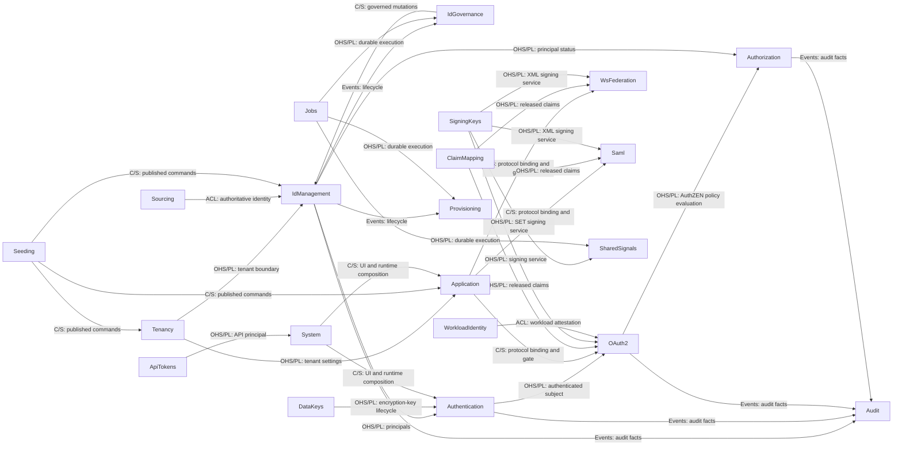

# Whole-System Specification

## Overview

この文書は、システム全体に適用する仕様と設計を記録する。一つの Bounded Context に属する振る舞いと設計は、その Context の `spec/contexts/<context>/SPECIFICATION.md` に置く。API とモデルの契約は隣接する TypeSpec に、変更ごとの検討と実装の経緯は work item に記録する。

エンドポイント、フィールド、画面など、個別機能の詳細はここに置かない。それぞれ `spec/contexts/*/*.tsp`、コード、UI 文書を正とする。

### Reading order

機能の変更では、次の順に読む。

1. `spec/SPECIFICATION.md`。システム全体の設計と所有権の所在をつかむ。
2. 所有する Context の `SPECIFICATION.md`、`models.tsp`、`main.tsp`。変更に先立って仕様を更新する。
3. 進行中の work item。変更ごとの設計と実装の経緯を確認する。
4. Go の実装。`domain/`、`usecase/`、`ports/`、関連する `<role>_<technology>/` アダプターの順に読む。
5. `backend/shared/` と `backend/cmd/internal/bootstrap/`。横断的な HTTP や永続化の振る舞いを変更するときだけ読む。
6. UI を変更するときは `spec/contexts/system/SPECIFICATION.md` と `frontend/src/features/README.md` を先に読む。

実装から仕様を探す場合は、原則としてパッケージ名に対応する Context を参照する。Context に属さない技術的な共通機能は `backend/shared/` に集約している。

## Design

### Structure

```text
.
├── backend/           # Go Bounded Contexts, shared, cmd/
├── frontend/          # React UI and gateway
├── spec/              # TypeSpec, canonical specification/design Markdown, and release baseline
│   └── contexts/<context>/SPECIFICATION.md
├── infra/             # container, local runtime, and database schema assets
├── load/k6/           # tenant-local OAuth SLO smoke
├── tools/             # specification, boundary, compatibility, and rendering tools
└── work-items/        # units of work, decision history, and completion records
```

依存は `spec` から実装と派生成果物へ向かって流れる。`backend` のドメイン層とユースケース層のパッケージが、アダプターやランタイムへ逆向きに依存することはない。

#### Development flow mapping

| 関心事 | 置き場所 | 詳細 |
| --- | --- | --- |
| 仕様と設計 | `spec/**/*.tsp`, `spec/**/SPECIFICATION.md` | 規範的な振る舞い、契約、現在の根拠。変更はここから始まる。 |
| 変更の記録 | `work-items/*.md` | 1 つの変更についての代替案、計画、作業、完了の記録。 |
| ドメインモデル | `backend/<context>/(<feature>/)domain` | フレームワークに依存しないドメインモデル。 |
| アプリケーションロジック | `backend/<context>/(<feature>/)usecase` | フレームワークに依存しないユースケース。 |
| ポート | `backend/<context>/(<feature>/)ports` | HTTP、永続化、通知などのポート。 |
| アダプター | `backend/<context>/(<feature>/){handlers_http,db_postgres,...}` | HTTP、永続化、通知などのアダプター。 |
| ランタイム | `backend/cmd/`, `backend/cmd/internal/bootstrap` | 起動、依存注入。 |
| インフラ基盤 | `infra` | インフラ基盤の設定コード。 |
| フロントエンド | `frontend` | フロントエンドコード。 |

### Stack

- **バックエンド**：Go。
- **フロントエンド**：React/TypeScript、Bun。
- **データベース**：PostgreSQL。
- **インフラ基盤**：Docker Compose、Kubernetes、Prometheus、Grafana、Loki、Promtail、k6。

### Context Map

この図は DDD の Context Map であり、ドメイン上の関係と統合境界を示す。ソースコードの import 関係を網羅するものではない。矢印は Supplier（上流）から Customer（下流）へ向かう。`OHS/PL` は Published Language を伴う Open Host Service、`C/S` は Customer/Supplier、`ACL` は Anti-Corruption Layer、`Events` は公開イベントによる関係を表す。



次の表が、全 Bounded Context の責務と実装場所の索引である。

| Specification context | Go package | Responsibility |
| --- | --- | --- |
| `System` | `backend/cmd/internal/bootstrap`, `backend/shared/http/server_http`, `frontend/` | 起動、経路の組み立て、健全性、フロントエンド UI。 |
| `Tenancy` | `backend/tenancy` | Tenant と realm、テナント単位の設定、ユーザーの属性スキーマ、制御面のテナント管理。 |
| `IdManagement` | `backend/idmanagement` | User、Group、Agent、自身のプロフィール、アイデンティティのライフサイクル、CEL による動的メンバーシップ規則と再評価。 |
| `IdGovernance` | `backend/idgovernance` | LifecycleWorkflow のポリシーとオーケストレーション。記録の正は IdManagement に残る。 |
| `Authentication` | `backend/authentication` | 資格情報の検証、MFA、ログインセッション、ステップアップ認証、パスワードの変更とリセット、認証イベント。 |
| `OAuth2` | `backend/oauth2` | OAuth 2.0 と OIDC のプロトコルエンドポイント、クライアント、同意、トークン、ロールのポリシー。 |
| `Application` | `backend/application` | Application のカタログ、プロトコルのバインディング、割り当て、ポータルの並び順と分類。 |
| `Authorization` | `backend/authorization` | リソース 1 件ごとの細粒度認可。テナントごとの認可モデル（リソース型と関係の定義）、関係タプル、深さ制限つきのグラフ評価、整合トークンを所有する。判定の合成そのものは持たず、関係の成否を事実として OAuth2 が所有する AuthZEN の `Authorizer` ポートへ渡す。 |
| `Audit` | `backend/audit` | 全 Context にまたがる監査イベントの Read Model。検索属性の登録簿、個人識別情報の変換、管理 API、保持期間を所有する。 |
| `ClaimMapping` | `backend/claimmapping` | プロトコルに依存しないクレーム開示ポリシー、アイデンティティ属性からクレームへのマッピング、フェイルクローズな検証。 |
| `Provisioning` | `backend/provisioning` | SCIM 2.0 による外向きのプロビジョニング。IdMagic の User と Group を正として、下流の SaaS へライフサイクルを反映する。 |
| `Sourcing` | `backend/sourcing` | 上流の権威からの内向きのアイデンティティ取り込み。取り込み元のバインディング、外部の不変 ID との相関、上流の権威に追随する削除と無効化を所有する。取り込み元ごとに 1 つの機能単位として構成し、現在は `sourcing/scim` だけを持つ。 |
| `ApiTokens` | `backend/apitoken` | 管理 API と SCIM API を認証するテナント単位の API アクセストークン（`idmagic_pat_` で始まる）。発行、失効、一覧、スコープの語彙を担う。 |
| `Jobs` | `backend/jobs` | テナント境界を保つ汎用の非同期ジョブ基盤。 |
| `Seeding` | `backend/seeding` | 環境ごとの構成、プレビュー、機密情報を伏せた計画、適用ポリシー。業務データとその永続化は、記録を所有する各 Context に残る。 |
| `SigningKeys` | `backend/signingkeys` | テナントと用途で区切られた鍵のメタデータ、X.509 資格情報、ローテーション、Repository のポート、管理 API と JWKS の HTTP エンドポイント、メモリ、PostgreSQL、Vault の各アダプター。JWT と XML の署名処理はプロトコルのアダプターに残す。 |
| `DataKeys` | `backend/datakeys` | MFA の TOTP シードなど、データベースに保存する必要がある可逆なシークレットを保護するテナントごとの `DataEncryptionKey`（DEK）のメタデータとライフサイクル。署名鍵は `SigningKeys`、`EnvelopeCrypto` ポートは `backend/shared/security` が所有する。 |
| `WsFederation` | `backend/wsfederation` | WS-Federation のパッシブプロファイル、WS-Trust のアクティブ STS、フェデレーションメタデータ、MEX、RP の信頼、リクエスト元テナントによる XML 署名。 |
| `Saml` | `backend/saml` | SAML 2.0 IdP、SP の信頼、メタデータ、SSO と SLO、リクエスト元テナントによる XML 署名。 |
| `WorkloadIdentity` | `backend/workloadidentity` | エージェントの実行環境に対するワークロードアイデンティティフェデレーション。登録済みの外部アテステーション発行者（`WorkloadTrustBundle`）と、`subject` のパターンから `Agent` への対応付け（`AgentWorkloadBinding`）を持つ。OAuth2 のトークン交換はこれを使い、長期シークレットを配布せずに外部の JWT-SVID を IdMagic のトークンへ交換する。 |
| `SharedSignals` | `backend/sharedsignals` | OpenID Shared Signals Framework（SSF）と RFC 8417 の Security Event Token（SET）による継続的アクセス評価（CAEP）およびエージェントのほぼ即時の失効。 |

### Conventions

Bounded Context は通常、次の 4 層で構成する。

```text
backend/<context>/
  domain/            # エンティティ、値オブジェクト、状態遷移、純粋な検証
  usecase/           # 仕様で定めた操作を行うアプリケーションロジック
  ports/             # Repository、ストア、外部サービスの抽象
  handlers_http/     # 受信 HTTP アダプター
  db_memory/         # メモリ版 Repository アダプター
  db_postgres/       # PostgreSQL 版 Repository アダプター
```

アダプターはそれを所有する Context または機能の直下に置き、snake_case の `<role>_<technology>` で命名する。

`backend/shared/` は、複数の Context が実際に共有する技術的な能力のための場所である。

具象のドメインイベントの構造体は、それを所有する Context の `domain/events.go` に置く。`backend/shared/spec/events.go` はイベントのエンベロープとなるインターフェースと、そのワイヤ表現への変換だけを持つ。

2 つ以上の独立した機能を持つ Context は、4 層の構成に機能ごとの垂直分割を追加してよい：`backend/<context>/<feature>/{domain,ports,usecase,<role>_<technology>}/`。機能が 1 つしかない Context は分割しない。

```text
backend/idmanagement/
  module.go                 # Context ごとに 1 つ置く DI の組み立て
  domain/                   # 機能間で共有する型だけ（列挙、DomainEvent）
  usecase/                  # 機能をまたぐユースケース補助とエラー値だけ
  deps_http/                # Deps 型を定義する末端パッケージ
  handlers_http/            # ルート登録と機能をまたぐ統合テスト
  user/  group/  agent/     # 各機能の domain、ports、usecase、アダプター
```

#### Frontend Component Structure

仕様上の機能とそろえた UI の境界は `frontend/src/features/<feature>/` に置く。その機能のビュー、ローカルコンポーネント、ヘルパー、テスト、ローカライズ辞書（`*.i18n.ts`）は必ずそのディレクトリに置く。特定の機能境界にひも付かない、横断的で再利用可能なコンポーネントは `frontend/src/components/` に置く。

### Cross-cutting Concerns

#### HTTP routing

HTTP ルーティングは `backend/shared/http/server_http/routes.go` で組み立てる。ここがテナント単位のルートを既定のテナントと `/realms/:tenant_id` の両方に登録し、制御面のテナント管理だけを `/realms/default/admin/tenants` に分離する。

各 Context のルーティングは `backend/<context>/handlers_http/routes.go` にある。正確なエンドポイントの一覧はそのファイルを参照する。新しい HTTP API は、それを所有する Context の `routes.go` に、同じ `handlers_http` 配下のハンドラーとともに登録する。Context 固有の Repository とルーティングの接続は `backend/<context>/module.go` に集約し、中央のルーターは Module を呼ぶだけにする。

#### Request correlation

すべてのリクエストに `request_id` を割り当て、`X-Request-ID` レスポンスヘッダーと、そのリクエストに関するすべてのアプリケーションログへ付与する。`OBSERVABILITY=otel` の場合は `trace_id` と `span_id` も付与する。

`X-Request-ID` はクライアントが制御できるため、既定では受信値を無視して新しい ID を生成する。これにより、クライアントによる ID の偽装や意図的な衝突を防ぐ。`REQUEST_ID_TRUST_INBOUND=true` を設定できるのは、信頼できる境界プロキシがヘッダーを生成または無害化する場合だけである。クライアントの値をそのまま転送するプロキシは信頼してはならない。受信値を利用する場合も長さと文字種を制限し、ヘッダーとログへの注入を防ぐ。

#### Cursor pagination

管理用の一覧 API は、署名済みで版の付いたキーセット方式のカーソルを RFC 8288 の `Link` レスポンスヘッダーで返す。カーソルは自身のテナント、問い合わせと並び順の同一性、方向、行の境界を束縛する。

#### HTTP error responses

汎用 API のエラーレスポンスには、既定形式として RFC 9457 Problem Details（`application/problem+json`、`type`、`title`、`status`、`detail`、`instance`）を使う。`instance` には上記のリクエスト相関用の `request_id` を載せる。HTTP ステータスコードは RFC 9110 に従い、400 はリクエストを解析できないこと（不正な JSON、必須構造の欠落）を、422 は解析できた内容が業務規則に違反すること（不正なロール、参照の不一致、ポリシー違反）を表す。

OAuth2（`backend/oauth2/handlers_http`）、SCIM（`backend/sourcing/scim/handlers_http`）、Dynamic Client Registration（RFC 7591、`backend/oauth2/handlers_http` の一部）、SharedSignals の受信エンドポイント（RFC 8935、`/ssf/streams/{stream_id}/events`）は、各標準が定めるエラーレスポンスを返す。標準に従うクライアントとの相互運用性を保つため、これらには Problem Details を適用しない。この境界は接点ごとに引く。同じパッケージの中でも、ブラウザーや管理コンソールが呼ぶ汎用 API は Problem Details を返し、標準が形を定める相手だけが例外である。

契約側では、この 3 通りの本文をそれぞれ 1 つのモデルが持つ。汎用 API のエラーは `IdMagic.Contract.ProblemDetails` で、`type` / `title` / `status` / `detail` / `instance` を宣言する。個々のエラーは `model <Name>Error is ProblemDetails;` と書き、どの `type` URN 接尾辞 (= サーバーが返す error code) に対応するかを `@doc` で名指しする。標準が形を定める接点のうち OAuth 2.0 / OIDC 系は `IdMagic.Contract.OAuthError` (`error` / `error_description`、RFC 6749 §5.2) を、SCIM は `IdMagic.Contract.ScimProtocolError` (RFC 7644 §3.12) を同じ形で参照する。どちらにも当てはまらない独自形状は、`EndpointRateLimitPolicy` の 429 (`error` / `retry_after_seconds` / `message` と `Retry-After` ヘッダー) と SharedSignals 受信エンドポイントの拒否 (`error` / `message`) の 2 つだけで、それぞれ本文を直接宣言する。同じ error code が接点によって別の本文で返るときは、`AccessDeniedError` と `OAuthAccessDeniedError` のように接点ごとにモデルを分ける。1 つのモデルが 2 つの形を名乗ることは許さない。

#### Wire bodies in the contract

TypeSpec が `@body` に宣言する型は、サーバーが実際に受理し返す JSON そのものである。サーバーが送らない封筒を契約側で 1 段挟まない。ハンドラーが `map[string]any{"groups": ...}` のような封筒を書くときにだけ、契約もその封筒を持つ。パスやクエリのパラメータは要求本体のプロパティにしない。本文が JSON でない接点 (CSV のアップロード、SET の受信、XML メタデータ、画像の配信、メトリクスの公開) は、その media type と本文の型をそのまま宣言する。

同じ規則が値にも及ぶ。enum の値は member 名の複製ではなく線上の値そのものを書き、標準が定める値は標準から、独自の値は Go の定数から写す。`unknown` は「任意の JSON 値」と読まれるので、実在する型やモデルがあるならそれを書き、本当に任意でよい場合だけ、なぜ任意なのかを `@doc` に残す。

#### String length limits

文字列フィールドの長さ上限は、公開契約、Go の検証、PostgreSQL の制約、UI の入力欄という 4 つの境界に同じ数で現れる。数が同じでも数える単位が違えば別々の上限になるので、単位を先に固定する。

単位は **Unicode コードポイント**である。TypeSpec の `@maxLength`、そこから生成される OpenAPI の `maxLength`、PostgreSQL の `char_length()`、Go の `utf8.RuneCountInString` は、いずれもコードポイントを数える。zog の `String().Max(n)` だけは UTF-8 バイト数を数えるため、文字列フィールドには使わない。代わりに `backend/shared/spec` の `Chars` と `CharsAtMost` を使う。バイト数で数えると、上限 100 の名前が英字なら 100 文字、日本語なら 33 文字になり、契約に書いた数が意味を持たなくなる。

例外は、準拠する標準自身がオクテットで上限を定めている値に限る。メールアドレスは RFC 5321 の 254 オクテット、realm は DNS ラベルの 63 オクテットである。どちらも書式を ASCII に限っているため、実際の値ではコードポイント数と一致する。

上限を置く値は、次の既定の区分から選ぶ。外部の標準も固定の表示面も関与しない値のために、新しい数を持ち込まない。

| Class | Limit | Applies to |
| --- | --- | --- |
| Handle | 64 | IdMagic が採番する集約の ID、および関係名や型名のような語彙的な名前 |
| Name | 100 | 一行の名前 |
| DisplayName | 200 | 利用者に見せる表示名とメールの件名 |
| ExternalID | 256 | 呼び出し側の資源空間から来る識別子 |
| Description | 500 | 数文の説明、パターン、表示テンプレート |
| URI | 2048 | URL と URI |
| Expression | 4096 | CEL のような式 |
| PlainBody | 8000 | 平文の本文 |
| RichBody | 20000 | HTML の本文 |

次の値は外部の標準か固定の表示面から上限が決まるので、区分の外に置く。

| Field | Limit | Why |
| --- | --- | --- |
| メールアドレス | 254 | RFC 5321 が定める経路の上限 |
| `Tenant.realm` | 63 | DNS ラベル |
| `WorkloadTrustBundle.trust_domain` | 255 | DNS 名 |
| `client_id` | 128 | UUID を収めたうえで、他の認可サーバーから移入した値も受けられる幅 |
| パスワード | 128 | `PasswordPolicy` の既定の上限 |
| ブランディングの短いラベル | 80 | サインイン画面とメールの固定枠に収まる幅 |
| ブランディングの補足テキスト | 280 | 同上 |

連携相手が値を決める識別子にも上限を置く。上限を置かないという選択は、実際には上限を PostgreSQL の btree に任せることでしかない。btree v4 は索引行 1 件を 2704 バイトに制限するので、主キーや一意索引の成分になっている列は、宣言の有無にかかわらずそこで頭打ちになる。宣言しなければ、超過は書き込み時の `SQLSTATE 54000` として現れ、どのフィールドをどこまで短くすればよいのかを利用者に伝えられない。索引タプルは値を圧縮しようとするため、その境界がどこに来るかは値の中身によっても動く。

そこで、索引の鍵の成分になる列では、性質の違う 2 つの上限を重ねる。

| Limit | Unit | Role |
| --- | --- | --- |
| 契約の上限 | コードポイント | 公開契約が示す数。TypeSpec の `@maxLength` と Go の `spec.Chars` が持つ |
| 資源の上限 | バイト | 索引行に収まることの保証。Go の `spec.KeyString` と PostgreSQL の `octet_length` が持つ |

資源の上限だけがバイトで数えるのは、btree が制限しているものがバイトだからである。単位をコードポイントに揃える原則の例外は、これで 2 つになる。標準自身がオクテットで上限を定めている値と、上限が守る資源そのものがバイトで測られる場合である。契約の上限をコードポイントで置くだけでは足りない。標準が 1024 文字と定める識別子でも、すべて 3 バイト文字なら 3072 バイトになり、宣言した契約を満たしたまま btree で落ちる。

複合鍵では、列ごとではなく鍵 1 件の合計が索引行に収まらなければならない。鍵ごとにバイトの予算を持ち、その合計を 2400 バイト以下とする。btree の 2704 バイトとの差が、索引タプル自身が使う領域と、将来列を足すための余白になる。この条件を守るのはこの文書ではなく `backend/shared/spec` のテストで、上限を後から広げて予算を割ったときにそこで分かる。

上限には、標準が定める数をそのまま使わない。標準を超える値を出す実装は実在しうるので、標準の数は「上限が実運用で拘束的でないことの根拠」として記録し、上限そのものはその外側に置く。これらは安全のために置く資源の境界であって、業務上望ましい長さではない。

| Column | Code points | Bytes | Why |
| --- | --- | --- | --- |
| `SamlServiceProvider.entity_id` | 2048 | 2048 | URI 区分。`saml-schema-metadata-2.0.xsd` の `entityIDType` は 1024 文字を定めるが、非準拠の SP を拒否しないためその外側に置く |
| SAML AuthnRequest の `ID` | 256 | 256 | 資源の上限。`xs:ID` に長さの規定はない |
| `WsFedRelyingParty.wtrealm` | 2048 | 2048 | URI 区分。WS-Federation は `wtrealm` を URI としか定めない |
| 外部 IdP の subject | 512 | 1024 | 資源の上限。OpenID Connect Core 1.0 §2 は `sub` を 255 ASCII 文字以下と定めるが、SAML の NameID には規定がない |
| 外部 IdP の SAML `Response` の `ID` | 256 | 256 | 資源の上限 |
| DPoP proof と client assertion の `jti` | 256 | 256 | 資源の上限。RFC 7519 に長さの規定はない |
| WebAuthn の credential ID | 2048 | 2048 | 資源の上限。WebAuthn は 1023 バイト以下と定めるので base64url で 1364 文字になる |

IdMagic が採番する鍵の成分にも上限を置くが、置く境界が違う。SCIM の `id`（RFC 7643 が service provider の割り当てと定める値）、署名鍵の `kid`（RFC 7638 の JWK thumbprint）、発行した token の `jti` は、いずれも Handle 区分の 64 とする。実値はそれぞれ hex 32 文字、base64url 43 文字、UUID であり、ASCII しか取らないので契約の上限と資源の上限が同じ数になる。これらには Go 側の検査を置かず、`CHECK` だけを置く。拒否すべき外部の入力が無いためである。超過するのは採番の実装が壊れたときだけで、それは利用者の誤りではないので 422 にしない。

鍵の成分ではない外部由来の値にも上限を置く。btree の制約は受けないが、保存量を無制限にしてよい理由にはならない。`tls_client_auth_subject_dn` は URI 区分の 2048、連携先の同期を隔離した理由を記録する文字列は Description 区分の 500 とする。後者は利用者の入力ではなく連携先が返したエラー文なので、拒否せず書き込み側で切り詰める。長いエラー文を理由に隔離そのものが失敗する方が高くつく。外部入力を通らない固定長のダイジェスト（各種 token hash）には上限を置かない。

4 つの境界は同じ数を持つが、役割は同じではない。

| Boundary | Role |
| --- | --- |
| TypeSpec の `@maxLength` | 公開契約。OpenAPI と生成ドキュメントが示す数の出どころ。 |
| Go の domain スキーマ | 唯一の強制点。ここを通らない書き込み経路を作らない。 |
| PostgreSQL の `CHECK (char_length(col) <= N)` | 最後の防壁。ここで落ちるのは実装の不具合であり、利用者向けエラーの発生源にしない。索引の鍵の成分では `octet_length(col) <= M` を同じ `CHECK` に併記する。 |
| UI の `maxLength` 属性 | 入力の補助。保証ではない。 |

UI だけは数える単位が違う。HTML の `maxLength` が数えるのは UTF-16 のコード単位なので、基本多言語面の外にある絵文字などは 1 文字が 2 と数えられる。UTF-16 のコード単位数はコードポイント数を下回らないため、ずれは必ず厳しい側に出る。入力欄が通した値をサーバが長さで拒むことはなく、逆に絵文字だけの入力では上限の手前で入力欄が止まる。この不一致は許容する。ブラウザーの `maxLength` にコードポイントを数えさせる方法はなく、自前で数え直して入力を書き換えると、入力中の変換や取り消しの邪魔になるためである。

`CHECK` に置いてよいのは、長さのように安定した構造上の境界に限る。スキームの allowlist のような、変わりうる入力規則を DDL へ入れない。規則が変わるたびに全配備でスキーマ移行が必要になるうえ、利用者の入力誤りで落ちる規則をこの層に置くと、上の表が定める「実装の不具合だけが落ちる場所」という役割が崩れるためである。たとえばテナントのフッターリンクに `https` しか許さない規則は Go の domain が持ち、`CHECK` は長さだけを見る。

上限違反は、解析できた内容が業務規則に違反する場合に当たるので、[HTTP error responses](#http-error-responses) が定める 422 で返す。違反したフィールドと上限を `detail` に載せ、何を短くすればよいかを利用者が判断できるようにする。

ただしこれは管理 API の話である。SAML、WS-Federation、OAuth 2.0、SCIM、WebAuthn のように相手側のプロトコルが応答の形を定めている接点では、長さの違反もそのプロトコルが定めるエラーとして返す。AuthnRequest を送ってきた相手に Problem Details を返しても読めない。上限の数は同じでも、それを伝える語彙は接点ごとに違う。

資源の上限は書き込み経路にだけ課す。索引の鍵の成分を検索の条件として受け取る経路（`GET /Users/{id}` のような）は、長い値を渡されても索引行を作らないので、上限を超えた値でも 422 ではなく通常の「見つからない」として扱う。

#### Metrics

`GET /metrics` は Prometheus と OpenMetrics の形式でメトリクスを公開する。ルートパターンごとの HTTP RED（件数、`status_code` によるエラー率、所要時間、処理中の数）に加え、SLO とアラートに使う認証のゴールデンシグナルを含む。

| Metric | Labels | Verifies |
| --- | --- | --- |
| `http_requests_total`, `http_request_duration_seconds`, `http_requests_in_flight` | `route`, `method`, `status_code` | 接点ごとの遅延とエラー率の目標 |
| `authn_login_attempts_total` | `outcome`, `reason_class`, `method` | ログインの成否というゴールデンシグナル |
| `authn_login_throttle_total` | `policy`, `outcome` | ログインのスロットルの発動率 |
| `endpoint_rate_limit_total` | `policy`, `outcome` | エンドポイントの流量制限の発動率 |
| `oauth2_token_issuance_total`, `oauth2_token_issuance_duration_seconds` | `grant_type`, `outcome` | grant 別の `/token` の発行率と遅延 |
| `http_request_aborts_total`, `operation_detached_completion_failures_total` | `kind` | 中断の扱い |

ラベルの値は有限の集合に限る。値の種類に上限がない `tenant_id`、`user_id`、`client_id`、解決済みのリクエストパスはラベルにしない。エンドポイントは常に登録するが、起動時に Prometheus の構築が完了するまでは `503` を返す。公開先はループバックアドレス、管理ネットワーク、または認証付きプロキシの背後に限る。

#### Logging

アプリケーションログは、`timestamp`、`level`、`service`、`message` と、相関用の `trace_id`、`span_id`、`request_id` を持つ JSON Lines として標準出力へ書く（`backend/shared/logging`）。プロセス自身は他の場所へログを書かない。

**ローカル**（`infra/docker/docker-compose.dev.yaml`）：Promtail は Docker Engine API（`docker_sd_configs`）ですべてのコンテナを検出し、ログを Loki へ送る。ホストのログディレクトリをマウントする必要はなく、Docker ソケットだけを使用する。Grafana には初回起動時に Prometheus と Loki のデータソースとゴールデンシグナルのダッシュボードを設定する。`just dev-compose` だけでメトリクスとログを閲覧できる。

**Kubernetes**（`infra/k8s/monitoring/loki/`）：Promtail は DaemonSet として動作し、`kubernetes_sd_configs` で Pod を検出して `/var/log/pods` を追尾する。Loki は永続ボリュームを持つ単一レプリカの StatefulSet として動作する。ファイルシステムへの保存は開発用の既定であり、本番クラスターではオブジェクトストレージを使う保持設定で上書きする。

| Field | Loki treatment | Why |
| --- | --- | --- |
| `service`, `level` | インデックスラベル | 有限の集合である |
| `trace_id`, `span_id`, `request_id` | 構造化メタデータ（ラベルではない） | 値の種類に上限がなく、インデックスラベルにすると組み合わせが爆発する。[Metrics](#metrics) で `tenant_id` と `user_id` をラベルにしない理由と同じ |

#### HTTP server hardening

外部に公開する HTTP サーバーには、本番環境で安全なタイムアウトとリクエスト本体の上限を適用する。低速な接続や過大なリクエストによる接続枠とメモリの枯渇を防ぐためである（`gosec G112`、CWE-400）。上限を超えた本体は `413` で拒否する。

| Variable | Default | Purpose |
| --- | --- | --- |
| `HTTP_READ_HEADER_TIMEOUT` | `10s` | リクエストのヘッダーを読む上限時間（slowloris の抑止） |
| `HTTP_READ_TIMEOUT` | `30s` | リクエスト全体を読む上限時間 |
| `HTTP_WRITE_TIMEOUT` | `60s` | レスポンスを書く上限時間 |
| `HTTP_IDLE_TIMEOUT` | `120s` | 持続接続の待機時間の上限 |
| `HTTP_MAX_BODY_BYTES` | `1048576` | リクエスト本体の最大バイト数（1 MiB） |

これは多層防御であり、境界プロキシの代わりではない。大量のリクエストと TLS ハンドシェイクを悪用する slowloris には、前段のリバースプロキシで対処する。

#### Security response headers

境界ミドルウェアは、すべてのバックエンドレスポンスに `X-Content-Type-Options: nosniff`、`Referrer-Policy: no-referrer`、`X-Frame-Options: DENY`、厳格な `Content-Security-Policy`（`default-src 'none'; base-uri 'none'; frame-ancestors 'none'; form-action 'self'`）を適用する。`frame-ancestors 'none'` と `X-Frame-Options: DENY` により、ログイン、同意、ポータル画面の埋め込みとクリックジャッキングを防ぐ。CSP では `'unsafe-inline'` を使わない。IdMagic が出力する埋め込みスクリプトは、SAML ACS と WS-Fed の POST バインディングで使う固定の自動送信処理だけである。これらはレスポンスごとに `script-src 'sha256-…'` で許可し、`form-action` も送信先エンドポイントに限定する。

CSP と `frame-ancestors` はルートごとの判断が必要なので、IdMagic がヘッダーを設定する。これにより、最小構成のプロキシの背後でも、プロキシがない場合でも保護が成立する。単一ページアプリケーションはゲートウェイが配信し、静的 HTML に対して `script-src 'self'` を含む CSP を設定する。

HSTS は TLS を終端する側が設定する。`Strict-Transport-Security` は既定で無効とし、平文の `http` を使う開発環境に影響させない。TLS がこの区間か、その手前で終端される場合にのみ有効化する。通常の構成では境界のプロキシに任せ（`HSTS_ENABLED=false`）、アプリケーション自身が表明すべき場合に `HSTS_ENABLED=true` とする（`HSTS_MAX_AGE_SECONDS` と `HSTS_INCLUDE_SUBDOMAINS` で調整する）。

画面を壊さずに CSP を厳しくするには、`CSP_REPORT_ONLY=true` で `Content-Security-Policy-Report-Only` を出し、`CSP_REPORT_URI=<url>` で違反を収集し、観察してから強制へ戻す。

#### Persistence

永続化ポートと Repository の実装は、それを所有する Context に属する。Context 固有のメモリと PostgreSQL のアダプターは `backend/<context>/{db_memory,db_postgres}` に置き、共有のデータベース接続プール、行の読み取り、トランザクションのヘルパーは `backend/shared/storage/db_postgres` に置く。一時的な状態も PostgreSQL に統合するため、2 種類目のデータストアは運用しない。

`db_postgres` の静的な SQL 文はすべて `sqlc` の入力とし、型安全な Go コードを生成しなければならない。SQL 文字列を直接渡す `Pool.Query` と `Pool.Exec` は、問い合わせの構造が実行時まで決まらず、`sqlc` の型生成を利用できない場合に限って許される。

PostgreSQL の構造を変更する場合は、まず `infra/schema/postgres.sql` の現行スキーマを更新する。`psqldef` で差分をプレビューしてから適用し、適用後と再適用後のプレビューが空になることを確認する。手順は `infra/schema/README.md` に記載しており、CI では空のデータベースに対して `postgres.sql` が収束することを `just check-schema` で検証する。既存データのバックフィル、値の変換、削除前の退避など、構造差分で表現できない変更は work item の手順または専用 SQL に明記する。アプリケーション起動時にスキーマを移行する仕組みは設けない。

#### Database design policy

##### 1. Column type selection

列型の選択を一貫させるため、次の規則を適用する。

- **自由形式の文字列、長さ無制限**：`TEXT` を使う。制約のない `varchar` は使わない。
- **長さの上限がある文字列**：`TEXT` + `CHECK (char_length(col) <= N)` を使う。`varchar(N)` は使わない。上限を宣言と別の場所に置かず、他の `CHECK` と同じ書き方で並べるためである。`N` の決め方は [String length limits](#string-length-limits) に従う。書式が固定された識別子は `CHECK (... ~ regex)` で併せて守る。
- **内部で生成する ID**：IdMagic が `spec.NewUUIDv4()` で生成する列は `UUID` とする。Go 側は `string` で保持し、pgx のテキスト用符号器（`RegisterUUIDAsText`）が両者を変換する。
- **外部が決める ID**：`entity_id` や `wtrealm` など、外部が値を決める ID は `TEXT` とする。IdMagic が採番する値ではなく、UUID とも限らないためである。索引の鍵の成分になる場合は、`CHECK (char_length(col) <= N AND octet_length(col) <= M)` を 1 つの制約として置く。同じ列に `CHECK` を 2 つ並べると psqldef の差分が収束しない。
- **時刻**：すべて `TIMESTAMPTZ` とし、マイクロ秒の精度を正とする。スキーマで丸めない。
- **有限の値集合**：`TEXT` + `CHECK (col IN (...))` とする。PostgreSQL の列挙型は避ける。値の追加に `ALTER TYPE` が必要で、宣言的なスキーマの差分取りと相性が悪いためである。
- **JSONB**：結合や絞り込みが必要な値、外部キーや一意性の制約を持つ値などは JSONB の中に置かない。

##### 2. tenant_id retention classes

`users.id` と `oauth2_clients.client_id` はシステム全体で一意なので、子の行はその鍵だけで親を参照し、**テナント単位の複合外部キーは使わない**。全体で一意な親からテナントを特定できるという理由だけで、子の行へ `tenant_id` を重複して持たせない。`tenant_id` は、検索、制約、保持期間、監査のいずれかに必要な場合にだけ追加する。

- **テナントが所有する Aggregate**：`tenant_id` を持つ。
- **テナント単位で外部に由来する自然キー**：外部の ID がテナント内でしか一意でないため、`tenant_id` を主キーの一部にする（`scim_user_refs` と `scim_group_refs` は `(tenant_id, scim_id)`）。
- **全体で一意な親の子**：全体で一意な鍵（`user_id` と `client_id`）で識別し、テナントごとの検索や保持期間が必要でない限り `tenant_id` を持たない。
  - ただし `authentication_sessions` では、不透明な Cookie 値であるセッション ID をすべてのリクエストで照合するため、`tenant_id` をフェイルクローズな多層防御の条件として使う。テナントごとの有効なセッション一覧にも必要である。不透明なトークン、認可コード、チャレンジを鍵とする一時的な認証情報も同様に扱う。

##### 3. Envelope encryption for reversible secrets

データベースに保存する必要がある可逆なシークレットは、平文で保存しない。差し替え可能な `EnvelopeCrypto` プロバイダーのマスターキーでテナントごとの `DataEncryptionKey`（DEK）をラップし、その DEK で各シークレットを AEAD 暗号化する。AEAD と鍵セットの処理は [Tink](https://developers.google.com/tink) に委ね、nonce、認証タグ、追加認証データの組み立てを自作しない。追加認証データには `(tenant, context, table, record id, field)` と DEK のバージョンを使う。このため、暗号文を別のテナント、テーブル、フィールドへ複製しても復号できない。

- `EnvelopeCrypto`（Tink を使う AEAD と鍵セットのポート、および OpenBao と平文鍵セットによるマスターキー提供元のアダプター）は、`certificates_mtls`、`passwords_argon2id`、`tokens_jose` と並べて `backend/shared/security` に置く。これは業務上の Aggregate ではなく、技術上の共通機能である。
- `backend/datakeys`（`DataKeys` Context）は、ラップされた DEK のメタデータとライフサイクル（初期化、ローテーション、無効化、破棄）だけを所有し、`EnvelopeCrypto` ポート自体は所有しない。`SigningKeys` が `transit/sign` を暗号化、復号、データ鍵の機能から分離しているのと同じ構成である。
- ローテーションでは新しい DEK の版を以後の書き込み用に有効化し、直前の版を復号可能な `retiring` のまま残す。`backend/jobs` の `JobKind` と `HandlerRegistry` に登録した再開可能な再暗号化ジョブがすべての参照を移行し終えた後にだけ、古い版を破棄できる。`FieldMigrator` ポート（`backend/datakeys/ports`）により、各 Context は自身の一括再暗号化処理と残件数の算出を登録する。これにより、`DataKeys` はこのポートを利用する Context のスキーマへ依存しない。ローテーションは登録された移行処理ごとにジョブを自動投入し、いずれかの移行処理が残件を報告している間はラップされた DEK の消去を拒否する。
- アンラップに失敗した場合、プロバイダーへ到達できない場合、追加認証データが一致しない場合、または改ざんを検知した場合は、フェイルクローズで復号を拒否する。呼び出し元は平文へフォールバックしたり、項目を読み飛ばしたりしない。
- マスターキーの提供元は OpenBao（Vault Transit 互換の HTTP API）である。開発環境とローカル環境では Tink の平文鍵セットを使うため、OpenBao は不要である。提供元は設計上差し替え可能である。
- 唯一の HTTP 接点は、読み取り専用で `system_admin` に限定した `GET /api/admin/data-keys/health`（`backend/datakeys/handlers_http`）である。各テナントで有効な DEK の版とステータス、マスターキー提供元の名前と到達性を報告し、鍵素材は決して返さない。ローテーション、無効化、破棄は内部操作とし、管理用エンドポイントを公開しない。

DEK の破棄では `tenant_data_encryption_keys` の行を削除せず、`wrapped_dek` を `NULL` にして暗号学的に消去する。これにより、鍵素材を失った後も `active`、`retiring`、`disabled`、`destroyed` というライフサイクルの履歴を参照できる。

##### 4. Notification template catalog and locale resolution

通知メールの内容は、システムが同梱する日本語と英語の組み込みカタログと、必要に応じた `(tenant_id, template_key, locale)` ごとの上書きという 2 段階で解決する。版の履歴は持たず、`ResetNotificationTemplate` は常に既知の正常な組み込み文面へ戻す。`template_key` は仕様で定める固定の列挙であり、テナントは追加できない。各キーは 1 つの送信経路に対応し、送信元のないテンプレートは作成できない。

プレースホルダー（`{{name}}`）は保存時にテンプレートキーごとの許可リストと照合する。宣言されていないプレースホルダーを参照する上書きは、空の値で描画するのではなく、保存時に拒否する。アカウント復旧などの導線が実行時に欠落することを防ぐためである。許可リストは `backend/shared/notification/template` で定義して API から返す。

| Key | Placeholders |
| --- | --- |
| all keys | `product_name`, `tenant_display_name`, `user_display_name` |
| `PasswordReset`, `EmailVerification`, `EmailChangeConfirmation` | 1 つの `*_url` の導線、`expires_in_minutes` |
| `EmailChangeConfirmation` (additional) | `new_email` |
| `LifecycleWorkflowNotification` (additional) | `notification_key` |
| `AccountSecurityAlert` (additional) | `event_description`, `occurred_at`, `device_summary`, `security_review_url` |

資格情報、ダイジェスト値、TOTP シークレット、API トークン、生の IP アドレスは決して差し込みにしない。メールは受信者によって転送され、引用され、無期限に保持されるため、これらの情報を差し込むと、後に受信箱が侵害された際に露出する。

描画処理は、件名、平文本文、HTML 本文を常に 1 つの単位として返す。上書きも 3 つを同時に置き換え、メールは `multipart/alternative` として送るため、平文と HTML の内容が意図せず食い違わない。

特殊文字の処理はテンプレートではなく描画処理の責務とし、HTML に差し込む値だけをエスケープする。導線の URL は呼び出すユースケースがリクエストの `issuer` から組み立て、1 つのプレースホルダー値として渡す。テンプレートは URL を配置できるが、断片から組み立てられない。

上書きできるのは、件名、HTML 本文の断片、平文本文、送信者の表示名だけである。HTML 文書の外枠と送信元アドレスはシステムが所有し、テナントの入力をこれらへ注入させない。

言語は、受信者の `User.locale`、テナントの `default_locale`、システム設定の `DEFAULT_LOCALE`（既定値は `en`）の順に解決し、カタログに翻訳がある最初の言語を使う。テナントの既定言語は明示的な列で管理し、ある言語のテンプレートを上書きしただけで他の通知までその言語へ変わることを防ぐ。

試し送りは、操作中の管理者自身が確認済みのアドレスにだけ送信し、エンドポイントは宛先を受け取らない。任意の宛先を許可すると、テナントのブランド表示を使ったメールを第三者へ送る手段になるためである。下書きのプレビューは読み取り専用で、実際の利用者データではなく固定のサンプル値を使って描画する。

##### 5. Endpoint rate limiting

`backend/shared/ratelimit`（`ports`、`db_memory`、`db_postgres`）は業務上の Aggregate ではなく、`backend/shared/security` の `EnvelopeCrypto` と同様の技術的な共通機能である。OAuth2 と Authentication の双方に属するエンドポイント（`/authorize`、`/token`、`/par`、`/device_authorization`、`/bc-authorize`、`/api/auth/password_reset/*`）を保護するため、特定の Context には置かない。アカウント単位および IP 単位のログインスロットルとは目的が異なり、その代わりにはならない。

ポートは `Allow(ctx, tenantID, policyID, key, now)` という単一の操作を公開する。`(tenant_id, policy_id, key_hash)` をキーとする固定時間枠のカウンターを持ち、許可と拒否のいずれでも、リクエストごとに 1 回加算する。失敗だけを数えるログインスロットルとは異なる。

`endpoint_rate_limit_counters` は、すべてのリクエストで更新される一時データなので `UNLOGGED` とする。障害でカウンターを失っても時間枠がリセットされるだけで、永続的な安全性の保証は失われない。一方、失うと保証が弱まる `login_throttle_counters` とアクセストークンの拒否リストは `LOGGED` のままにする。

ストアへ到達できない場合は、すべてのポリシーでフェイルクローズに拒否する。保護対象のエンドポイントはすでに PostgreSQL を必須としているため、依存先の種類は増えない。

ポリシーごとに、固定時間枠の最大リクエスト数と枠の長さを秒単位の環境変数で設定できる。運用者はコードを変更せずに閾値を調整できる。

| Policy | Env (max / window) | Default |
| --- | --- | --- |
| `token` | `RATE_LIMIT_TOKEN_MAX_REQUESTS` / `RATE_LIMIT_TOKEN_WINDOW_SECONDS` | 60 / 60s |
| `authorize` | `RATE_LIMIT_AUTHORIZE_MAX_REQUESTS` / `RATE_LIMIT_AUTHORIZE_WINDOW_SECONDS` | 30 / 60s |
| `par` | `RATE_LIMIT_PAR_MAX_REQUESTS` / `RATE_LIMIT_PAR_WINDOW_SECONDS` | 30 / 60s |
| `device_authorization` | `RATE_LIMIT_DEVICE_AUTHORIZATION_MAX_REQUESTS` / `RATE_LIMIT_DEVICE_AUTHORIZATION_WINDOW_SECONDS` | 20 / 60s |
| `backchannel_authentication` | `RATE_LIMIT_BACKCHANNEL_AUTHENTICATION_MAX_REQUESTS` / `RATE_LIMIT_BACKCHANNEL_AUTHENTICATION_WINDOW_SECONDS` | 20 / 60s |
| `password_reset` | `RATE_LIMIT_PASSWORD_RESET_MAX_REQUESTS` / `RATE_LIMIT_PASSWORD_RESET_WINDOW_SECONDS` | 5 / 900s |

キーは `client_id`、IP、`identifier_hash` の組み合わせである。`client_id` はシークレットではないが、IP とパスワード再設定の識別子は保存前に SHA-256 でダイジェスト化する。ログインスロットルの `hashThrottleIdentifier` と同じ方式である。閾値を超えると、`Retry-After` と TypeSpec の `RateLimitedError` を伴う HTTP 429 を返す。

### Runtime Composition

システムには次の 3 つの実行単位がある。

- **API プロセス**：`backend/cmd/idmagic/` の `main` パッケージが起動し、`backend/cmd/internal/bootstrap` が依存注入を担う。
- **ワーカー**：`backend/cmd/idmagic-worker/` が永続化されたジョブを取得してハンドラーを実行し、API とは独立して水平スケールできる。
- **バッチ**：`backend/cmd/idmagic-batch/` が外部スケジューラーから起動され、保持期限を過ぎたデータの削除または署名鍵のライフサイクル処理を 1 回実行して終了する。

すべての実行単位は、同じ Go モジュールと Bounded Context の実装を再利用する。実行単位の一覧は別の台帳に重複して持たず、エントリーポイントと対応する `just` のビルド手順から導く。

単一の Go モジュール内で Bounded Context の境界を保ちつつ、複数の実行単位が実装を共有する現在のアーキテクチャを **Modular Monolith** とする。Context 間は公開された言語とポートで接続する。

通常は複数の Context を 1 つの API プロセスに組み合わせ、リソースやレイテンシーの特性が異なるジョブと横断的なバッチ処理だけを別の実行単位にする。独立したデータ所有権、担当チーム、SLO が必要になるまではサービスを分割しない。この記述は現在の設計を示すものであり、将来も同じ構成を義務付けるものではない。

`backend/cmd/internal/bootstrap/deps.go` の `Dependencies` は HTTP 層へ渡す依存を集約し、メモリ、PostgreSQL、コンソール、OpenTelemetry など実行時の実装選択を吸収する。Context 固有の Repository は各 `Module` にまとめ、中央の `Dependencies` とサーバーの `Deps` はその Module を受け取る。ポートを追加した場合は、その Context の `ports/`、メモリと PostgreSQL の各アダプター、スキーマ変更の要否、`bootstrap.Dependencies`、`assembleMemory`、`assemblePostgres`、`support.Deps`、関連する HTTP ハンドラーまたはユースケースの構築処理を確認する。

#### Health probes and graceful drain

Kubernetes 向けのヘルスチェックは、生存確認、受付可否、起動完了を別々のエンドポイントに分ける。これらを 1 つにまとめると、PostgreSQL の一時的な障害で回復可能な Pod を繰り返し再起動したり、応答できないレプリカへ通信を流し続けたりするためである。従来の `/health` は起動時設定のラベルを返すだけなので、後方互換のために残す。

- **`/livez`** はデッドロックなど回復不能な状態でのみ失敗する。一時的な依存障害では `200` を返し、自然に回復できる Pod を再起動させない。
- **`/readyz`** は必須の依存（PostgreSQL）へ短いタイムアウト（既定値は `1s`）で並行に問い合わせ、到達できなければ `503` を返す。`?verbose` を付けると、依存ごとに `healthy`、`degraded`、`unavailable` の状態を返す。
- **`/startupz`** はアプリケーションの初期化（初期データの確認を含む）が完了すると `200` を返す。
- **`/health`** は後方互換のために残しており、従来どおり起動時の設定のラベルだけを返す。

`SIGTERM` または `SIGINT` を受けると停止状態に入り、`/readyz` は直ちに `503`（`unavailable`）を返す。負荷分散装置が対象を外す時間を確保するため、退避猶予期間（`DRAIN_GRACE_PERIOD_SECONDS`、既定値は `5s`）を待ってから HTTP サーバーの停止を始める。

#### Availability and shared state

レプリカを複数動かすには `postgres` のランタイム（`PERSISTENCE=postgres`、`DATABASE_URL`）が必要である。共有される状態は永続的なものも一時的なものも、レプリカごとのプロセスメモリではなくすべて PostgreSQL に置く。

- **永続的**：リフレッシュトークン、監査イベント、認証イベントの集計バケット、ログインセッション。ログイン済みのブラウザーセッションは `authentication_sessions` を唯一の正とするため、API レプリカを再起動または順次入れ替えても有効なセッションは失われない。利用者の操作、ログアウト、アカウントの無効化による失効では行を削除せず、`revoked_at` と `revoke_reason` を記録する。このため、失効リクエストを再送しても安全である。
- **一時的**：認可リクエスト、認可コード、PAR、デバイスコード、DPoP とクライアントアサーションの再送防止、アクセストークンの拒否リスト、WebAuthn のチャレンジ、ログイン試行のスロットル、エンドポイントのレート制限カウンター。いずれも短命で、再試行しても安全である。すべての行が `expires_at` を持ち、読み取りを `expires_at > now()` で絞り込むため、有効期限の正しさは `idmagic-worker` が領域回収のために行う最善努力型の削除処理に依存しない。

ログインスロットルの状態は必ず共有する。レプリカごとにカウンターを持つと、失敗試行が `N` 個のレプリカへ分散され、アカウント単位と IP 単位の閾値がシステム全体では最大 `N` 倍に緩むためである。PostgreSQL の共有カウンターを `SELECT ... FOR UPDATE` で直列化して更新し、すべてのレプリカを通じて試行回数を数える。アカウントと IP の識別子は SHA-256 でハッシュ化し、平文のユーザー名や IP は保存しない。

スロットルはログイン可否の判定に使うため、障害時は**フェイルクローズ**とする。ストアへ到達できず状態を確認できない場合、ログイン試行を許可せず拒否する。複数レプリカで運用する場合は、PostgreSQL も地域冗長や同期スタンバイなどの高可用構成にする。

`memory` のランタイムはこの状態をプロセス内に保持するので、**単一レプリカとテスト専用**である。
