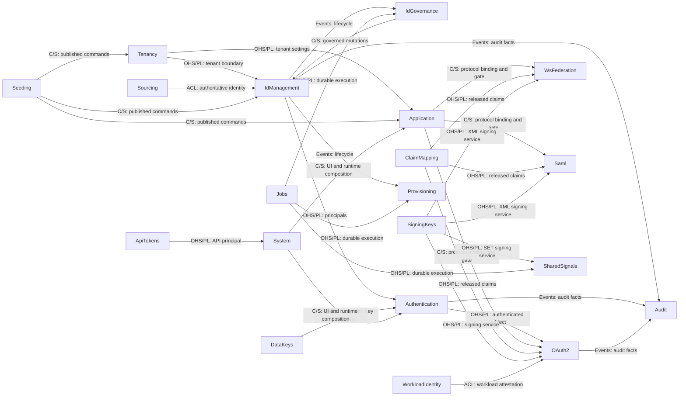

# Whole-System Specification

## Overview

This document is the whole-system specification and cross-cutting design record: how the system is
currently built and why it has that shape. Behavior and design that belong to one bounded context live in that context's own
`spec/contexts/<context>/SPECIFICATION.md`. Repository paths and imports are the module map; a lightweight
check rejects forbidden outward dependencies without an exhaustive edge ledger.

Normative behavior and current design share the owning `SPECIFICATION.md`; API and model contracts are in
adjacent TypeSpec, and change-specific alternatives and implementation history are in work items. Current
documentation is self-contained; historical decision records are not part of the current specification.

Lists that churn — endpoints, fields, screens — are not kept here. Code, `spec/contexts/*/*.tsp`, and the
UI documents are authoritative for those.

### Reading order

For a feature change, read in this order.

1. `spec/SPECIFICATION.md`, to locate whole-system design and ownership.
2. The owning context's `SPECIFICATION.md`, `models.tsp`, and `main.tsp`. Changes are specification-first.
3. The active work item for change-specific alternatives and implementation history.
4. Go implementation, in the order `domain/`, `usecases/`, `ports/`, then whichever
   `<role>_<technology>/` adapter is involved.
5. `backend/shared/` and `backend/cmd/internal/bootstrap/` only when touching cross-cutting HTTP or
   persistence behavior.
6. `spec/contexts/system/SPECIFICATION.md` and `frontend/src/features/README.md` first when touching the UI.

Going the other way — implementation back to specification — package names correspond closely to
context names. The exceptions are collected under `backend/shared/`.

## Design

### Structure

```text
.
├── backend/           # Go bounded contexts, shared, cmd/
├── frontend/          # React UI and gateway
├── spec/              # TypeSpec, canonical specification/design Markdown, and release baseline
│   └── contexts/<context>/SPECIFICATION.md
├── infra/             # container, local runtime, and database schema assets
├── load/k6/           # tenant-local OAuth SLO smoke
├── tools/             # specification, boundary, compatibility, and rendering tools
└── work-items/        # units of work, decision history, and completion records
```

Dependencies run from `spec` toward the implementations and derived artifacts. `backend` domain and
usecase packages never depend back on adapters or runtime.

#### Development flow mapping

The repository keeps specification, change history, implementation, and runtime boundaries distinct
without assigning them methodology-specific layer names.

| Concern | Location | How to read it |
| --- | --- | --- |
| Specification and design | `spec/**/*.tsp`, `spec/**/SPECIFICATION.md` | Normative behavior, contracts, and current rationale. Changes start here. |
| Change record | `work-items/*.md` | Alternatives, plan, tasks, and completion history for one change. |
| Application logic | `backend/<context>/domain`, `backend/<context>/usecases` | Framework-independent domain and use cases. |
| Adapters | `backend/<context>/{handlers_http,db_postgres,...}`, `backend/shared/<capability>/<role>_<technology>` | HTTP, persistence, crypto, policy, notification — the connections outward. |
| Runtime and infrastructure | `backend/cmd/`, `backend/cmd/internal/bootstrap`, `infra/`, `frontend/`, `docker compose` | Startup, DI, delivery, and process boundaries. |

Generated OpenAPI is ignored and recreated from TypeSpec. The tracked OpenAPI baseline represents the
last released wire contract and changes only as part of a release.

### Stack

- Go, React/TypeScript, Bun, PostgreSQL, Docker Compose, Kubernetes, Prometheus, Grafana, Loki, Promtail,
  k6.
- Dynamic Group membership expressions over User attributes evaluate through a restricted CEL
  environment (`cel-go`). The environment is narrowed so unsafe expressions cannot be accepted, and a
  rule-version mismatch fails closed.

### Context Map

The diagram is a curated DDD context map: it shows domain-facing relationships and integration boundaries,
not every source import. Arrow direction is supplier/upstream to customer/downstream. `OHS/PL` means an
Open Host Service with a Published Language, `C/S` means Customer/Supplier, `ACL` means Anti-Corruption
Layer, and `Events` means a published event relationship. Repository paths and imports remain the source
for code dependency checks; this graph is not an architecture ledger.



The table is the responsibility and implementation-location index for every bounded context.

| Specification context | Go package | Responsibility |
| --- | --- | --- |
| `System` | `backend/cmd/internal/bootstrap`, `backend/shared/http/server_http`, `frontend/` | Cross-cutting UX, startup, routing composition, health. |
| `Tenancy` | `backend/tenancy` | Tenant / realm, tenant-scoped settings, user attribute schema, control-plane tenant administration. |
| `IdManagement` | `backend/idmanagement` | User, Group, Agent, self profile, identity lifecycle, CEL dynamic membership rules and re-evaluation. |
| `IdGovernance` | `backend/idgovernance` | LifecycleWorkflow policy and orchestration; the record of truth stays in IdManagement. |
| `Authentication` | `backend/authentication` | Credential verification, MFA, login sessions, step-up, password change and reset, authentication events. |
| `OAuth2` | `backend/oauth2` | OAuth 2.0 / OIDC protocol endpoints, clients, consent, tokens, role policy. |
| `Application` | `backend/application` | Application catalog, protocol bindings, assignment, portal ordering and categories. |
| `Audit` | `backend/audit` | Read model of audit events across every context. Owns the search-attribute registry, PII transformation, admin API, and retention. |
| `ClaimMapping` | `backend/claimmapping` | Protocol-neutral claim release policy, identity attribute projection, fail-closed validation. |
| `Provisioning` | `backend/provisioning` | SCIM 2.0 outbound provisioning: the push lifecycle toward downstream SaaS. idmagic's User/Group is the source of truth and the downstream is a mirror. |
| `Sourcing` | `backend/sourcing` | Inbound identity intake from an upstream authority. Owns source bindings, correlation with the external immutable id, and deletion/deactivation that follows the upstream authority. Organized as one feature slice per source; currently `sourcing/scim` only. |
| `ApiTokens` | `backend/apitoken` | Tenant-scoped API access tokens (`idmagic_pat_` prefix) that authenticate the management and SCIM APIs: issuance, revocation, listing, and the scope vocabulary. |
| `Jobs` | `backend/jobs` | Generic asynchronous job infrastructure that preserves the tenant boundary. Design: [Jobs specification](contexts/jobs/SPECIFICATION.md). |
| `Seeding` | `backend/seeding` | Environment profiles, dry-run, redacted plans, and apply policy. Business data and its persistence stay in each record context. |
| `SigningKeys` | `backend/signingkeys` | Tenant-and-usage-scoped key metadata, X.509 credentials, rotation, repository port, admin/JWKS HTTP, and memory/PostgreSQL/Vault adapters. JWT and XML wire signers stay in the protocol adapters. Design: [Signing Keys specification](contexts/signing-keys/SPECIFICATION.md). |
| `DataKeys` | `backend/datakeys` | Per-tenant `DataEncryptionKey` (DEK) metadata and lifecycle (bootstrap/rotate/disable/destroy) for reversible secrets left in the app DB (e.g. MFA TOTP seeds). Does not own signing keys (`SigningKeys`) or the `EnvelopeCrypto` port itself, which lives in `backend/shared/security` as a technical shared adapter. |
| `WsFederation` | `backend/wsfederation` | WS-Fed passive, WS-Trust active STS, federation metadata, MEX, RP trust, and request-tenant XML signing. Design: [WS-Federation specification](contexts/ws-federation/SPECIFICATION.md). |
| `Saml` | `backend/saml` | SAML 2.0 IdP, SP trust, metadata, SSO/SLO, and request-tenant XML signing. Design: [SAML specification](contexts/saml/SPECIFICATION.md). |
| `WorkloadIdentity` | `backend/workloadidentity` | Workload identity federation for agent runtimes: registered external attestation issuers (`WorkloadTrustBundle`) and the subject-pattern-to-`Agent` mapping (`AgentWorkloadBinding`) that OAuth2's token-exchange grant consumes to federate external JWT-SVIDs into idmagic tokens without long-lived secrets. |
| `SharedSignals` | `backend/sharedsignals` | Continuous access evaluation (CAEP) and near-real-time agent revocation via the OpenID Shared Signals Framework (SSF, RFC 8417 Security Event Tokens). Owns the per-agent `AgentRevocationEpoch` that OAuth2's `Introspect` checks against a token's `issued_at` for fail-closed local revocation, and `SsfStream`/`SsfTransmitterConfig`/`SsfReceiverConfig` for pushing/receiving CAEP events to/from external parties. Local revocation always precedes and does not wait on ecosystem propagation. `AgentRevocationReactor` reacts to IdManagement's already-emitted lifecycle events (kill/disable/credential-unbind, owner disable/soft-delete/delete) via `idmanagement/deps_http.EventReactor` — IdManagement's usecases carry no SharedSignals dependency or explicit call. The outbound SET transmitter pipeline is implemented: `AgentRevocationReactor`'s best-effort projection (`ProjectAgentAccessRevoked`) fans a local revocation out to every enabled Transmit `SsfStream` subscribed to `session-revoked`, signs a RFC 8417 Security Event Token via `ports.SecurityEventTokenSigner` (implemented by `sign_jose`, reusing SigningKeys' rotation/JWKS rather than separate key material), and enqueues a `SecurityEventDelivery`; a periodic worker (`ProcessDueDeliveries`, `sharedsignals/push_http` for the SSRF-safe HTTP push) retries with exponential backoff and dead-letters once `max_delivery_attempts` is exhausted. Domain model, memory/PostgreSQL persistence, `Introspect` enforcement wiring, Agent revocation enforcement, and the SET transmitter are implemented; the SSF receiver (inbound `ReceiveSecurityEvent`) and admin UI (stream CRUD, delivery status) are not yet implemented. |

Context ownership is documented here and in each context's requirements. Before adding a direct import,
run the forbidden-boundary check and keep cross-context dependencies on published interfaces.

### Conventions

A bounded context normally takes this shape.

```text
backend/<context>/
  domain/            # entities, value objects, state machines, pure validation
  usecases/          # application logic that performs the specified operations
  ports/             # abstractions over repositories, stores, external services
  handlers_http/     # inbound HTTP adapter
  db_memory/         # memory repository adapter
  db_postgres/       # PostgreSQL repository adapter
```

`domain/` knows nothing of Echo, PostgreSQL, or HTTP request/response. `usecases/` depends on `ports/`
and never on a concrete adapter. `handlers_http` owns wire conversion, HTTP status, cookies and headers,
and boundary concerns such as CSRF and Origin. The rule that `usecases/` never imports an adapter holds
in every context: outward capabilities (signing, assignment gating, authentication resolution) arrive as
a `ports/` abstraction or an interface declared inside the usecase package, and the adapter injects the
concrete implementation — for example `oauth2`'s `ports.TokenIssuer`, or the `ApplicationGate` interface
in `saml` and `wsfederation`.

Adapters sit directly under the context or feature that owns them, named `<role>_<technology>` in
snake_case, with no `adapters/` or `persistence/` classification directory in between. A package name
alone should reveal whether the role is handler, repository, publisher, or client, and whether they represent technical adapters—HTTP, PostgreSQL, S3, or SCIM. A classification directory destroys exactly that: the
package name stops saying what the thing does.

Whether a context has `domain/` and `usecases/` follows from whether it has logic of its own; the
packages are not placed mechanically. Shared runtime contract helpers stay in `backend/shared/spec`, while
context-specific business types are owned by that context's `domain/`. A context such as
`tenancy`, which has no domain logic beyond the bindings, has no per-context `domain/`. Contexts that do
have their own logic — `idmanagement` (User/Group/Agent aggregates, attribute schema, field validation)
or `saml` / `wsfederation` (protocol-specific parsing and claim mapping) — have `domain/`, and contexts
that orchestrate SSO/sign-in (SP/RP resolution, signature verification, assignment gating, claim
issuance) have `usecases/`. Every issuance decision in browser federation lives in `usecases/`;
`handlers_http` stays closed around wire format and the HTTP boundary.

`backend/shared/` is for technical capabilities that several contexts genuinely share. Putting a
context-specific concept there because it is convenient widens the reading surface of the next change.
Concrete domain event structs belong to the owning context's `domain/events.go`, and
`backend/shared/spec/events.go` carries only the event envelope interface and its wire marshalling.
Audit classifies on a stable event type discriminator rather than a registry of concrete types.

#### Feature vertical slices

A context with two or more independent sub-domains (features) may add a feature vertical slice layer to
the four-layer grid: `backend/<context>/<feature>/{domain,ports,usecases,<role>_<technology>}/`. A single-feature context does not
get one — a `<context>/<context>/` stutter stops the directory structure from screaming its purpose, and
is harmful for that reason. The pilot is `idmanagement`, split into `user`, `group`, and `agent`:

```text
backend/idmanagement/
  module.go                 # one per context (the DI bundle is not split by feature)
  domain/                   # only types shared across features (enums, DomainEvent)
  usecases/                 # only cross-feature usecase helpers and error values
  deps_http/                # the Deps type definition itself (leaf package, see below)
  handlers_http/            # route registration and cross-feature integration tests
  user/  group/  agent/     # each feature's domain/ ports/ usecases/ and adapters
```

`handlers_http` and `db_postgres` could not be split naively, because of Go's language rules and the
unit of code generation; they needed a different design from `domain`/`ports`/`usecases`.

- **handlers_http**: handlers were originally methods on a `Deps` struct (`func (d Deps) handleX`). Go
  only allows a method to be defined in the same package as its receiver type, so splitting `Deps` into
  per-feature embedded sub-structs would force the same field to be duplicated across them wherever a
  feature reaches across (group handlers use `UserRepo`; agent handlers use `UserRepo` and
  `ClientRepo`). Instead the `Deps` type definition was extracted into a standalone leaf package
  `deps_http`, and the handlers were converted into **free functions**
  (`func handleX(d Deps, c *echo.Context) error`) and moved into the feature packages. A free function
  need not share a package with the receiver type, so the implementation could be separated per feature
  without splitting `Deps` at all. `routes.go` re-exports it as `type Deps = httpdeps.Deps` (a type
  alias through an import alias), so external construction sites (`idmagic.Deps{...}` in bootstrap and
  tests) were untouched.
- **db_postgres**: the idmanagement entry in `sqlc.yaml` was split into several per-feature entries, and
  `queries/*.sql` together with the generated `sqlcgen/` moved into the feature directories.
  Cross-feature test fixture helpers (`seedTenant`, `seedUser`) were duplicated into each feature
  package, because Go's `_test.go` files cannot span packages. The `lifecycle_workflows` queries and
  `sqlcgen` belong to the IdGovernance context and therefore live in `backend/idgovernance/db_postgres/`.

Core package names stay as the layer names (`domain`/`ports`/`usecases`); adapter package names stay
`<role>_<technology>` (`handlers_http`, `db_memory`, `db_postgres`). Where several features of one
context are imported together, named imports (`userDomain`, `groupDomain`) disambiguate them. Resolving
the collision with an import alias preserves the shared vocabulary of the core packages, which
lengthening the directory names would not.

#### Frontend Component Structure

A UI context boundary aligned with a specification feature is placed in `frontend/src/features/<feature>/`.
Views, local components, helpers, tests, and localized dictionaries (`*.i18n.ts`) for that feature must reside in its directory. The alias `slices/` is not used.
Cross-cutting reusable components not tied to a specific feature boundary are placed in `frontend/src/components/`.

### Cross-cutting Concerns

#### HTTP routing

Routes are composed in `backend/shared/http/server_http/routes.go`. It registers the tenant-scoped
routes under both the default tenant and `/realms/:tenant_id`, and separates only control-plane tenant
administration under `/realms/default/admin/tenants`.

Each context's routes live in `backend/<context>/handlers_http/routes.go`; read that file for the exact
endpoint list. A new HTTP API is registered in the owning context's `routes.go` with its handler under
the same `handlers_http`. Context-specific repositories and route wiring are collected in
`backend/<context>/module.go` so the central router only calls the Module.

#### Request correlation

Every request is assigned a `request_id`, returned in the `X-Request-ID` response header and attached to
every application log line for that request (alongside `trace_id` / `span_id` when
`OBSERVABILITY=otel`).

Because `X-Request-ID` is attacker-controllable, the default is to **self-generate the id and ignore any
inbound value** — secure by default, so a directly reachable client cannot spoof or collide correlation
ids. Set `REQUEST_ID_TRUST_INBOUND=true` only when a trusted edge proxy generates (and thereby
sanitizes) the header, which is what makes a single id shared across the proxy and application tiers
worth having. A proxy that passes the client value through untouched must not be trusted. Either way, a
reused inbound value is bounded in length and character set as defense in depth against header and log
injection.

#### Cursor pagination

Administrative list APIs use signed, versioned keyset cursors carried in RFC 8288 `Link` response
headers. A cursor binds its tenant, query and sort identity, direction, and row boundary; new cursors do
not expire because they represent an addressable list position rather than an authorization capability.
Handlers emit only the available `prev` and `next` directions, while every request still passes through
normal authentication, authorization, and tenant isolation.

#### HTTP error responses

Generic API error responses use RFC 9457 Problem Details (`application/problem+json`, with
`type`/`title`/`status`/`detail`/`instance`) as the default envelope; `instance` carries the
`request_id` from Request correlation above. Status codes follow RFC 9110: 400 means the request
could not be parsed (malformed JSON, missing required framing), 422 means it parsed but its
content violates a business rule (invalid role, referential mismatch, policy violation) — this
distinguishes 400 from 422 more strictly than the historical practice of returning 400 for both.

OAuth2 (`backend/oauth2/handlers_http`), SCIM (`backend/sourcing/scim/handlers_http`), and Dynamic
Client Registration (RFC 7591, part of `backend/oauth2/handlers_http`) keep their own
spec-mandated error bodies and are not migrated to Problem Details, since Problem Details would
break interoperability with clients built against those standards. The SharedSignals inbound SET
receiver (`POST /ssf/streams/:id/events`) is a pending case: whether RFC 8935 constrains its error
format is unverified and must be settled before migrating it; the SharedSignals admin stream API
has no such constraint and follows the generic convention.

This convention is not yet implemented: `WriteBrowserError`
(`backend/shared/http/support_http/response.go`) still returns the legacy `{error, message}` shape
everywhere, and 422 is used in exactly one place today. The TypeSpec contract (status per
error model, envelope per binding) and the handler migration are tracked as separate work items.

#### Metrics

`GET /metrics` exposes Prometheus/OpenMetrics-format metrics: HTTP RED (count, error rate via
`status_code`, duration, in-flight) for every route template, plus authentication golden signals for
SLO and alerting.

| Metric | Labels | Verifies |
| --- | --- | --- |
| `http_requests_total`, `http_request_duration_seconds`, `http_requests_in_flight` | `route`, `method`, `status_code` | per-interface latency and error-rate objectives |
| `authn_login_attempts_total` | `outcome`, `reason_class`, `method` | login success/failure golden signal |
| `authn_login_throttle_total` | `policy`, `outcome` | login throttle hit rate |
| `endpoint_rate_limit_total` | `policy`, `outcome` | endpoint rate limiter hit rate |
| `oauth2_token_issuance_total`, `oauth2_token_issuance_duration_seconds` | `grant_type`, `outcome` | `/token` issuance rate and latency by grant |
| `http_request_aborts_total`, `operation_detached_completion_failures_total` | `kind` | cancellation policy |

Every label is a bounded, finite set. `tenant_id`, `user_id`, `client_id`, and resolved request paths are
never labels, because their cardinality is unbounded; that is also why the endpoint is scraped outside
the tenant-resolution middleware and kept separate from the application API. It is always registered but
returns `503` until the process finishes constructing its Prometheus registry at startup, and works
independently of `OBSERVABILITY`, because a pull-based scrape needs no collector configured. Expose it
only on a loopback/management network or behind an authenticating proxy.

#### Logging

Application logs are structured JSON Lines on stdout (`timestamp`, `level`, `service`, `message`, plus
`trace_id` / `span_id` / `request_id` for correlation — `backend/shared/logging`). This process
never writes them anywhere else; aggregating and searching them across replicas and nodes is a separate,
externally-observing concern, kept independent of the OpenTelemetry Collector so a logging outage cannot
affect trace/metric export.

**Local** (`infra/docker/docker-compose.dev.yaml`): Promtail discovers every container through the Docker
Engine API (`docker_sd_configs`) and ships its logs to Loki, so no host log directory needs to be
bind-mounted — only the Docker socket. Grafana is provisioned on first boot with both Prometheus
and Loki as datasources and with the existing golden-signals dashboard, so `docker compose up` is enough
to browse metrics and logs together.

**Kubernetes** (`infra/k8s/monitoring/loki/`): Promtail runs as a DaemonSet, discovering pods via
`kubernetes_sd_configs` and tailing `/var/log/pods`; Loki runs as a single-replica StatefulSet with PVC
storage (filesystem storage is a dev-shaped default, replaced by an overlay for
object-store-backed retention in a real production cluster). Grafana
itself is not deployed by this repo — the Loki datasource is registered against whatever Grafana instance
already exists, using the same ConfigMap-sidecar convention `grafana-dashboard.yaml` already relies on
(a label the cluster's Grafana sidecar watches), rather than the `grafana-dashboard.yaml` dashboard content
itself.

| Field | Loki treatment | Why |
| --- | --- | --- |
| `service`, `level` | index label | bounded, finite sets |
| `trace_id`, `span_id`, `request_id` | structured metadata (not a label) | unbounded — an index label here would blow up cardinality, the same reasoning [Metrics](#metrics) applies to `tenant_id` / `user_id` |

#### HTTP server hardening

The boundary HTTP server applies production-safe timeouts and a request body limit so a single slow or
oversized client cannot exhaust connections or memory (`gosec G112` / CWE-400). Bodies over the limit are
rejected with `413`.

| Variable | Default | Purpose |
| --- | --- | --- |
| `HTTP_READ_HEADER_TIMEOUT` | `10s` | max time to read request headers (slowloris bound) |
| `HTTP_READ_TIMEOUT` | `30s` | max time to read the full request |
| `HTTP_WRITE_TIMEOUT` | `60s` | max time to write the response |
| `HTTP_IDLE_TIMEOUT` | `120s` | keep-alive idle connection timeout |
| `HTTP_MAX_BODY_BYTES` | `1048576` | max request body size in bytes (1 MiB) |

This is defense in depth, not a substitute for an edge proxy. The primary line against volumetric floods
and TLS-handshake slowloris is the fronting reverse proxy, which sees total traffic and can stop abuse
cheaply. idmagic still enforces its own timeouts and body limit so it stays safe when run without a
proxy, and so the proxy-to-app hop and any in-cluster direct access are covered.

#### Security response headers

A boundary middleware applies `X-Content-Type-Options: nosniff`, `Referrer-Policy: no-referrer`,
`X-Frame-Options: DENY`, and a strict `Content-Security-Policy`
(`default-src 'none'; base-uri 'none'; frame-ancestors 'none'; form-action 'self'`) to every backend
response. `frame-ancestors 'none'` together with `X-Frame-Options: DENY` forbids framing, so the login,
consent, and portal surfaces cannot be clickjacked. The CSP does not use `'unsafe-inline'`: the only
inline script idmagic renders is the fixed auto-submit of the SAML ACS / WS-Fed POST-binding form, which
is pinned by a `script-src 'sha256-…'` hash on that response with its `form-action` narrowed to the
destination endpoint.

**Header ownership.** CSP and `frame-ancestors` require per-route decisions and are owned by idmagic, so
they hold even behind a minimal or absent proxy. The SPA is served by the gateway, which sets its own
`script-src 'self'` CSP for the static HTML.

**HSTS belongs to the TLS terminator.** `Strict-Transport-Security` is off by default so development
over plain `http` is not poisoned. Enable it only when TLS is terminated at or ahead of this hop: leave
it to the edge proxy in the usual setup (`HSTS_ENABLED=false`), or set `HSTS_ENABLED=true` when the app
itself should assert it (tuning `HSTS_MAX_AGE_SECONDS` / `HSTS_INCLUDE_SUBDOMAINS`).

To tighten CSP without breaking a page, set `CSP_REPORT_ONLY=true` to emit
`Content-Security-Policy-Report-Only` and `CSP_REPORT_URI=<url>` to collect violations, observe, then
switch back to enforce.

#### Persistence

Persistence ports and repository implementations belong to the owning context. Context-specific memory
and PostgreSQL adapters go in `backend/<context>/{db_memory,db_postgres}`; the shared DB pool, row
scanner, and transaction helpers go in `backend/shared/storage/db_postgres`.
Ephemeral state is consolidated into PostgreSQL as well, so no second class of datastore is operated.

All static SQL statements in `db_postgres` must use `sqlc` to generate type-safe queries. Raw `Pool.Query`/`Pool.Exec` with strings are only permitted for highly dynamic queries where `sqlc` provides no benefit, serving as an escape hatch rather than the default.

To add structure to PostgreSQL, first update the current-state schema in `infra/schema/postgres.sql`.
Structural diffs are inspected with a `psqldef` dry-run and applied by a pre-deploy job (the procedure is
in `infra/schema/README.md`). CI additionally enforces that `postgres.sql` converges under `psqldef`
against an empty database (`just check-schema`): apply, dry-run must be a no-op, apply again, dry-run
must still be a no-op. This is a permanent guard against `psqldef` regressions, not a one-time check —
see `infra/schema/README.md` Rules for the specific bug classes it backstops. Changes a structural diff
cannot express — backfills, value conversions, saving data before a drop — are stated explicitly in the
work item's runbook or a dedicated SQL script. There is no migration runner at application startup. The
memory adapter is also the reference for tests and the local demo, so never update only the postgres side.

`postgres.sql` carries no SQL comments. Design rationale for a table or column goes here (or the owning
context's `SPECIFICATION.md` Design section) instead, both because a second copy of "why" drifts from this record and
because `psqldef`'s dependency-ordering pass has shown comment-content-sensitive statement-ordering bugs
on an empty database (`infra/schema/README.md` Rules has the detail and upstream references).

#### Database design policy

##### 1. Column type selection

The selection rules are fixed so the judgement is reproducible each time a table is added.

- **Free-form strings, unbounded**: use `TEXT`. Never use unconstrained `varchar`.
- **Bounded strings**: `TEXT` + `CHECK (char_length(col) <= N)`, or `varchar(N)`, consistently, following
  a fixed per-column length limit policy. Fixed-format identifiers are guarded with `CHECK (... ~ regex)`.
- **Internally generated ids**: columns idmagic generates with `spec.NewUUIDv4()` are `UUID`. Go keeps
  them as `string`; the pgx text codec registration (`RegisterUUIDAsText`) bridges the two.
- **Externally decided ids**: ids whose value an external party decides (`entity_id`, `wtrealm`,
  `scim_id`, `kid`) stay `TEXT`, because idmagic does not assign them and they are not UUIDs.
- **Time**: `TIMESTAMPTZ` throughout, with microsecond precision as the source of truth. Do not round in
  the schema.
- **Finite value sets**: `TEXT` + `CHECK (col IN (...))`. PostgreSQL enums are avoided, because adding a
  value requires `ALTER TYPE` and sits badly with declarative schema diffing.
- **JSONB**: for external-spec-derived metadata, claim/policy configuration, and append-only payloads
  only. Values that need joins or filters, FK or uniqueness constraints, or that participate in a state
  machine are not kept inside JSONB.

##### 2. tenant_id retention classes

`users.id` and `oauth2_clients.client_id` are system-generated, globally unique identifiers, so child
rows reference their parent by that global key and **tenant-scoped composite foreign keys are not used**.
Do not add `tenant_id` merely because the tenant is reachable through a globally unique parent; add it
when it serves search, a constraint, retention, or audit.

- **Tenant-owned aggregate / tenant-scoped config**: carries `tenant_id`, usually as part of the primary
  or a unique key (`users`, `groups`, `oauth2_clients`, `applications`, `agents`, `signing_keys`,
  `application_categories`, `saml_service_providers`, `wsfed_relying_parties`, `*_sign_in_policies`).
- **External tenant-scoped natural key**: `tenant_id` is part of the primary key because the external id
  is only unique within a tenant (`scim_user_refs`, `scim_group_refs` on `(tenant_id, scim_id)`).
- **Child of a globally unique parent**: identified by the global key (`user_id` / `client_id`), with no
  `tenant_id` unless per-tenant search or retention needs it (`consents`, `application_orderings`,
  `mfa_factors`, `password_history`, `password_reset_tokens`, `email_change_tokens`, `group_members`).
  Two exceptions keep it. `authentication_sessions`: the session id is an opaque cookie value resolved on
  every request, so `tenant_id` is a fail-closed defense-in-depth predicate on that lookup as well as the
  per-tenant active-session listing index. The ephemeral auth/OAuth2 stores keyed by an opaque token, code,
  or challenge (`oauth2_authorization_requests`, `oauth2_authorization_codes`, `oauth2_par_requests`,
  `oauth2_device_codes`, `oauth2_replay_jtis`, `oauth2_access_token_denylist`, `webauthn_sessions`,
  `login_throttle_counters`, `saml_authnrequest_replays`, `endpoint_rate_limit_counters`) keep it for the
  same reason: each lookup is a high-frequency, fail-closed resolution of an attacker-influenced opaque
  key, so the tenant boundary is enforced in the DB layer.
- **Append-only / audit / throttling**: decided by emit-time tenant, query boundary, and
  retention (`audit_events`, `authentication_event_buckets`).

##### 3. Envelope encryption for reversible secrets

Reversible secrets that must remain in the app DB (MFA TOTP seeds today; future Token Vault upstream
tokens) are never stored as plaintext. The scheme is two-tier: a master key, held by a swappable
`EnvelopeCrypto` provider, wraps a per-tenant `DataEncryptionKey` (DEK); the DEK then AEAD-encrypts each
secret directly. AEAD/keyset handling is delegated entirely to [Tink](https://developers.google.com/tink)
— no hand-rolled nonce, tag, or AAD assembly. Every ciphertext binds an AAD of
`(tenant, context, table, record id, field)` plus the DEK version, so a ciphertext copied across tenant,
table, or field boundaries fails to decrypt rather than silently succeeding.

- `EnvelopeCrypto` (the Tink-backed AEAD/keyset port, plus the OpenBao/cleartext-keyset master-key
  provider adapter) lives in `backend/shared/security` alongside `certificates_mtls` /
  `passwords_argon2id` / `tokens_jose` — it is a technical capability, not a business aggregate.
- `backend/datakeys` (`DataKeys` context) owns only the wrapped-DEK metadata and lifecycle (bootstrap,
  rotate, disable, destroy) — never the `EnvelopeCrypto` port itself, mirroring how `SigningKeys` keeps
  `transit/sign` separate from this `encrypt`/`decrypt`/`datakey` capability.
- Rotation activates a new DEK version for new writes while the previous version stays `retiring` (still
  decryptable) until a resumable re-encryption job, registered through `backend/jobs`'
  `JobKind`/`HandlerRegistry`, migrates every reference; only then can the old
  version be destroyed. A `FieldMigrator` port (`backend/datakeys/ports`) lets each owning context
  register its own batch re-encryption/pending-count logic without `DataKeys` depending on any consumer's
  schema, mirroring how `Jobs`' `HandlerRegistry` stays decoupled from consumer business logic; Rotate
  auto-enqueues the job per registered migrator, and Destroy refuses to erase a wrapped DEK while any
  migrator still reports pending rows.
- Decrypt failure (unwrap failure, provider unreachable, AAD/tamper mismatch) is fail-closed: the caller
  denies access rather than falling back to plaintext or skipping the field.
- The initial master-key provider is OpenBao (Vault Transit-compatible HTTP API); dev/local uses a Tink
  cleartext keyset so OpenBao is not required to develop. The provider is swappable by design.
- The only HTTP surface is a read-only, `system_admin`-gated `GET /api/admin/data-keys/health`
  (`backend/datakeys/handlers_http`) reporting each tenant's active DEK version/status and master-key
  provider name/reachability — never key material. There is no rotate/disable/destroy admin endpoint;
  those lifecycle operations are internal-only for now.

`tenant_data_encryption_keys.wrapped_dek` is erased (set `NULL`) on destroy rather than the row being
deleted — crypto-shredding — so DEK lifecycle history (`status` moving through `active` / `retiring` /
`disabled` / `destroyed`) stays queryable after the key material itself is gone.

##### 4. Cross-context schema integration notes

The following notes compare persistence choices across several contexts, so they remain with the
repository-wide database policy instead of being duplicated in individual context documents or
`infra/schema/postgres.sql` (which carries no comments, see [Persistence](#persistence)).

- **Tenancy** — `tenant_brandings` is 1:1 hosted UI branding config kept in its own
  table rather than columns on `tenants` so per-feature config growth does not bloat the core tenant row;
  `tenant_branding_assets` and `tenant_user_attribute_schemas` follow the same reasoning. Absence of a
  `tenant_brandings` row, or all-`NULL` columns, means branding is unset and callers fall back to system
  defaults. `tenant_branding_assets` validates and stores logo/favicon blobs in the same
  shape as `application_icons`, kept in a separate table and `object_key` space so branding
  asset ownership never crosses with Application icon storage. `notification_templates` holds tenant
  overrides of the notification email catalog keyed by
  `(tenant_id, template_key, locale)`; see [Notification template catalog and locale
  resolution](#5-notification-template-catalog-and-locale-resolution) for how resolution works.
  Individual columns rather than JSONB keep per-column length limits as `CHECK` constraints;
  `subject`/`body_text`/`body_html` are `NOT NULL` together so a half-overridden template cannot exist,
  while `from_display_name` is nullable because the system default sender name is a valid
  choice. `tenants.default_locale` is the tenant tier of notification locale
  resolution (recipient → tenant → system); `NULL` means "use the system default".
  `tenants.endpoint_style` fixes the shape of a tenant's canonical location (its
  issuer, cookie scope, and WebAuthn RP ID all derive from it); `'path'` is the default because it needs
  neither wildcard DNS nor a wildcard certificate.
- **OAuth2** — `oauth2_client_secrets` separates the `client_secret` credential from the client
  row itself; `oauth2_clients.client_secret_hash` is kept only for dual-read/backfill during that
  rollout. `refresh_tokens.sid` is the OIDC session id, equal to
  `authentication_sessions.id`, `NULL` when issuance has no browser session (`client_credentials` etc.);
  there is no FK to `authentication_sessions` because housekeeping retention's physical deletes there run
  independent of a refresh token's own revoke state (the opaque-cross-context-reference
  exception noted under tenant_id retention classes above). `refresh_tokens.resource` (RFC 8707) is the
  resource indicator bound at authorization-code redemption, retained across rotation; `NULL` means no
  resource was specified. `mcp_resource_servers` is the tenant-scoped registration of an MCP resource
  server (a tool/data source); `resource` is the tenant-unique canonical resource URI that Protected
  Resource Metadata (RFC 9728) and resource-indicator (RFC 8707) verification are checked against. Within
  the ephemeral protocol-state tables already listed under [tenant_id retention
  classes](#2-tenant_id-retention-classes): `oauth2_authorization_requests` keeps the whole `/authorize`
  mid-flow state in `payload` JSONB and serializes its transitions with `SELECT ... FOR UPDATE` in one
  transaction; `oauth2_authorization_codes` is single-redeem, promoting `state` to a CAS
  predicate (`UPDATE ... WHERE state = 'issued' RETURNING`); `oauth2_par_requests` is likewise
  single-consume through a `used` CAS predicate; `oauth2_device_codes` keys on `device_code_hash` with
  `user_code` as a tenant-unique secondary lookup, approval sets `user_id`, and `state` is the Exchange
  CAS predicate; `oauth2_replay_jtis.kind` distinguishes `dpop` from `client_assertion` replay guards,
  recorded via `INSERT ... ON CONFLICT DO NOTHING` (a new row means new-use); `oauth2_access_token_denylist`
  stays `LOGGED` (replicated to a physical standby) because losing a revocation on failover would be a
  defense-in-depth regression.
- **Audit** — `audit_event_search_attributes` is a sidecar search index: one row per
  `(event, attr_name, transformed value)`, where `attr_name` is a `Field` from the `AuditSearchRegistry`.
  PII attributes are hashed or rounded before being stored here; plaintext exists only in
  `audit_events.payload`, and only for failure events under short-lived retention. It cascades on
  `audit_events` deletion, and its lookup index orders `(tenant_id, attr_name, attr_value)` for equality
  matches with `occurred_at DESC` for the scan.
- **ApiTokens** — `api_tokens` holds lifecycle records for managed RFC 9068 JWT access
  tokens; JWT bodies are never stored, `jti` is the lookup key. `scopes` lists the granted
  `<resource>:<action>` permissions (`ApiTokenScope` in `spec/contexts/api-tokens/models.tsp`); the table's
  `CHECK` mirrors that enum as defense in depth alongside Go-side validation.
- **IdGovernance** — `lifecycle_workflow_revisions` are append-only; execution records
  (`lifecycle_workflow_runs`/`_steps`) reference the revision they expand rather than mutable JSON.
- **Provisioning** — `provisioning_connections.credential_secret` is a dev/test-grade plaintext
  column with no envelope encryption yet; production deployments must not rely on it as-is,
  matching the `SigningKeys` PostgreSQL `KeyStore`'s own dev/test disclaimer.

##### 5. Notification template catalog and locale resolution

Notification email content resolves through exactly two tiers, with no version history: a built-in
catalog (system-shipped ja/en copy) plus optional per-`(tenant_id, template_key, locale)` overrides.
Deleting an override (`ResetNotificationTemplate`) always falls back to the built-in default; there is no
"revert to previous override" step, because when a template breaks a recovery flow, the fastest fix for
an admin is a known-good fallback, not a choice among versions. `template_key`
is a fixed specification enum — tenants cannot add keys — so every key traces to exactly one send path and no
orphaned template can exist without a sender.

Placeholders (`{{name}}`) are validated against a per-key allow-list at save time; an override that
references an undeclared placeholder is rejected outright rather than rendered with the value blanked
out, because a runtime-blanked link is only discovered when a user fails to recover their account
(fail-closed). The allow-list is defined in `backend/shared/notification/template` and
returned by the API so editors do not have to guess it.

| Key | Placeholders |
| --- | --- |
| all keys | `product_name`, `tenant_display_name`, `user_display_name` |
| `PasswordReset`, `EmailVerification`, `EmailChangeConfirmation` | one `*_url` link, `expires_in_minutes` |
| `EmailChangeConfirmation` (additional) | `new_email` |
| `LifecycleWorkflowNotification` (additional) | `notification_key` |
| `AccountSecurityAlert` (additional) | `event_description`, `occurred_at` |

Credentials, hashes, TOTP secrets, API tokens, and raw IP addresses are never placeholders: mail is
forwarded, quoted, and retained indefinitely by the recipient, so anything placed in it is exposed by any
later mailbox compromise.

The renderer's contract returns subject, text body, and HTML body together as one unit — no state exists
with only one or two of the three — and an override likewise replaces all three at once, sent as
`multipart/alternative`; this rules out the two parts of one email silently disagreeing because only one
was edited. Escaping is the renderer's responsibility, not the template's: HTML output
escapes interpolated values and text output does not, and link URLs are assembled by the calling usecase
from the request's own issuer and passed in as a single placeholder value, so a template can place a URL
but never concatenate one — the escaping obligation never reaches the tenant editor.
Overridable fields are limited to subject, HTML body fragment, text body, and sender display name; the
HTML document shell and the sender address stay system-owned, so the worst a malicious tenant admin can
do through the override mechanism is make their own tenant's mail look wrong, never inject into it (the
same split hosted UI branding uses).

Locale resolves recipient `User.locale` → tenant `default_locale` → system default
(`DEFAULT_LOCALE` env var, default `en`), taking the first locale the catalog has a translation for.
Making the tenant tier an explicit column rather than inferring it from which locales happen to have
overrides keeps editing one template in one locale from silently changing every notification's language.

Test-send delivers only to the acting admin's own verified address — the endpoint accepts no destination
parameter — because an arbitrary destination would turn tenant-admin access into a way to send
tenant-branded mail to anyone. Preview is read-only and renders with fixed sample values,
never real user data, so the editor screen cannot become a way to read user data.

##### 6. Endpoint rate limiting

`backend/shared/ratelimit` (`ports`, `db_memory`, `db_postgres`) is a technical capability, not a business
aggregate — the same placement as `EnvelopeCrypto` in `backend/shared/security` — because it protects
endpoints across both the OAuth2 and Authentication contexts (`/authorize`, `/token`, `/par`,
`/device_authorization`, `/api/auth/password_reset/*`). It is separate from, and does not replace, the
per-account/per-IP login throttle above.

The port is a single `Allow(ctx, tenantID, policyID, key, now)` call: a fixed-window counter keyed on
`(tenant_id, policy_id, key_hash)`, incremented once per request regardless of outcome (unlike the login
throttle, which only counts failures). `endpoint_rate_limit_counters` is `UNLOGGED` — every request counts
against it, making it the highest-churn ephemeral table, and losing counters on failover only resets a
window rather than weakening a security guarantee (contrast with `login_throttle_counters` and the
access-token denylist, which stay `LOGGED` because losing them would). Fail-closed applies uniformly:
PostgreSQL is already a hard dependency of every protected endpoint, so denying on an unreachable store
adds no new failure mode.

Thresholds are fixed-window `(max requests, window seconds)` per policy, environment-configurable (unlike
the login throttle's, which are still hardcoded in `server.go`) so operators can retune without a deploy:

| Policy | Env (max / window) | Default |
| --- | --- | --- |
| `token` | `RATE_LIMIT_TOKEN_MAX_REQUESTS` / `RATE_LIMIT_TOKEN_WINDOW_SECONDS` | 60 / 60s |
| `authorize` | `RATE_LIMIT_AUTHORIZE_MAX_REQUESTS` / `RATE_LIMIT_AUTHORIZE_WINDOW_SECONDS` | 30 / 60s |
| `par` | `RATE_LIMIT_PAR_MAX_REQUESTS` / `RATE_LIMIT_PAR_WINDOW_SECONDS` | 30 / 60s |
| `device_authorization` | `RATE_LIMIT_DEVICE_AUTHORIZATION_MAX_REQUESTS` / `RATE_LIMIT_DEVICE_AUTHORIZATION_WINDOW_SECONDS` | 20 / 60s |
| `password_reset` | `RATE_LIMIT_PASSWORD_RESET_MAX_REQUESTS` / `RATE_LIMIT_PASSWORD_RESET_WINDOW_SECONDS` | 5 / 900s |

Keys are `client_id`/IP/`identifier_hash` composites; `client_id` is not secret, while IP and
password-reset identifiers are SHA-256 hashed before storage, matching the login throttle's
`hashThrottleIdentifier` convention. Exceeding a threshold returns HTTP 429 with `Retry-After` and the TypeSpec
`RateLimitedError`, which also now covers the login throttle's own 429 response (previously an undeclared
ad hoc body).

### Runtime Composition

The main package in `backend/cmd/idmagic/` performs startup, and `backend/cmd/internal/bootstrap` owns
startup-time DI. `backend/cmd/idmagic-worker/` only claims durable
jobs and runs handlers, scaling horizontally independently of the API.
`backend/cmd/idmagic-batch/` is started one-shot by an external scheduler, performs a single retention
sweep or signing-key lifecycle pass, and exits. Every runtime unit reuses the same
Go module and bounded context implementations. Runtime units are derived from the entry points and
their `just` build recipes rather than repeated in a ledger.

This shape — every bounded context implementation in a single Go module, with several runtime units as
thin entry points reusing that shared implementation — is currently a **modular monolith**. Context
boundaries are kept strict as logical boundaries (contexts couple through published language and ports),
and by default several contexts compose into one process. The runtime splits that do exist
keep the synchronous dependencies of authentication and OAuth2 inside the API process, and are limited
to resource and latency characteristics (per-lane workers), and the execution boundary of cross-cutting
batches. The organizational
trigger has not fired, so no service split happens until independent data ownership, teams, and SLOs
exist. This describes the present state; it does not prescribe a future style.

`Dependencies` in `backend/cmd/internal/bootstrap/deps.go` is the boundary aggregate handed to the HTTP
layer, absorbing runtime choices such as memory / postgres / console / otel. Context-specific
repositories are bundled into each `Module`, and the central `Dependencies` and server `Deps` receive
the Module. After adding a port, check at least the context's `ports/`, the memory adapter, whether the
postgres adapter and a schema diff are needed, `bootstrap.Dependencies`, `assembleMemory` /
`assemblePostgres`, `support.Deps`, and the constructor of the HTTP handler or usecase involved.

#### Health probes and graceful drain

Kubernetes-facing health is split into three endpoints rather than one shared between liveness and
readiness: the original `/health` only echoed startup configuration labels, so using it for both meant a
transient PostgreSQL blip could both restart-loop the pod and keep traffic routed to a replica that could
not actually serve it. Readiness pinged a shared Valkey store as well before that dependency was removed.

- **`/livez`** fails only on an unrecoverable condition such as deadlock; a transient dependency outage
  still returns `200`, so liveness does not restart a pod that would recover on its own.
- **`/readyz`** pings required dependencies (PostgreSQL) in parallel with a short timeout (`1s` default)
  and returns `503` if unreachable; `?verbose` adds a per-dependency status vocabulary (`healthy` /
  `degraded` / `unavailable`).
- **`/startupz`** returns `200` once application initialization (including seed-data checks) completes.
- **`/health`** is kept for backward compatibility, still returning only the startup configuration labels
  it always has.

On `SIGTERM` / `SIGINT`, a shutdown flag is set so `/readyz` immediately starts returning `503`
(`unavailable`), giving the load balancer time to stop routing before the process stops accepting
connections. The server then waits a drain grace period (`DRAIN_GRACE_PERIOD_SECONDS`, default `5s`)
before starting the HTTP server's own shutdown.

#### Availability and shared state

Running more than one replica requires the `postgres` runtime (`PERSISTENCE=postgres`, `DATABASE_URL`).
All shared state, durable and ephemeral alike, lives in PostgreSQL rather than in per-replica process
memory.

- **Durable**: refresh tokens, audit events, authentication-event aggregation buckets, and **login
  sessions**. A logged-in browser session has `authentication_sessions` as its single source of truth,
  so restarting or rolling API replicas does not invalidate active sessions. Revocation (self-service,
  logout, or an account being disabled) tombstones the row (`revoked_at` / `revoke_reason`) instead of
  deleting it, so a repeated revoke request is a safe no-op.
- **Ephemeral** (short-lived auth/OAuth2 rows): authorization request, authorization code, PAR, device
  code, DPoP and client-assertion replay guards, access-token denylist, WebAuthn ceremony challenges, the
  login brute-force throttle, and endpoint rate limit counters. All are short-lived and
  retry-safe. Every row carries `expires_at`
  and every read filters on `expires_at > now()`, so TTL correctness is independent of the best-effort
  GC sweep that `idmagic-worker` runs to reclaim space.

A cutover onto this runtime abandons any **in-flight** ephemeral state (an `/authorize` mid-flow, a
pending PAR or device request, a throttle counter). Those simply restart and recover, and no durable
state is affected.

The login throttle in particular *must* be shared. With per-replica counters an attacker's failed
attempts split across `N` replicas, so the per-account and per-IP lockout thresholds effectively loosen
by up to `N×` cluster-wide — a silent security regression. In the shared PostgreSQL counter they are
counted cluster-wide with a serialized `SELECT ... FOR UPDATE` update, and the account and IP
identifiers are SHA-256 hashed so no plaintext username or IP is stored.

Because the throttle sits on the critical path, its degradation is **fail-closed**: if the store is
unreachable, a login attempt whose throttle state cannot be verified is rejected rather than let
through. Run PostgreSQL in a highly available configuration (REGIONAL / synchronous standby) for
multi-replica deployments so this path stays up.

The `memory` runtime keeps this state in process and is therefore **single-replica / test only**.

### Specification publishing

Canonical Markdown and TypeSpec are published as an ignored, reproducible static site rooted at
`spec/generated/docs/index.html`. The site separates Method guides, this whole-system document, each
bounded-context document, the API reference, and the TypeSpec model catalog into independently addressable
pages. Internal links are resolved from one generated page manifest, and generation fails on a broken or
unreachable page link.

API operation and wire-schema presentation is delegated to a repository-local Swagger UI distribution
that consumes the generated OpenAPI document; the specification renderer does not maintain a second
OpenAPI interpretation. The model catalog is separate and is derived from repository-owned TypeSpec model,
enum, union, and scalar declarations, including declarations that are not reachable from an HTTP operation.
Transport wrappers in `Operations` namespaces remain in the API reference rather than being duplicated as
catalog pages.

Mermaid source in canonical documents is rendered with repository-local assets. State diagrams are
derived from the normative `From / Event / Guard / To / Effects` tables, so the graph and table cannot
become separate sources of truth. Scenario keywords receive semantic HTML and visual labels without
changing their canonical Markdown grammar. The site has no CDN or hosted-service dependency and remains a
derived reading view rather than a specification source.

### Structural Decisions

- `backend/` and `frontend/` are separate deployable artifact boundaries; Go entry points live under
  `backend/cmd/` so runtime composition does not leak into context packages.
- Runtime, container, Kubernetes, and database infrastructure assets live under `infra/`, keeping
  operational composition separate from application source.
- Technical shared context is separated from context-owned adapters, and context-specific persistence
  adapters live with their context, because a shared package that accumulates context-specific concepts
  widens the reading surface of every later change.
- Endpoint rate limiting is a shared technical capability rather than a business aggregate, uses a fixed
  window rather than token-bucket/sliding-window counters, and stays fail-closed and PostgreSQL-only.
- Requirement IDs and TypeSpec symbols provide direct specification references without a repository-wide
  traceability manifest. Tests and work items cite those stable names where the evidence is useful, and
  the generated site derives the scenario-to-code view from those citations rather than from an authored
  index.
- Repository paths and imports are the executable structure. The check rejects forbidden outward
  dependencies without requiring every allowed module and edge to be declared twice.
- LifecycleWorkflow policy and orchestration live in IdGovernance, while IdManagement remains the record
  of truth for users and groups; this keeps governance policy out of the record context.
- Environment-specific seed policy and execution orchestration are separated from the record contexts and
  applied through each context's published command surface.
- Outbound provisioning (the SCIM client) is a separate context from the inbound SCIM server because the
  direction of truth is reversed and the lifecycles differ. Delivery does not observe the existing
  queue; it is committed by a same-transaction capture that writes `ProvisioningDelivery` inside the
  caller's Postgres transaction.
- Inbound identity intake is grouped by whether there is an authority with a durable source binding —
  not by direction or runtime shape — into a single `Sourcing` context with one feature slice per
  source. A source-independent core is not built until a second source lands (thin root).
- Envelope encryption for DB-resident reversible secrets splits the technical `EnvelopeCrypto` port
  (Tink AEAD/keyset, master-key provider) from the business-facing per-tenant DEK lifecycle, the same
  split `SigningKeys` uses for `transit/sign`; the port lives in `backend/shared/security`, the lifecycle
  in the new `DataKeys` context, and neither is merged into `SigningKeys`, whose `KeyStore` port has a
  different operation shape and lifecycle.
- Dynamic Group membership rules evaluate through a restricted CEL environment rather than a bespoke
  expression language or full script engine.
- `ApiTokens` unifies SCIM and management API access tokens under one issuance/scope model instead of two
  parallel token types.
- `WorkloadIdentity` federates external workload attestation (JWT-SVIDs) into idmagic tokens via
  OAuth2 token-exchange rather than a parallel credential system.
- Adapter packages sit flat under the owning context/feature, named `<role>_<technology>`, with no
  `adapters/`/`persistence/` classification directory, so the package name alone states the role.
- Context-specific business types are owned by that context's `domain/` rather than a shared package.
- A context with independent sub-domains may add a feature vertical slice layer
  (`backend/<context>/<feature>/{domain,ports,usecases,<role>_<technology>}/`), piloted on `idmanagement`.
- Context-specific repositories and route wiring are collected in `backend/<context>/module.go` so the
  central router only calls the Module.
- Error response bodies migrate to RFC 9457 Problem Details except where a protocol spec mandates its own
  error shape (OAuth2, SCIM, DCR).
- Addressable administrative list positions use non-expiring, bidirectional signed keyset cursors rather
  than offsets or short-lived continuation tokens.
- Audit log (immutable, long-retention, legal/SIEM evidence) and application log (operational, stdout
  JSON Lines with `trace_id`/`span_id`/`request_id`) are kept as two separate tracks with different
  storage and retention, rather than one shared log stream.
- PostgreSQL column type selection follows a fixed rule set (`TEXT` for free-form/bounded strings with
  `CHECK`, `UUID` for internally generated ids, `TIMESTAMPTZ`, `TEXT`+`CHECK` over enums, JSONB only for
  spec-derived/append-only payloads) so the choice is reproducible each time a table is added.
- `users.id`/`oauth2_clients.client_id` are globally unique, so child rows reference them directly and
  tenant-scoped composite foreign keys are not used.
- `authentication_sessions` and the ephemeral auth/OAuth2 opaque-key stores keep `tenant_id` as a
  fail-closed defense-in-depth predicate even though their parent key is already globally unique. This
  is the deliberate exception to the otherwise direct globally-unique parent-key policy.
- Volatile auth/OAuth2 state (authorization requests/codes, PAR, device codes, replay guards, the
  denylist, WebAuthn challenges, login throttle) is consolidated into PostgreSQL rather than a second
  stateful store, so only one datastore is operated.
- Notification email content resolves through exactly two tiers (built-in catalog, optional per-tenant
  override) with no version history, and overridable fields are limited to subject/body/sender-display-name
  so a malicious tenant admin can only make their own mail look wrong, never inject into the shared shell, the same
  system-shell/tenant-content split hosted UI branding uses.
- `application_icons` and tenant branding assets are kept in separate tables and `object_key` spaces so
  the two never cross ownership.
- A tenant has exactly one canonical location, chosen between path-prefix and subdomain, which fixes its
  issuer, cookie scope, and WebAuthn RP ID; `'path'` is the default so no wildcard DNS/certificate is
  required.
- `refresh_tokens.sid` links a refresh token to its OIDC browser session without an FK, because session
  housekeeping deletes independently of token revoke state; `refresh_tokens.resource` and
  `mcp_resource_servers` implement RFC 8707 resource indicators as part of idmagic acting as an MCP
  authorization server.
- `idmagic-worker` only claims durable jobs and scales independently of the API; `idmagic-batch` runs
  one-shot retention/key-lifecycle sweeps and exits; job execution uses per-lane
  workers for resource/latency isolation.
- Kubernetes health is split into `/livez`/`/readyz`/`/startupz` instead of one shared liveness/readiness
  endpoint, so a transient dependency blip cannot both restart-loop a pod and keep traffic routed to a
  replica that cannot serve it.

### Documentation Policy

Once you know what you want to write, this table decides where it goes. The axis is the question each
document answers.

| What you want to write | Where it goes | Question it answers |
| --- | --- | --- |
| Overview, requirement, scenario, glossary, standard, state transition | `spec/**/SPECIFICATION.md` | What must hold and what the context means |
| Model, API contract, HTTP binding, authentication | `spec/**/*.tsp` | What is exchanged |
| Current design of one context | Its `spec/contexts/<context>/SPECIFICATION.md` Design section | How it is now, and why |
| Cross-cutting design, conventions, cross-cutting policy | This document's Design section | The same, for what spans contexts |
| Forbidden dependency rules | `tools/check/src/check-boundaries.ts` | Which outward imports are rejected |
| How to use or run something | the `README.md` of that directory | How to use it / how to run it |
| What to do when something happens | `infra/runbooks/*.md` | What to do in an incident |
| A one-off implementation record | `work-items/` | What was done this time |

Historical records remain outside current specification navigation.

Do not hand-copy lists that can be read mechanically from code or schema. No exhaustive endpoint tables,
test inventories, or environment-variable tables.

Design prose is written in English, matching `README.md`. Product requirements and acceptance scenarios
may use the product team's normative working language.
